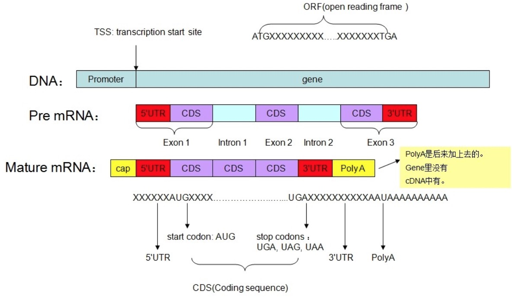
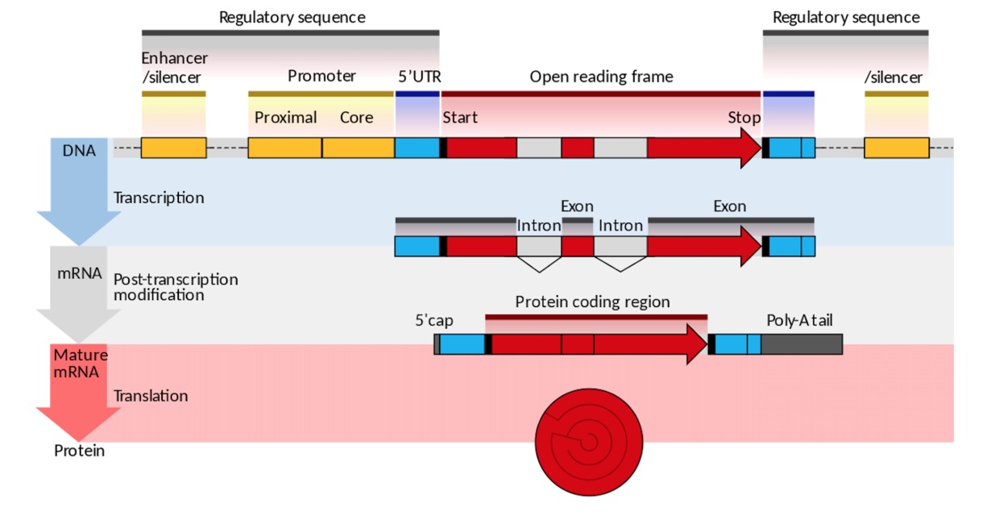

## 

5' UTR，3' UTR 叫作 untranslated region ,而 introns 叫作 non-coding RNA。一段基因序列上包含外显子和内含子，转录的时候，pre-RNA就是前体RAN上会有内含子和外显子，成为成熟RNA时，内含子已经被剪切了，只保留外显子，所以内含子叫作非编码RNA（non-coding RNA）。但成熟的RNA上也是有一部分序列并不翻译成蛋白质，就是非翻译区域（untranslated region），包括上游的 5' UTR，下游的3' UTR。

一个基因中：
1、包含相同个数的CDS和外显子
2、除第一个和最后一个CDS和外显子的序列不同之外，其它都是相同的
3、第一个外显子比CDS要长，这是因为第一个外显子中有翻译信号，同理最后一个里面有什么我现在也不知道。（哈哈哈）
4、CDS并不是从第一个位置进行翻译的，而是根据其frame决定。
5、要记住，CDS直接对应于蛋白质序列，而外显子则是相对于mRNA自我剪接过程而言的，这就是两者的不同。

**Giemsa banding (G-banding) - G显带**
+ Dark bands are AT-rich and have less genes.
+ Light bands are GC-rich DNA and are more transcriptionally active.

https://www.jieandze1314.com/post/cnposts/104/

## 外显子功能突变
https://www.jieandze1314.com/post/cnposts/160/