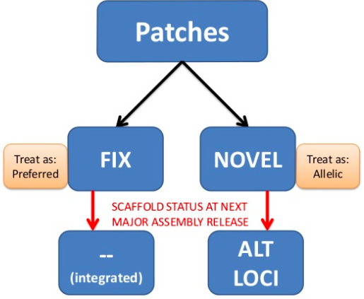

<!-- TOC -->

- [fasta](#fasta)
  - [Unlocalized scaffolds(*_random)](#unlocalized-scaffolds_random)
  - [Unplaced scaffolds(chrUn_)](#unplaced-scaffoldschrun_)
  - [Alternate loci scaffolds(*_alt)](#alternate-loci-scaffolds_alt)
- [2. Common](#2-common)
  - [2.1. Ucsc(参考序列文件推荐下载这个)](#21-ucsc参考序列文件推荐下载这个)
    - [Table Browser](#table-browser)
    - [ftp下载](#ftp下载)
    - [获取序列](#获取序列)
      - [Ref_info](#ref_info)
  - [2.2. Gencode（基因注释文件下载）](#22-gencode基因注释文件下载)
  - [2.3. Ensembl](#23-ensembl)
  - [2.4. NCBI Refseq](#24-ncbi-refseq)
      - [Ref_Info](#ref_info-1)
- [http://www.zxzyl.com/archives/848](#httpwwwzxzylcomarchives848)
  - [转化](#转化)
    - [怎么获取exon 和 intron区域](#怎么获取exon-和-intron区域)
      - [knownGene](#knowngene)
      - [gff](#gff)
    - [Reference genome patches](#reference-genome-patches)
    - [注释区间](#注释区间)
    - [Mappability](#mappability)

<!-- /TOC -->

#
https://anjingwd.github.io/AnJingwd.github.io/2017/08/12/参考基因组数据下载/

# fasta

## Unlocalized scaffolds(*_random)
a sequence found in an assembly that is associated with a specific chromosome but cannot be ordered or oriented on that chromosome.
简单理解：知道这个scaffolds在哪条染色体上，但不知道其在染色体的具体位置及方向
```
format: chr{chromosome number orname}_{sequence_accession}v{sequence_version}_random
```

## Unplaced scaffolds(chrUn_)
a sequence found in an assembly that is not associated with any chromosome.
简单理解：不知道这条scaffolds的所属染色体信息
```
format: chrUn_{sequence_accession}v{sequence_version}
```

## Alternate loci scaffolds(*_alt)
a scaffold that provides an alternate representation of a locus found in the primary assembly. These sequences do not represent a complete chromosome sequence although there is no hard limit on the size of the alternate locus; currently these are less than 1 Mb. These could either be NOVEL patch sequences, added through patch releases, or present in the initial assembly release.
简单理解：参考基因组存在的主要依据是人类99.9%的序列是一致的。但是会存在一些序列在不同人群中不一致。例如49%人群该基因组特定位置为序列A，而49%人群则为序列B，都是正常的。但拿其中一种作为参考基因组都可能不太合适，因此标记出Alternate loci scaffolds。
```
format: chr{chromosome number or name}_{sequence_accession}v{sequence_version}_alt
```
Alternate loci scaffolds为hg38版本基因组新添类型Sequence，此前hg19版本还没有。

> https://www.ncbi.nlm.nih.gov/grc/help/definitions/

> http://blog.sciencenet.cn/blog-543513-1229366.html

# 2. Common
## 2.1. Ucsc(参考序列文件推荐下载这个)
### Table Browser
> http://genome.ucsc.edu/cgi-bin/hgTables

```
1. clade(Mammal) -> #查找物种
2. genome()      -> 选择对应的物种名字
3. assembly()    ->选择基因组版本。
4. group(Genes and Gene Predictions) ->
5. track选择对应的数据库和版本，通常选择NCBI RefSeq。->
6. table选择数据，对于NCBI RefSeq, 提供了如下选择

RefSeq All代表RefSeq中所有的转录本信息，RefSeq Curated代表核对过的数据，可信度较高，以NM, NR, YP开头，RefSeq Predicted代表预测的数据，以XM, XR开头；UCSC RefSeq 代表所有以NM, NR开头的转录本信息。通常选择UCSC RefSeq即可。

7. region选择下载的区域，是选择整个基因组，还是只是染色体上的部分区域。

http://genome.ucsc.edu/cgi-bin/hgTables?hgsid=682987339_Q4QiJkTbj7alIOKSnfjFgXGdrGKS&clade=mammal&org=&db=hg19&hgta_group=genes&hgta_track=knownGene&hgta_table=knownGene&hgta_regionType=genome&position=&hgta_outputType=primaryTable&hgta_outFileName=
```
### ftp下载
> http://hgdownload.soe.ucsc.edu/goldenPath/hg38/database/

```
#gtf
#http://hgdownload.soe.ucsc.edu/admin/exe/

wget http://hgdownload.soe.ucsc.edu/goldenPath/hg38/database/refGene.txt.gz
gunzip refGene.txt.gz
cut -f 2- refGene.txt | genePredToGtf file stdin -source=hg38_Ref  hg38.gtf
[zhangbo@cu-0036 hg19]$ sort -k1,1 -k4,4n  -k5,5r  -k9,9 ucsc.full.gtf > 2


# fasta
wegt http://hgdownload.cse.ucsc.edu/goldenPath/hg19/bigZips/chromFa.tar.gz ##hg19
wget http://hgdownload.cse.ucsc.edu/goldenPath/hg38/bigZips/chromFa.tar.gz ##hg38

tar -zxvf chromFa.tar.gz
cd chroms
cat *.fa >hg19.fa
```
### 获取序列
```
http://genome.ucsc.edu/cgi-bin/das/hg38/dna?segment=chr17:7676091,7676196
```


#### Ref_info
https://my.oschina.net/u/4580290/blog/4620751

## 2.2. Gencode（基因注释文件下载）
(http://www.gencodegenes.org/)下载需要的注释文件，进入网站后选择Data > Human > GRCh37-mapped Releases
```
ftp://ftp.sanger.ac.uk/pub/gencode/Gencode_human/

axel ftp://ftp.ebi.ac.uk/pub/databases/gencode/Gencode_human/release_28/GRCh37_mapping/gencode.v28lift37.annotation.gtf.gz
axel ftp://ftp.ebi.ac.uk/pub/databases/gencode/Gencode_human/release_28/GRCh37_mapping/gencode.v28lift37.annotation.gff3.gz
```

## 2.3. Ensembl
```
http://asia.ensembl.org/info/data/ftp/index.html

ftp://ftp.ensembl.org/pub/

ftp://ftp.ensembl.org/pub/release-87/gtf/homo_sapiens/Homo_sapiens.GRCh38.87.chr.gtf.gz 

ftp://ftp.ensembl.org/pub/current_gtf/homo_sapiens/Homo_sapiens.GRCh38.90.gtf.gz## hg38

```
Gencode vs. Ensembl:

1. X/Y染色体上PAR区域的注释：该区域的注释在Gencode中X染色体和Y染色体各注释一次，而在Ensembl文件中，只在X染色体进行了注释

> PAR region(Pseudoautosomal region)：该区域是X和Y染色体的同源序列，因为这上面的任何基因可以和常染色体基因一样正常遗传而得名

2. Gencode的第九列，也就是attribute那一列，有一些其他额外的tags，这些tags是Ensebl所没有的

## 2.4. NCBI Refseq
```
ftp://ftp.ncbi.nlm.nih.gov/genomes/refseq/vertebrate_mammalian/Homo_sapiens/latest_assembly_versions/

wget ftp://ftp.ncbi.nlm.nih.gov/genomes/Homo_sapiens/GFF/ref_GRCh38.p7_top_level.gff3.gz          ## hg38
wget ftp://ftp.ncbi.nlm.nih.gov/genomes/Homo_sapiens/ARCHIVE/BUILD.37.3/GFF/ref_GRCh37.p5_top_level.gff3.gz    ## hg19
ftp://ftp.ncbi.nlm.nih.gov/refseq/H_sapiens/annotation/GRCh37_latest/refseq_identifiers/ ##hg19
```


```
##hg19：

for i in $(seq 1 22) X Y M;
do wget ftp://ftp.ncbi.nlm.nih.gov/genomes/Homo_sapiens/ARCHIVE/BUILD.37.3/Assembled_chromosomes/seq/hs_ref_GRCh37.p5_chr${i}.fa.gz; 
gzip -d hs_ref_GRCh37.p5_chr${i}.fa.gz;
cat hs_ref_GRCh37.p5_chr${i}.fa.gz >>hg19.fa;
sleep 10s;
done;

##hg38：
同理，只要找到下载地址，改动一下即可。
### ftp://ftp.ncbi.nlm.nih.gov/genomes/Homo_sapiens/Assembled_chromosomes/seq/hs_ref_GRCh38.p7_chr${i}.fa.gz
```
1000g:
```
http://ftp.1000genomes.ebi.ac.uk/vol1/ftp/technical/reference/
```


#### Ref_Info
https://blog.csdn.net/tanzuozhev/article/details/78861704

# http://www.zxzyl.com/archives/848

## 转化
https://www.ncbi.nlm.nih.gov/assembly/GCF_000001405.39#/def

https://ftp.ncbi.nlm.nih.gov/genomes/all/GCF/000/001/405/GCF_000001405.39_GRCh38.p13/GCF_000001405.39_GRCh38.p13_assembly_report.txt

### 怎么获取exon 和 intron区域
#### knownGene
```
$ curl  -s "http://hgdownload.cse.ucsc.edu/goldenPath/hg19/database/knownGene.txt.gz" | gunzip -c | awk '{n=int($8); split($9,S,/,/);split($10,E,/,/); for(i=1;i<=n;++i) {printf("%s,%s,%s,%s,%s,EXON\n",$1,$2,$3,S[i],E[i]); if(i+1<=n) printf("%s,%s,%s,%s,%s,INTRON\n",$1,$2,$3,int(E[i]),int(S[i+1]));  }}' 
```

#### gff
```
GENE            ######################################################
ISOFORM-1       #########--------#######-------####----------#########
                E1.1             E1.2          E1.3          E1.4
                         I1.1           I1.2       I1.3
ISOFORM-2       #########--------###########---------###-----#########
                E2.1             E2.2                E2.3    E2.4
                         I2.1               I2.2        I2.3

https://www.biostars.org/p/411934/
```

### Reference genome patches
https://janbio.home.blog/2018/11/27/reference-genome-patches/


http://www.xybiotech.com/resources/support/667.html

https://zhuanlan.zhihu.com/p/87788625

### 注释区间
https://www.biostars.org/p/253812/

### Mappability