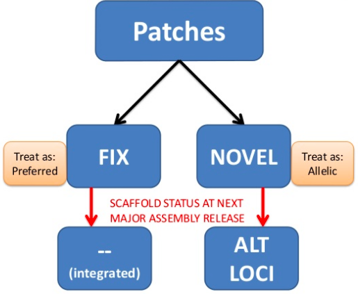

<!-- TOC -->

- [1. fasta](#1-fasta)
    - [1.1. Unlocalized scaffolds(*_random)](#11-unlocalized-scaffolds_random)
    - [1.2. Unplaced scaffolds(chrUn_)](#12-unplaced-scaffoldschrun_)
    - [1.3. Alternate loci scaffolds(*_alt)](#13-alternate-loci-scaffolds_alt)
- [2. Common](#2-common)
    - [2.1. Ucsc(参考序列文件推荐下载这个)](#21-ucsc参考序列文件推荐下载这个)
        - [2.1.1. Table Browser](#211-table-browser)
        - [2.1.2. ftp下载](#212-ftp下载)
        - [2.1.3. 获取序列](#213-获取序列)
            - [2.1.3.1. Ref_info](#2131-ref_info)
        - [2.1.4 gatk bundle](#214-gatk-bundle)
    - [2.2. Gencode（基因注释文件下载）](#22-gencode基因注释文件下载)
    - [2.3. Ensembl](#23-ensembl)
    - [2.4. NCBI Refseq](#24-ncbi-refseq)
            - [2.4.0.2. Ref_Info](#2402-ref_info)
    - [2.5. 转化](#25-转化)
        - [2.5.1. 怎么获取exon 和 intron区域](#251-怎么获取exon-和-intron区域)
            - [2.5.1.1. knownGene](#2511-knowngene)
            - [2.5.1.2. gff](#2512-gff)
        - [2.5.2. Reference genome patches](#252-reference-genome-patches)
        - [2.5.3. 注释区间](#253-注释区间)
        - [2.5.4. Mappability](#254-mappability)
    - [2.6. 注释bed文件](#26-注释bed文件)
        - [1. GIAB(2016)](#1-giab2016)
        - [2. Truth ChallengeV2(202005-202006)](#2-truth-challengev2202005-202006)
- [1000g](#1000g)
- [na12878](#na12878)
    - [cnv](#cnv)
        - [cnv golden dataset](#cnv-golden-dataset)
- [数据集](#数据集)
        - [韩国人基因组计划KPGP:](#韩国人基因组计划kpgp)
    - [Benchmark datasets](#benchmark-datasets)
- [rnaseq 数据集](#rnaseq-数据集)
- [NA12878](#na12878)
- [Cancer-like mixture with Genome in a Bottle samples](#cancer-like-mixture-with-genome-in-a-bottle-samples)
    - [HCC1395 somatic benchmark](#hcc1395-somatic-benchmark)
    - [融合基因数据集](#融合基因数据集)

<!-- /TOC -->

#
https://anjingwd.github.io/AnJingwd.github.io/2017/08/12/参考基因组数据下载/

# 1. fasta

## 1.1. Unlocalized scaffolds(*_random)
a sequence found in an assembly that is associated with a specific chromosome but cannot be ordered or oriented on that chromosome.
简单理解：知道这个scaffolds在哪条染色体上，但不知道其在染色体的具体位置及方向
```
format: chr{chromosome number orname}_{sequence_accession}v{sequence_version}_random
```

## 1.2. Unplaced scaffolds(chrUn_)
a sequence found in an assembly that is not associated with any chromosome.
简单理解：不知道这条scaffolds的所属染色体信息
```
format: chrUn_{sequence_accession}v{sequence_version}
```

## 1.3. Alternate loci scaffolds(*_alt)
a scaffold that provides an alternate representation of a locus found in the primary assembly. These sequences do not represent a complete chromosome sequence although there is no hard limit on the size of the alternate locus; currently these are less than 1 Mb. These could either be NOVEL patch sequences, added through patch releases, or present in the initial assembly release.
简单理解：参考基因组存在的主要依据是人类99.9%的序列是一致的。但是会存在一些序列在不同人群中不一致。例如49%人群该基因组特定位置为序列A，而49%人群则为序列B，都是正常的。但拿其中一种作为参考基因组都可能不太合适，因此标记出Alternate loci scaffolds。
```
format: chr{chromosome number or name}_{sequence_accession}v{sequence_version}_alt
```
Alternate loci scaffolds为hg38版本基因组新添类型Sequence，此前hg19版本还没有。

> https://www.ncbi.nlm.nih.gov/grc/help/definitions/

> http://blog.sciencenet.cn/blog-543513-1229366.html

# 2. Common
## 2.1. Ucsc(参考序列文件推荐下载这个)
### 2.1.1. Table Browser
> http://genome.ucsc.edu/cgi-bin/hgTables

```
1. clade(Mammal) -> #查找物种
2. genome()      -> 选择对应的物种名字
3. assembly()    ->选择基因组版本。
4. group(Genes and Gene Predictions) ->
5. track选择对应的数据库和版本，通常选择NCBI RefSeq。->
6. table选择数据，对于NCBI RefSeq, 提供了如下选择

RefSeq All代表RefSeq中所有的转录本信息，RefSeq Curated代表核对过的数据，可信度较高，以NM, NR, YP开头，RefSeq Predicted代表预测的数据，以XM, XR开头；UCSC RefSeq 代表所有以NM, NR开头的转录本信息。通常选择UCSC RefSeq即可。

7. region选择下载的区域，是选择整个基因组，还是只是染色体上的部分区域。

http://genome.ucsc.edu/cgi-bin/hgTables?hgsid=682987339_Q4QiJkTbj7alIOKSnfjFgXGdrGKS&clade=mammal&org=&db=hg19&hgta_group=genes&hgta_track=knownGene&hgta_table=knownGene&hgta_regionType=genome&position=&hgta_outputType=primaryTable&hgta_outFileName=
```
### 2.1.2. ftp下载
> http://hgdownload.soe.ucsc.edu/goldenPath/hg38/database/

```
#gtf
#http://hgdownload.soe.ucsc.edu/admin/exe/

wget http://hgdownload.soe.ucsc.edu/goldenPath/hg38/database/refGene.txt.gz
gunzip refGene.txt.gz
cut -f 2- refGene.txt | genePredToGtf file stdin -source=hg38_Ref  hg38.gtf
[zhangbo@cu-0036 hg19]$ sort -k1,1 -k4,4n  -k5,5r  -k9,9 ucsc.full.gtf > 2


# fasta
wegt http://hgdownload.cse.ucsc.edu/goldenPath/hg19/bigZips/chromFa.tar.gz ##hg19
wget http://hgdownload.cse.ucsc.edu/goldenPath/hg38/bigZips/chromFa.tar.gz ##hg38

tar -zxvf chromFa.tar.gz
cd chroms
cat *.fa >hg19.fa
```
### 2.1.3. 获取序列
```
http://genome.ucsc.edu/cgi-bin/das/hg38/dna?segment=chr17:7676091,7676196
```

#### 2.1.3.1. Ref_info
https://my.oschina.net/u/4580290/blog/4620751

### 2.1.4 gatk bundle
+ GRCh37 (GRCh37.p13.genome.fasta, MD5sum: c140882eb2ea89bc2edfe934d51b66cc)
    + 是由 Genome Reference Consortium 构建的智人基因组参考文件。这是一个基线人类基因组参考，并作为此比较中其他三个参考的基础。
    + ftp://ftp.ncbi.nlm.nih.gov/genomes/refseq/vertebrate_mammalian/Homo_sapiens/all_assembly_versions/GCF_000001405.25_GRCh37.p13/GCF_000001405.25_GRCh37.p13_genomic.fna.gz
+ hg19 (ucsc.hg19.fasta, MD5sum: a244d8a32473650b25c6e8e1654387d6)
    + http://hgdownload.cse.ucsc.edu/goldenPath/hg19/bigZips/hg19.fa.gz
+ b37 (Homo_sapiens_assembly19.fasta, MD5sum: 886ba1559393f75872c1cf459eb57f2d)
    + Broad Institute created
+ humanG1Kv37 (human_g1k_v37.fasta, MD5sum: 0ce84c872fc0072a885926823dcd0338)
    + 除了它不包含人类疱疹病毒 41 型(NC007605_)的诱饵序列外，其他等同于b37
+ hs37d5
    + http://ftp.1000genomes.ebi.ac.uk/vol1/ftp/technical/reference/phase2_reference_assembly_sequence/
> https://gatk.broadinstitute.org/hc/en-us/articles/360035890711-GRCh37-hg19-b37-humanG1Kv37-Human-Reference-Discrepancies

> https://gatk.broadinstitute.org/hc/en-us/articles/360035890951-Human-genome-reference-builds-GRCh38-or-hg38-b37-hg19

> https://github.com/bahlolab/bioinfotools/blob/master/GATK/resource_bundle.md

human_g1k_v37_decoy vs. human_g1k_v37
```
diff human_g1k_v37_decoy.dict11 human_g1k_v37.dict11
86,87d85
< @SQ	SN:NC_007605	LN:171823
< @SQ	SN:hs37d5	LN:35477943
```

## 2.2. Gencode（基因注释文件下载）
(http://www.gencodegenes.org/)下载需要的注释文件，进入网站后选择Data > Human > GRCh37-mapped Releases
```
ftp://ftp.sanger.ac.uk/pub/gencode/Gencode_human/

axel ftp://ftp.ebi.ac.uk/pub/databases/gencode/Gencode_human/release_28/GRCh37_mapping/gencode.v28lift37.annotation.gtf.gz
axel ftp://ftp.ebi.ac.uk/pub/databases/gencode/Gencode_human/release_28/GRCh37_mapping/gencode.v28lift37.annotation.gff3.gz
```

## 2.3. Ensembl
```
http://asia.ensembl.org/info/data/ftp/index.html

ftp://ftp.ensembl.org/pub/

ftp://ftp.ensembl.org/pub/release-87/gtf/homo_sapiens/Homo_sapiens.GRCh38.87.chr.gtf.gz 

ftp://ftp.ensembl.org/pub/current_gtf/homo_sapiens/Homo_sapiens.GRCh38.90.gtf.gz## hg38

```
Gencode vs. Ensembl:

1. X/Y染色体上PAR区域的注释：该区域的注释在Gencode中X染色体和Y染色体各注释一次，而在Ensembl文件中，只在X染色体进行了注释

> PAR region(Pseudoautosomal region)：该区域是X和Y染色体的同源序列，因为这上面的任何基因可以和常染色体基因一样正常遗传而得名

2. Gencode的第九列，也就是attribute那一列，有一些其他额外的tags，这些tags是Ensebl所没有的

## 2.4. NCBI Refseq
```
ftp://ftp.ncbi.nlm.nih.gov/genomes/refseq/vertebrate_mammalian/Homo_sapiens/latest_assembly_versions/

wget ftp://ftp.ncbi.nlm.nih.gov/genomes/Homo_sapiens/GFF/ref_GRCh38.p7_top_level.gff3.gz          ## hg38
wget ftp://ftp.ncbi.nlm.nih.gov/genomes/Homo_sapiens/ARCHIVE/BUILD.37.3/GFF/ref_GRCh37.p5_top_level.gff3.gz    ## hg19
ftp://ftp.ncbi.nlm.nih.gov/refseq/H_sapiens/annotation/GRCh37_latest/refseq_identifiers/ ##hg19
```


```
##hg19：

for i in $(seq 1 22) X Y M;
do wget ftp://ftp.ncbi.nlm.nih.gov/genomes/Homo_sapiens/ARCHIVE/BUILD.37.3/Assembled_chromosomes/seq/hs_ref_GRCh37.p5_chr${i}.fa.gz; 
gzip -d hs_ref_GRCh37.p5_chr${i}.fa.gz;
cat hs_ref_GRCh37.p5_chr${i}.fa.gz >>hg19.fa;
sleep 10s;
done;

##hg38：
同理，只要找到下载地址，改动一下即可。
### ftp://ftp.ncbi.nlm.nih.gov/genomes/Homo_sapiens/Assembled_chromosomes/seq/hs_ref_GRCh38.p7_chr${i}.fa.gz
```
1000g:
```
http://ftp.1000genomes.ebi.ac.uk/vol1/ftp/technical/reference/
```


#### 2.4.0.2. Ref_Info
https://blog.csdn.net/tanzuozhev/article/details/78861704

http://www.zxzyl.com/archives/848

## 2.5. 转化
https://www.ncbi.nlm.nih.gov/assembly/GCF_000001405.39#/def

https://ftp.ncbi.nlm.nih.gov/genomes/all/GCF/000/001/405/GCF_000001405.39_GRCh38.p13/GCF_000001405.39_GRCh38.p13_assembly_report.txt

### 2.5.1. 怎么获取exon 和 intron区域
#### 2.5.1.1. knownGene
```
$ curl  -s "http://hgdownload.cse.ucsc.edu/goldenPath/hg19/database/knownGene.txt.gz" | gunzip -c | awk '{n=int($8); split($9,S,/,/);split($10,E,/,/); for(i=1;i<=n;++i) {printf("%s,%s,%s,%s,%s,EXON\n",$1,$2,$3,S[i],E[i]); if(i+1<=n) printf("%s,%s,%s,%s,%s,INTRON\n",$1,$2,$3,int(E[i]),int(S[i+1]));  }}' 
```

#### 2.5.1.2. gff
```
GENE            ######################################################
ISOFORM-1       #########--------#######-------####----------#########
                E1.1             E1.2          E1.3          E1.4
                         I1.1           I1.2       I1.3
ISOFORM-2       #########--------###########---------###-----#########
                E2.1             E2.2                E2.3    E2.4
                         I2.1               I2.2        I2.3

https://www.biostars.org/p/411934/
```

### 2.5.2. Reference genome patches
https://janbio.home.blog/2018/11/27/reference-genome-patches/


http://www.xybiotech.com/resources/support/667.html

https://zhuanlan.zhihu.com/p/87788625

### 2.5.3. 注释区间
https://www.biostars.org/p/253812/

### 2.5.4. Mappability

> https://zenodo.org/record/5521424#.Yle9UShByUk

官网： https://evodify.com/gem-mappability/
下载：
```
wget https://sourceforge.net/projects/gemlibrary/files/gem-library/Binary%20pre-release%203/GEM-binaries-Linux-x86_64-core_i3-20130406-045632.tbz2
bzip2 -d GEM-binaries-Linux-x86_64-core_i3-20130406-045632.tbz2
tar -xvf GEM-binaries-Linux-x86_64-core_i3-20130406-045632.tar
```

#
- [x] SRR11652532 查看文章来源

https://pubmed.ncbi.nlm.nih.gov/32221409/


## 2.6. 注释bed文件
1. https://github.com/vladsaveliev/bed_annotation
2. https://www.biostars.org/p/147916/
3. https://www.biostars.org/p/116790/

```
wget -c http://hgdownload.cse.ucsc.edu/goldenPath/hg19/database/refGene.txt.gz
cut -f 2- refGene.txt > refGene.genePred
genePredToGtf file refGene.genePred refGene.gtf
sort -V -k1,1 -k4,4 -k5,5 refGene.gtf > refGene.gtf1
```

https://www.synapse.org/#!Synapse:syn312572/wiki/60873

https://umccr.org/blog/bwa-mem-vs-minimap2/
- We downloaded 2 datasets with curated somatic variants: - ICGC medulloblastoma. Tumor: 103x, normal: 89x (downsampled from tumor: 314x, normal: 272x).
  - https://www.nature.com/articles/ncomms10001
- COLO829 metastatic melanoma cell line. Tumor: 81x, normal: 79x
  - https://www.ncbi.nlm.nih.gov/pmc/articles/PMC4837349/

### 1. GIAB(2016)

HG001(NA12878)
HG002(son)

### 2. Truth ChallengeV2(202005-202006)
HG003(father)
HG004(mother)

# 1000g
http://ftp.1000genomes.ebi.ac.uk/vol1/ftp/phase3/data/

# na12878
http://ftp.1000genomes.ebi.ac.uk/vol1/ftp/phase3/data/NA12878/

https://www.internationalgenome.org/data-portal/sample/NA12878

## cnv
https://www.ncbi.nlm.nih.gov/sra/?term=SRR622461
+  ILLUMINA (Illumina HiSeq 2000) run: 92.5M spots, 18.7G bases, 4.8Gb downloads
+ 1000 Genomes on GRCh38
  + SRR622461 low coverage wgs
    + ftp:/­/­ftp.­sra.­ebi.­ac.­uk/­vol1/­fastq/­SRR622/­SRR622461/­SRR622461_2.­fastq.­gz 
```
/home/zhangbo/.aspera/connect/bin/ascp -QT -l 300m -P33001 -i ~/.aspera/connect/etc/asperaweb_id_dsa.openssh era-fasp@fasp.sra.ebi.ac.uk:vol1/fastq/SRR622/SRR622461/SRR622461.fastq.gz . && mv SRR622461.fastq.gz SRR622461_Illumina_sequencing_of_HapMap_individual_NA12878_aligned_by_BI_downsampled_to_5x_coverage.fastq.gz
/home/zhangbo/.aspera/connect/bin/ascp -QT -l 300m -P33001 -i ~/.aspera/connect/etc/asperaweb_id_dsa.openssh era-fasp@fasp.sra.ebi.ac.uk:vol1/fastq/SRR622/SRR622461/SRR622461_1.fastq.gz . && mv SRR622461_1.fastq.gz SRR622461_Illumina_sequencing_of_HapMap_individual_NA12878_aligned_by_BI_downsampled_to_5x_coverage_1.fastq.gz
/home/zhangbo/.aspera/connect/bin/ascp -QT -l 300m -P33001 -i ~/.aspera/connect/etc/asperaweb_id_dsa.openssh era-fasp@fasp.sra.ebi.ac.uk:vol1/fastq/SRR622/SRR622461/SRR622461_2.fastq.gz . && mv SRR622461_2.fastq.gz SRR622461_Illumina_sequencing_of_HapMap_individual_NA12878_aligned_by_BI_downsampled_to_5x_coverage_2.fastq.gz
```
+ 1000 Genomes phase 3 release
  + ftp:/­/­ftp.­1000genomes.­ebi.­ac.­uk/­vol1/­ftp/­phase3/­data/­NA12878/­sequence_read/­SRR622461_1.­filt.­fastq.­gz 
```
 ll
total 13580512
drwxr-xr-x 2 zhangbo med           4096 Apr  8 17:26 .
drwxr-xr-x 6 zhangbo zhangbo       4096 Apr  8 15:54 ..
-rw-r--r-- 1 zhangbo med     4515787433 Apr  8 17:40 SRR622461_1.filt.fastq.gz
-rw-r--r-- 1 zhangbo med     4598249219 Apr  8 17:11 SRR622461_Illumina_sequencing_of_HapMap_individua
l_NA12878_aligned_by_BI_downsampled_to_5x_coverage_1.fastq.gz
-rw-r--r-- 1 zhangbo med     4792383631 Apr  8 17:16 SRR622461_Illumina_sequencing_of_HapMap_individua
l_NA12878_aligned_by_BI_downsampled_to_5x_coverage_2.fastq.gz
-rw-r--r-- 1 zhangbo med            318 Apr  8 17:08 SRR622461_Illumina_sequencing_of_HapMap_individua
l_NA12878_aligned_by_BI_downsampled_to_5x_coverage.fastq.gz
```
### cnv golden dataset
https://doi.org/10.1371/journal.pcbi.1007069.s004

https://mp.weixin.qq.com/s/LYBcfMILpvHL2LnguB2ebg

# 数据集
### 韩国人基因组计划KPGP:
+  http://opengenome.net/index.php/Main_Page
+ https://pzweuj.github.io/2018/11/16/KPGP.html

https://portals.broadinstitute.org/ccle/data


##Benchmark datasets
ICGC benchmarking exercise

```
Medulloblastoma tumour/normal pair sequenced in 6 different centres to combined 300-fold coverage used to establish 'truth'

16 ICGC project teams ran their pipelines on data from one centre (40x)

Alioto et al., Nat Commun. 2015
```

ICGC-TCGA DREAM Somatic Mutation Calling challenge

```
6 synthetic datasets based on cell line sequenced to 80x, BAM randomnly split into 2 ('tumour' and 'normal'), mutations added to one computationally

Synthetic dataset 4: 80% cellularity; 50% and 35% subclone VAF (effectively 30% and 15%)

Ewing et al., Nat Methods 2015 [leaderboards]
```

https://login.illumina.com/platform-services-manager/?rURL=https://basespace.illumina.com&clientId=basespace&clientVars=aHR0cHM6Ly9iYXNlc3BhY2UuaWxsdW1pbmEuY29tL2FuYWx5c2VzLz9vZmZzZXQ9MCZzb3J0Ynk9TW9kaWZpZWRPbiZzb3J0ZGlyPWRlc2MmbGltaXQ9MjU&redirectMethod=GET


# rnaseq 数据集
https://github.com/STAR-Fusion/STAR-Fusion_benchmarking_data


----
# NA12878
+ https://ftp.1000genomes.ebi.ac.uk/vol1/ftp/phase3/data/NA12878/
+ https://www.internationalgenome.org/data-portal/sample/NA12878
NA12878 variation benchmark, 
ftp://ftp-trace.ncbi.nlm.nih.gov/giab/ftp/technical/svclassify_Manuscript/Supplementary_Information/

NA12878 CNV Benchmark：
> ftp://ftp-trace.ncbi.nlm.nih.gov/giab/ftp/technical/svclassify_Manuscript/Supplementary_Information、Personalis_1000_Genomes_deduplicated_deletions.bed
 filtered to retain only deletions ≥1 kb
> https://ars.els-cdn.com/content/image/1-s2.0-S0002929717304962-mmc4.txt

+ The CNVs in this GS set range from 50 bp to 453,312 bp with 1,941 and 135 autosomal deletions and duplications, respectively.


# Cancer-like mixture with Genome in a Bottle samples
This example simulates somatic cancer calling using a mixture of two Genome in a Bottle samples, NA12878 as the “tumor” mixed with NA24385 as the background. The Hartwig Medical Foundation and Utrecht Medical Center generated this “tumor/normal” pair by physical mixing of samples prior to sequencing. The GiaB FTP directory has more details on the design and truth sets. The sample has variants at 15% and 30%, providing the ability to look at lower frequency mutations.

To get the data:
```
wget https://raw.githubusercontent.com/bcbio/bcbio-nextgen/master/config/examples/cancer-giab-na12878-na24385-getdata.sh
bash cancer-giab-na12878-na24385-getdata.sh
```
https://bcbio-nextgen.readthedocs.io/en/latest/contents/somatic_variants.html#workflow4-cancer-like-mixture-with-genome-in-a-bottle-samples


## HCC1395 somatic benchmark
https://github.com/broadinstitute/gatk/issues/7921
https://pubmed.ncbi.nlm.nih.gov/34504347/
https://ftp-trace.ncbi.nlm.nih.gov/ReferenceSamples/seqc/Somatic_Mutation_WG/release/latest/
https://www.nature.com/articles/s41587-021-00993-6


## 融合基因数据集
https://github.com/ccmbioinfo/MetaFusion/wiki/Benchmarking-dataset-fastq-files