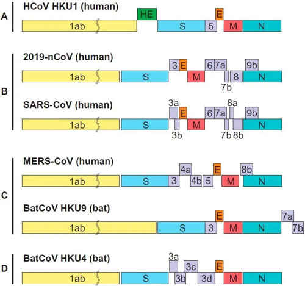
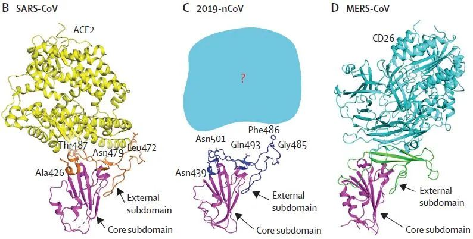

与SARS-CoV、MERS-CoV都是β 冠状病毒家族成员。

基于病毒的基因组序列，我们可以从基因组学研究的角度，解析其基因组结构、预测各结构的功能、预测蛋白的3D结构和功能。在基因组学研究的基础上，我们可以利用转录组学对病毒的致病机制进行预测，为病毒的分子实验研究提供理论参考.

## 致病机制

通过与其它冠状病毒进行序列比对，研究者首先对SARS-CoV-2 基因组进行注释，发现它的主要组成与SARS-CoV和bat SL-CoVs的相同，如图3 所示。对其编码的蛋白进行氨基酸同源性比对发现，其中非结构蛋白（nsp）、被膜蛋白（E）、膜蛋白（M）的氨基酸同源性较高，而棘突蛋白（Spike）S1的变异性较大。

冠状病毒Sp ike 蛋白是与宿主细胞结合的关键结构域，其中的S1亚基含受体结合域（RBD），通过氨基酸序列比对[15]和蛋白质三级结构预测[4]发现，SARS-CoV-2 的RBD与SARS-CoV 极为相似（见图4），猜测SARS-CoV的受体ACE2也能与SARS-CoV-2 结合，介导SARS-CoV-2 入侵宿主细胞。

之后，研究者将探询的目光投向了人体内ACE2的表达情况，希望通过找到 ACE2高表达的器官、组织、甚至是细胞，为新冠肺炎的预防和治疗提供指导，单细胞转录组测序（ scRNA-seq）的出现完美地解决了这这一问题。

多个研究者利用已有的单细胞转录组数据，首先对目标组织进行细胞聚类鉴定，再检测ACE2 在各类细胞中的表达丰度。结果表明，ACE2在大量细胞中都存在高表达，如肺AT2细胞[8, 18]、食管上皮细胞[8, 18]和回肠、结肠吸收性肠上皮细胞[8, 18, 19]、肾脏细胞[8, 20, 21]、精巢各细胞[20, 22-24]。

这一结果也许能解释一部分SARS-CoV-2感染途径多样化的原因，另一方面也提醒在治疗患者时不仅需要关注肺部损伤，还需要注意其他组织器官的损伤，这样才能起到更好的治疗效果。

https://zhanglab.ccmb.med.umich.edu/COVID-19/

http://virological.org/t/phylodynamic-analysis-176-genomes-6-mar-2020/356/18

https://github.com/rrwick/Unicycler

https://github.com/CDCgov/SARS-CoV-2_Sequencing

https://covid19.galaxyproject.org/

https://www.biocommons.org.au/galaxy-covid-19

https://covid19.galaxyproject.org/genomics/4-variation/#analysis-of-illumina-single-end-data

https://www.ncbi.nlm.nih.gov/pmc/articles/PMC7086142/

https://davetang.org/muse/2020/03/06/sequence-analysis-of-sars-cov-2-part-2/
