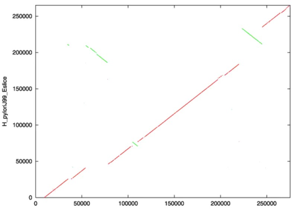

# MUMmer
MUMmer的核心基于 Maximal exact matching 算法开发的mummer。其他工具(nucmer,promer,run-mummer1.run-mummer3)都是基于mummer的开发的流程。这些流程的分析策略分为三步：

1. 用mummer在两个输入中找给定长度的极大唯一匹配( Maximal exact matching )
2. 然后将这些匹配区域聚类成较大不完全联配区域, 作为锚定点(anchor)
3. 最后它从每个匹配外部扩展联配, 形成有gap的联配。


###
 mummer
```
nucmer [options] <reference> <query file>

mummer -mum -b -c H_pylori26695_Eslice.fasta H_pyloriJ99_Eslice.fasta > mummer.mums
可以多条reference对多条query。不过plot还是1对1比较清楚。
-m:all maximal unique matches
-b:both forward and reverse
-c:relative to forward strand
```

输出mummer.mums

mummerplot


```
mummerplot -x "[0,275287]" -y "[0,265111]" -postscript -p mummer mummer.mums
-p 输出文件前缀
-x -y：根据input序列长度来设定

输出文件：
plot files contains the data points：mummer.fplot mummer.rplot
mummer.gp is a gnuplot script for plotting the data points in the plot files
mummer.ps is the postscript plot generated by the gnuplot script.
`
A line of dots斜率为1表示 an undisturbed segment of conservation between the two sequences,
若为-1，represents an inverted segment of conservation between the two sequences.
左上的绿色部分表示既是an inversion 也是translocation, 因为斜率为负，而且和其他部分不在一个位置，看起来是在 line approximated by f(x) = x.
右上的绿色部分仅仅是inversion。
总的来说，线越接近 f(x) = x (or -x) ，两个序列之间的 macroscopic differences越少。
```
#### Ref_Info
https://www.jianshu.com/p/c12f2a117892

### 画图

```
/usr/bin/ps2pdf mummerplot.ps mummerplot.pdf #只能在登录节点运行！！！

convert -density 300 <outpfix>.pdf <outpfix>.png
```
```
https://github.com/tpoorten/dotPlotly
```

https://blog.csdn.net/u012110870/article/details/102492711?utm_medium=distribute.pc_relevant.none-task-blog-title-3&spm=1001.2101.3001.4242

https://www.jianshu.com/p/befb3a440aed


# https://lxz9.com/2021/02/06/hifiasm/