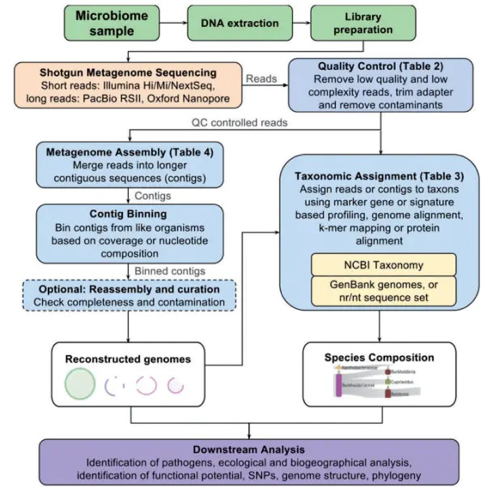

<!-- TOC -->

- [人体微生物库](#人体微生物库)
- [对组装的contig 进行分类](#对组装的contig-进行分类)
- [人体微生物](#人体微生物)
  - [微生物分类](#微生物分类)
    - [病毒分类](#病毒分类)
      - [链](#链)
  - [临床宏基因组学的应用](#临床宏基因组学的应用)
  - [检测方法](#检测方法)
    - [难点](#难点)
- [数据库](#数据库)
  - [ncbi taxonomy（关注数据库处理）](#ncbi-taxonomy关注数据库处理)
    - [taxonomy有关](#taxonomy有关)
  - [其他数据库](#其他数据库)
    - [MG-RAST](#mg-rast)
    - [NIH人体微生物计划](#nih人体微生物计划)
    - [GOLD数据库](#gold数据库)
    - [人类口腔微生物数据库](#人类口腔微生物数据库)
    - [http://data.mypathogen.org/pgdb/](#httpdatamypathogenorgpgdb)
    - [IGC](#igc)
    - [GPD](#gpd)
    - [UHGG](#uhgg)
    - [GTDB](#gtdb)
    - [CNGB 国家基因库](#cngb-国家基因库)
      - [病毒数据库](#病毒数据库)
    - [https://www.genome.jp/kegg/genome/pathogen.html](#httpswwwgenomejpkegggenomepathogenhtml)
    - [微生物基因组数据库](#微生物基因组数据库)

<!-- /TOC -->


文献：A review of methods and databases for metagenomic classification and assembly
杂志：Briefings in Bioinformatics
时间：2017


---

http://blog.sciencenet.cn/blog-3334560-1141270.html

宏基因组，除去宿主序列
https://pzweuj.github.io/2019/01/28/remove-host.html


https://pzweuj.github.io/2018/08/18/amp-workflow-1.html
https://pzweuj.github.io/2018/08/18/amp-workflow-2.html
https://pzweuj.github.io/2018/08/18/amp-workflow-3.html

https://zhuanlan.zhihu.com/p/75587070

# 人体微生物库
https://hmpdacc.org/

https://github.com/ewj34/AfDV-Viral-Metagenome/blob/master/Analysis.ipynb

# 对组装的contig 进行分类 
https://github.com/ablab/viralVerify

https://zhuanlan.zhihu.com/p/136728968

# 人体微生物

根据病毒不同的特征进行分类，包括病毒的宿主范围；病毒的形态学；病毒的基因组大小；病毒的核酸组成成分以及病毒的致病性。虽然所有的性状在病毒分类学的确定中都很重要，但目前利用平均核苷酸同源性（ANI）和系统发育关系进行序列比较被视为定义和区分病毒群类的主要标准。

## 微生物分类
+ 真菌
+ 古菌
+ 细菌
+ amoebozoa or apicomplexa
+ 未知微生物
+ 病毒
  + DNA病毒
  + RNA病毒
### 病毒分类
#### 链
+ 双链DNA (double-stranded DNA, dsDNA)
+ 单链DNA (single-stranded DNA, ssDNA)
+ RNA病毒

https://zhuanlan.zhihu.com/p/232424098

http://blog.sciencenet.cn/blog-635619-921701.html

http://blog.sciencenet.cn/home.php?mod=space&uid=635619&do=blog&id=902677


http://rs.yiigle.com/yufabiao/1181377.htm


## 临床宏基因组学的应用

> + [Clinical_metagenomics](https://www.nature.com/articles/s41576-019-0113-7)
> + https://blog.csdn.net/woodcorpse/article/details/106913521
> + https://mp.weixin.qq.com/s/au8PE82gDIiTklLkOIW8Qw
> 
## 检测方法
宏基因组测序（Meta）、探针捕获测序（Capture）和多重PCR扩增子测序（Amplicon）。
### 难点
+ Unknown number of species in a sample and heterogeneous sequencing coverage can lead to erroneous assemblies.


# 数据库

## ncbi taxonomy（关注数据库处理）
```
ls genomes/refseq/date/
archaea  bacteria  fungi  protozoa  viral
```
> 污染：hostmitochondrionDNA(target organism)

https://github.com/Joseph7e/Assess-NCBI-sequence-availability

https://github.com/kblin/ncbi-genome-download

###
```bash
#NCBI accession2taxonomy file
wget ftp://ftp.ncbi.nih.gov/pub/taxonomy/accession2taxid/n ucl_gb.accession2taxid.gz
gunzip nucl_gb.accession2taxid.gz

#NCBI nt database
mkdir NCBI_blast_nt
cd NCBI_blast_nt
wget ftp://ftp.ncbi.nlm.nih.gov/blast/db/nt* for file in nt*.tar.gz; do tar -zxf $file; done
```
### taxonomy有关
+ https://github.com/lpipes/taxid2taxonpath
+ https://indexofire.github.io/pathongs/book/C20_Others/02_gi-to-accession/
+ https://www.ncbi.nlm.nih.gov/genome/doc/ftpfaq/#allcomplete


ftp://ftp.ncbi.nlm.nih.gov/blast/db/

https://ftp.ncbi.nih.gov/pub/taxonomy/

https://www.jianshu.com/p/85c1729efedc


https://github.com/frallain/NCBI_taxonomy_tree


https://ftp.ncbi.nih.gov/genomes/

https://www.jianshu.com/p/72d9271db051

http://www.chenlianfu.com/?p=2691

## 其他数据库
### MG-RAST
https://www.mg-rast.org/

### NIH人体微生物计划
https://www.hmpdacc.org/

### GOLD数据库
https://gold.jgi.doe.gov/

### 人类口腔微生物数据库
http://www.homd.org/

### http://data.mypathogen.org/pgdb/

### IGC
https://db.cngb.org/microbiome/genecatalog/genecatalog_human/

### GPD

数据库：http://ftp.ebi.ac.uk/pub/databases/metagenomics/genome_sets/gut_phage_database/
分类脚本：https://github.com/cai91/GPD/tree/master/classifier

https://www.jianshu.com/p/aaf254694bd6

### UHGG
https://www.jianshu.com/p/3a6ff21730b7

### GTDB
https://gtdb.ecogenomic.org/

### CNGB 国家基因库
#### 病毒数据库
https://db.cngb.org/pvd/

### https://www.genome.jp/kegg/genome/pathogen.html

### 微生物基因组数据库
http://data.mypathogen.org/pgdb/


