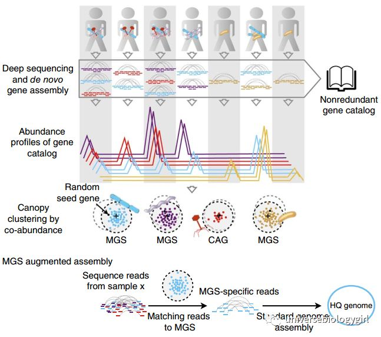

<!-- TOC -->

- [概述](#概述)
- [原理方法](#原理方法)
        - [1. 根据核酸组成信息来进行binning：k-mer frequencies](#1-根据核酸组成信息来进行binningk-mer-frequencies)
        - [2. 根据丰度信息来进行binning](#2-根据丰度信息来进行binning)
        - [3. 同时依据核酸组成和丰度变化信息](#3-同时依据核酸组成和丰度变化信息)
        - [4. 根据基因组甲基化模式](#4-根据基因组甲基化模式)
        - [基于reads binning](#基于reads-binning)
        - [基于genes binning](#基于genes-binning)
        - [基于contigs binning](#基于contigs-binning)
- [Binning工具](#binning工具)
    - [DAS_Tool](#das_tool)
    - [MetaWRAP](#metawrap)
    - [MetaBAT2](#metabat2)
    - [maxBin](#maxbin)
    - [CONCOCT](#concoct)
    - [CheckM（https://ecogenomics.github.io/CheckM/](#checkmhttpsecogenomicsgithubiocheckm)

<!-- /TOC -->

## 概述
宏基因组分箱（Binning）是将宏基因组测序得到的混合了不同微生物的序列reads或序列组装得到的contigs或scaffolds按物种分开归类的过程。与把预测到的基因与各种数据库进行比对相比，对宏基因组数据进行Binning是一个较为“高大上”的操作，该技术有助于获得不可培养微生物的全基因组序列，获得新物种的基因组序列和功能，预测未知物种的培养方法等。

----
## 原理方法
在宏基因组中分离单基因组，可利用序列特征或序列组装信息，常见的可用信息主要有以下几种：

1. 根据核酸使用频率（通常是四核苷酸频率）、GC含量和必需的单拷贝基因等基因组特征；
2. 根据contig序列的覆盖度coverage信息；
3. 根据测序数据的kmer丰度信息；
4. 根据序列在不同样品的共出现规律（co-abundance patternsacross multiple samples）；
5. 将序列map到数据库的参考序列所获得的注释信息，也即物种binning。

序列特征的3种算法：

+ nucleotide composition(NC)：不同的微生物基因组有不同的TNF (tetranucleotide frequency)和GC%。
+ differential abundance(DA)：来自同一个菌株的基因在不同的样品中 ( 不同时间或不同病理程度 ) 的丰度分布模式是相似的。
+ nucleotide composition and abundance(NAC)：整合TNF矩阵和丰度矩阵 

#### 1. 根据核酸组成信息来进行binning：k-mer frequencies
依据：来自同一菌株的序列，其核酸组成是相似的

例如根据核酸使用频率（oligonucleotide frequency variations），通常是四核苷酸频率（tetranucleotide frequency），GC含量和必需的单拷贝基因等

优势：即便只有一个样品的宏基因组数据也可以进行binning，这在原理上是可操作的

不足：由于很多微生物种内各基因型之间的基因组相似性很高，想利用1个样品的宏基因组数据通过核酸组成信息进行binning，效果往往并不理想或难度很大。利用核酸组成信息进行binning，基本上只适合那些群落中物种基因型有明显核酸组成差异的，例如低GC含量和一致的寡核苷酸使用频率

#### 2. 根据丰度信息来进行binning
依据：来自同一个菌株的基因在不同的样品中 ( 不同时间或不同病理程度 ) 的丰度分布模式是相似的【PMID: 24997787】。

原因：比如，某一细菌中有两个基因，A和B，它们在该细菌基因组中的拷贝数比例为 A:B = 2:1，则不管在哪个样品中这种细菌的数量有多少，这两个基因的丰度比例总是为 2:1

优势：这种方法更有普适性，一般效果也比较好，能达到菌株的水平

不足：必须要大样本量，一般至少要50个样本以上，至少要有2个组能呈现丰度变化 ( 即不同的处理，不同的时间，疾病和健康，或者不同的采样地点等 ) ，每个组内的生物学重复也要尽量的多

对于像质粒这样的可移动遗传单元 (mobile genetic elements (MGEs))，由于其复制独立于细菌染色体，则同一种细菌的不同个体，该质粒的拷贝数可能存在差异，使得无法用丰度信息进行有效地bining

#### 3. 同时依据核酸组成和丰度变化信息
将核酸组成信息和丰度差异信息创建一个综合的距离矩阵，既能保证binning效果，也能相对节约计算资源，现在比较主流的binning软件多是同时依据核酸组成和丰度变化信息

#### 4. 根据基因组甲基化模式
依据：不同的细菌，其基因组甲基化模式不同，平均一种细菌有3种特意的甲基化 motif。MGEs (mobile genetic elements) 中含有 MTase 基因，其基因水平转移是细菌甲基化组多样性的驱动因素。虽然 MGEs 在不同个体的拷贝数不同，但是都存在，因此具有相同 MGEs 的细菌个体，其总遗传物质（包括染色体和 MGEs ）都会受到相同的MTase的作用而得到相同的甲基化模式。

根据所使用的序列数据不同，binning策略可分为三种：基于组装前的clean reads，基于组装后的contigs，基于注释的基因genes。

#### 基于reads binning
环境样本中微生物的丰度不同，其基因组kmer的期望深度也不同，根据kmer丰度可以直接对reads进行聚类，将属于不同基因组的reads分离开来。其优势是可以聚类出宏基因组中丰度非常低的物种，而且可以分离系统发育关系很近的物种。考虑到在宏基因组组装中reads利用率很低，单样品5Gb测序量情况下，环境样品组装reads利用率一般只有10%左右，肠道样品或极端环境样品组装reads利用率一般能达到30%，这样很多物种，尤其是低丰度的物种的reads没有被没有被组装出来，没有体现在contig中而被浪费，因此基于reads binning才有可能得到低丰度的物种基因组的的测序数据，在实际研究中基于reads binning的LSA（Latent Strain Analysis）方法可以聚类出丰度低到0.00001%的物种，并且对同一物种中的不同菌株的敏感性很强[2]。

优势：基于reads binning的优势是可以聚类出宏基因组中丰度非常低的物种

考虑到在宏基因组组装中reads利用率很低，单样品5Gb测序量情况下，环境样品组装reads利用率一般只有10%左右，肠道样品或极端环境样品组装reads利用率一般能达到30%，这样很多物种，尤其是低丰度的物种可能没有被组装出来，没有体现在gene 或者contig 中，因此基于reads binning 才有可能得到低丰度的物种

如 Brian Cleary 等 (DOI:10.1038/nbt.3329.Detection) 利用基于 reads binning 的 latent strain analysis 可以聚类出丰度低至0.00001%的菌株。此方法虽然得到更全面的 bins，但低丰度 bins 信息依旧不完整。

#### 基于genes binning

在宏基因组做完序列组装和基因预测之后，把所有样品中预测到的基因混合在一起，去冗余得到unique genes集合，根据gene在各个样品中的丰度变化模式，计算gene之间的相关性，利用这种相关性进行聚类,binning。利用这种策略进行binning得到的bins可称为CAG（co-abundance genegroups），包含有700个以上的gene的CAG称为MGS（metagenomic species），CAG可用进行关联分析，MGS可用进行后续的单菌组装[3]。当然根据具体的聚类算法和相关性系数的不同，对genes binning得到的bins的叫法也不同，除以上外还有MLG（metagenomic linkage groups）、MGC（metagenomic clusters）和MetaOTUs（metagenomic operational taxonomicunits）等，同时，MLG, MGC, MGS和MetaOTUs物种注释的标准也是不一样的。

优势：基于gene binning的应用主要在于宏基因组关联分析（MWAS）和多组学联合分析。目前已发表的宏基因组关联分析（MWAS）和多组学联合分析文章中，宏基因组binning很多都用genes binning方法，尤其是疾病的MWAS研究中基本都用genes binning[4]。这种方法的优势是基于genes丰度变化模式进行binning可操作性比较强，过程比较简单，可复制性强，对计算机资源消耗比较低。

#### 基于contigs binning
在宏基因组做完序列组装之后，将所有reads序列map到contigs上获得contig覆盖率，再综合GC含量、核算组成等信息对contig进行聚类，将属于不同基因组的contig序列分开。contig binning目前应用十分广泛，最常用的就是用于组装单物种基因组，目前已经有多种基于contig binning的软件[1]，对于丰度较高的物种contigs binning效果较好，但是目前也有些缺陷或者说还有很多可提升的空间，例如对核酸组成信息的利用，开发得就不够充分，四碱基使用频率因简单而被广泛使用和接受，但现在已有研究表明k-mer丰度信息也是很好的种系特征，同时越长的k-mer含有越多的信息，还有基因和参考基因组间的同源关系也是有价值的种系信号，但这些都还没有被自动化的binning软件整合。

由于核酸组成和物种丰度变化模式在越长的序列中越显著和稳定，基于contig binning效果可能更好

----
## Binning工具

| 分箱工具             | 发表杂志                | 发表时间 |
| ---------------- | ------------------- | ---- |
| PhyloPythiaS     | Plos One            | 2012 |
| MetaCluster 5    | Bioinformatics      | 2012 |
| GroopM           | PeerJ               | 2014 |
| coNCOCT          | Nature Methods      | 2014 |
| Anvi'o           | PeerJ               | 2015 |
| VizBin           | Microbiome          | 2015 |
| MaxBin 2         | Bioinformatics      | 2015 |
| MetaBAT          | PeerJ               | 2015 |
| CoMet            | BMC Bioinformatics  | 2017 |
| coCACOLA         | Bioinformatics      | 2017 |
| Binning\_refiner | Bioinformatics      | 2017 |
| DAS\_Tool        | Nature Microbiology | 2018 |
| MetaWRAP         | Microbiome          | 2018 |
| MetaBAT2         | PeerJ               | 2019 |
| ProxiMeta        | Genome Biology      | 2019 |

### DAS_Tool
2018年，加利福利亚大学的研究人员在Nature Microbiology上 发表了题为“Recovery of genomes from metagenomes via a dereplication, aggregation and scoring strategy”的文章，即利用去重、聚合和评分的策略从宏基因组中恢复基因组，通过整合多个算法设计出了新的Binning软件—DAS_ tool。在本研究中，作者依次将5种常用的Binning工具（ABAWACA、CONCOCT、Maxbin、MetaBAT、ESOM）和开发的DAS_ tool应用于不同复杂程度的模拟微生物群落和环境微生物群落，与ABAWACA、CONCOCT、MaxBin、MetaBAT以及ESOM等单一工具相比，该工具的各项Binning指数要明显优于这些工具，Binning结果更完整、更准确。

具体步骤：1）DAS工具的输入文件包括拼接结果中的scaffolds序列和来自不同binning工具得到的bins集合；2）预测每个bins中scaffold的单拷贝基因，并进行打分；3）在所有结果中，将相同的bins进行合并，作为这个bins的备选集合；4）迭代选择高分bins，并更新集合剩余部分候选bins的分数。最终输出包括来自不同输入文件预测的非冗余高分bins。

### MetaWRAP
2018年，约翰斯·霍普金斯大学的研究人员在Microbiome上发表了题为“MetaWRAP—a flexible pipeline for genome-resolved metagenomic data analysis”的文章，即MetaWRAP—灵活的宏基因组数据挖掘单菌基因组分析流程。该工具不仅整合3个主流分箱工具（MetaBAT、CONCOCT、MaxBin 2），还整合了质控、拼接、分箱、提纯、评估、物种注释、丰度估计、功能注释等多种功能。此外，MetaWRAP还可实现宏基因组分析从原始数据到结果可视化的全部流程，同时也可灵活使用各个模块独立分析，弹性多变。与MetaBAT、CONCOCT、MaxBin 2、DAS_tool、Binning-refiner相比，分箱结果更佳。总之，MetaWRAP可轻松解决分箱中可能遇到的绝大多数问题，然而，其存在耗时长、计算成本高、没有独立验证等缺点。

### MetaBAT2
2015年发布的MetaBAT是近几年所有分箱工具中最受欢迎的工具之一（引用达470+）。2019年，美国能源部联合基因组研究所和中国科学技术大学等研究人员在PeerJ上发表了题为“MetaBAT 2: an adaptive binning algorithm for robust and efficient genome reconstruction from metagenome assemblies”的文章。与MetaBAT、CONCOCT、MaxBin、COCACOLA及DAS_ tool等相比，MetaBAT 2在Bin数量、Bin纯度、完成度、精确度以及效率等方面均表现出色，近年多篇发表于Cell、Nature Biotechnology及Genome Biology的高水平文章都引用了MetaBAT 2。
MetaBat 2的使用：1）输入为组装的contig序列以及将二代reads比对到contig序列上的比对文件(bam格式)。2）比对可采用BWA或Bowtie 2，比对完生成sample.sort.bam文件，再采用MetaBat 2做Binning。3）运行完会生成assembly_contig.fasta.metabat-bins目录。
https://mp.weixin.qq.com/s/V6bQJPrUiYUuWL6Olv9O5Q

### maxBin

### CONCOCT

### CheckM（https://ecogenomics.github.io/CheckM/
https://mp.weixin.qq.com/s/2cggAwQbRRWG9WfjEj0t9Q

总结

关于宏基因组Binning，有无数的软件和数据库，DAS_tool和MetaWRAP集成了多个分箱工具，可获得更优的分箱结果、更少的污染和更完整的基因组。此外，这些流程还提供了有用的脚本，用于对箱进行评估和可视化。然而，MetaWRAP、DAS_tool虽然表现突出，但时间成本非常高，在大样本大数据的研究中行不通。在单样本分箱中MetaBAT2表现最佳，研究人员可根据自己的实际情况选择合适的Binning工具。