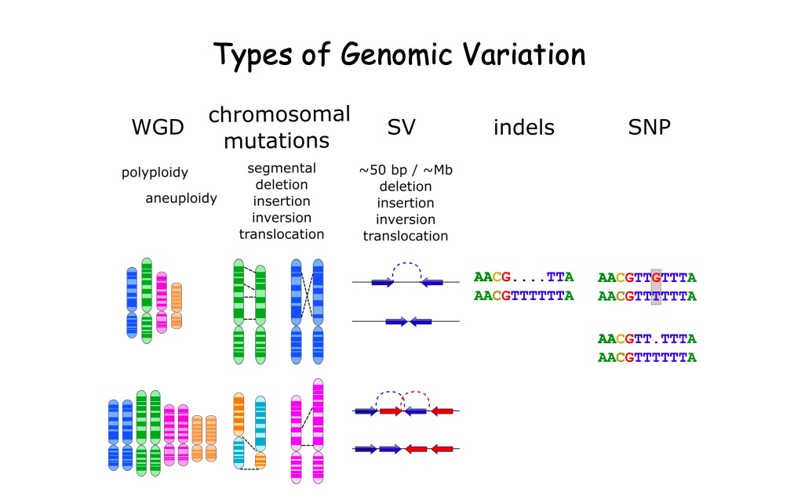
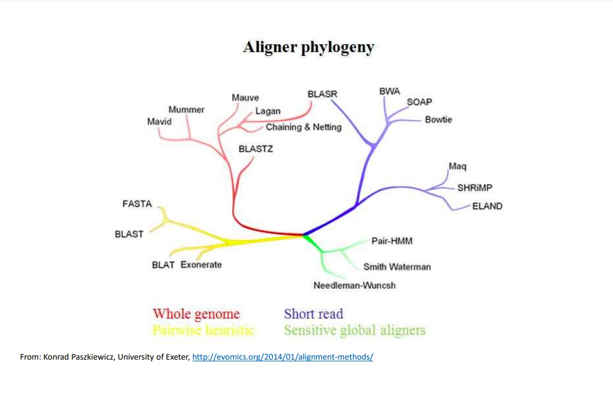

## 学习资料

Tumor	heterogeneity	is	based	on	polygenomic
popula*ons,	segregated	or	intermixed,	due	to	ongoing	
subclonal	evolu*on.	

> https://www.ncbi.nlm.nih.gov/books/NBK20362/

> http://petang.cgu.edu.tw/Bioinfomatics/Lecture/0_HTS/HTS2019/Whole_Exome_Sequencing_Analysis_%E5%BC%B5%E8%80%81%E5%B8%AB_0426/LECTURE/20190426_Whole_Exome_Sequencing_Analysis.pdf

