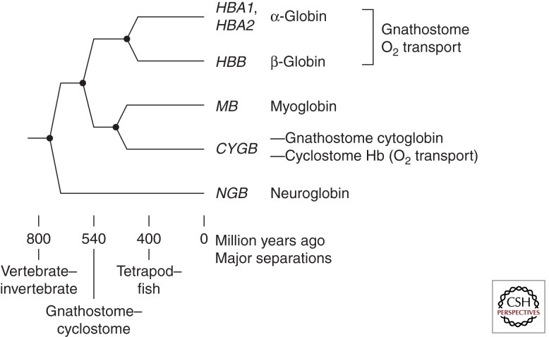

[Model for evolution of vertebrate globin genes.](https://www.ncbi.nlm.nih.gov/pmc/articles/PMC3543078/)

```
#HBA1
chr16	HAVANA	gene	226679	227521	.	+	.	gene_id "ENSG00000206172.8_5"; gene_type "protein_coding"; gene_name "HBA1"; level 2; hgnc_id "HGNC:4823"; havana_gene "OTTHUMG00000060138.3_5"; remap_status "full_contig"; remap_num_mappings 1; remap_target_status "overlap";

ENST00000320868.9_2
ENST00000472694.1_1
ENST00000397797.1_1
ENST00000487791.1_1


#HBA2
chr16	HAVANA	gene	222875	223709	.	+	.	gene_id "ENSG00000188536.13_6"; gene_type "protein_coding"; gene_name "HBA2"; level 2; hgnc_id "HGNC:4824"; havana_gene "OTTHUMG00000059924.3_6"; remap_status "full_contig"; remap_num_mappings 1; remap_target_status "overlap";
ENST00000251595.11_3
ENST00000397806.1_1
ENST00000482565.1_1
ENST00000484216.1_2


#HBB
chr11	HAVANA	gene	5246694	5250625	.	-	.	gene_id "ENSG00000244734.4_7"; gene_type "protein_coding"; gene_name "HBB"; level 2; hgnc_id "HGNC:4827"; havana_gene "OTTHUMG00000066678.8_7"; remap_status "full_contig"; remap_num_mappings 1; remap_target_status "overlap";
ENST00000335295.4_5
ENST00000647020.1_3
ENST00000633227.1_3
ENST00000475226.1_3
ENST00000485743.1_4
ENST00000380315.2_4

```