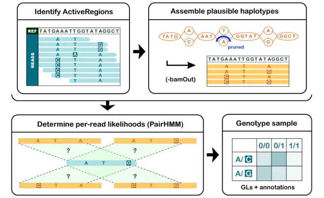
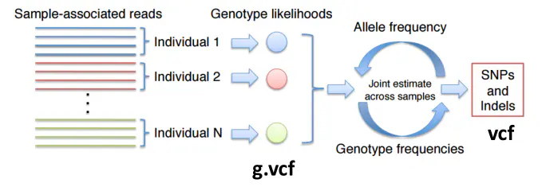

# BQSR
## why
碱基质量分数就是指测序fastq结果的碱基质量值。
校正的前提是测序错误碱基的可能性远远大于基因组变异的概率，或者说物种基因变异很小；把所有与参考基因组不一致的碱基视为测序错误导致（可排除已知的变异记录）。
然后根据得到的碱基质量分数，进行转换得到碱基数目，比如说100个质量分数为20(10的-2次方)的碱基=1个错误碱基。
最后根据一定的算法/模型，进行质量分数的校正（如下图），具体可深入了解。
所以这里强调是碱基质量分数校准这一步适合于变异概率很少，并且有已知参考变异数据库的物种基因组。因此这一步基本上只适合人类的测序数据。

## how
分为两步，首先BaseRecalibrator利用已有的snp数据库，建立相关性模型，产生重校准表( recalibration table)，输入已知的变异位点数据库，用于屏蔽那些不需要重校准的部分。
然后ApplyBQSR根据上一步得到的模型对原始碱基质量分数进行调整，且只会调整非已知SNP区域。

# gvcf

当前探测SNV的统计方法:

+ 通过计算等位基因（counting alleles）
+ 通过二项分布（ binomial distribution）
+ 通过泊松二项分布（Poisson-binomial distribution）
+ 通过贝叶斯方法（Bayesian）
https://mp.weixin.qq.com/s?__biz=MzI5MzE4MTAyNQ==&mid=2247483755&idx=1&sn=20f02265dbb8e786a53e57da763f4108&chksm=ec774265db00cb737d30de7d043dfa08a13b9f6bc8674166f0eadf873ed79b1e88adc8232bcf&mpshare=1&scene=23&srcid=0606XkT2hlh9hAEvj9J24NrO&sharer_sharetime=1622984770093&sharer_shareid=c515a8361d8a8d8b4a39f0c018078961%23rd

