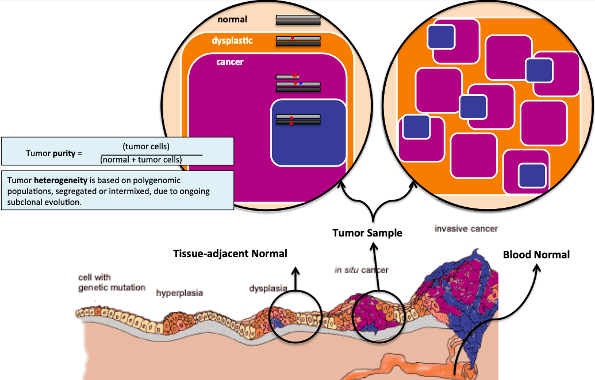
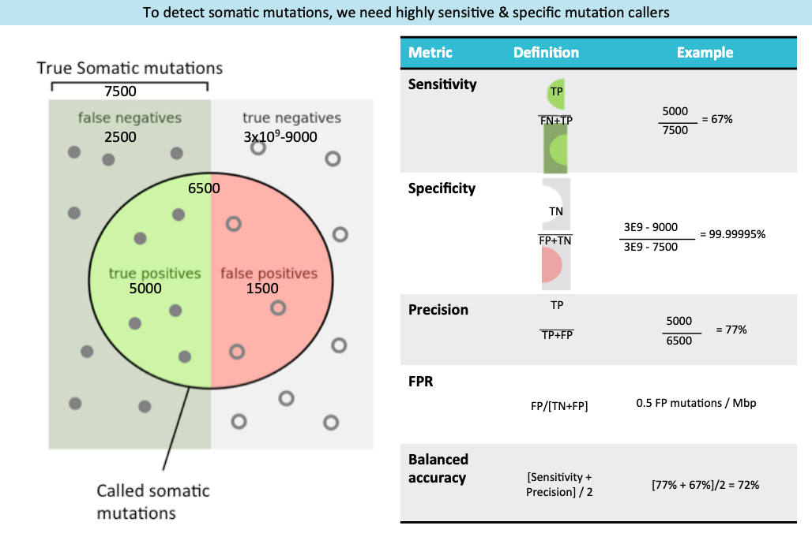
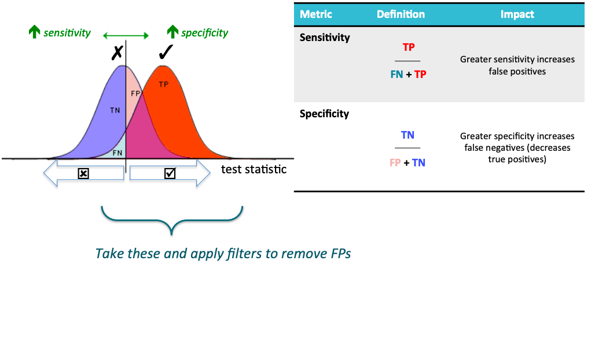
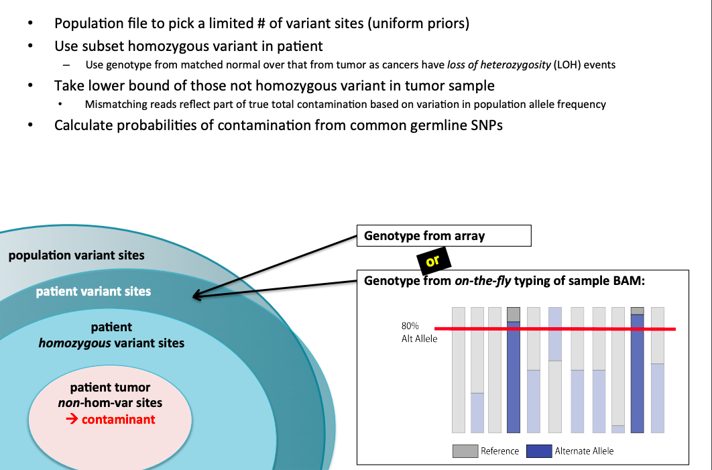
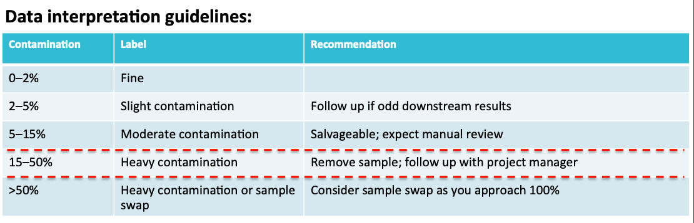
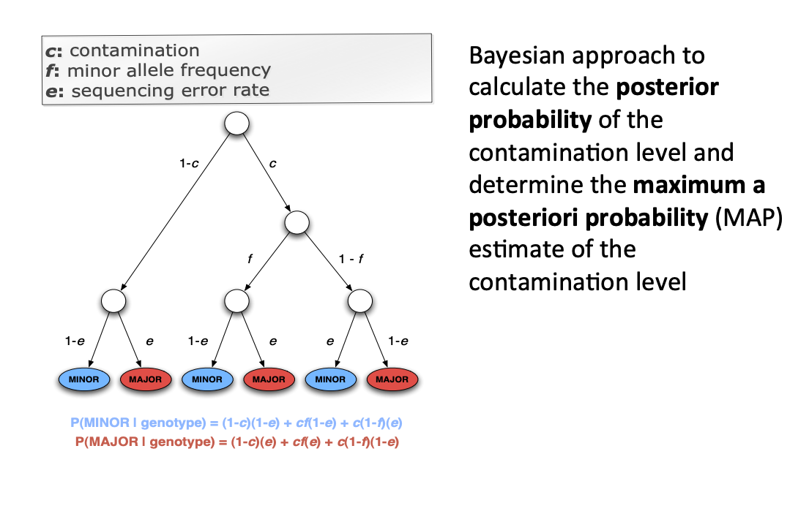

<!-- TOC -->

- [pre](#pre)
- [Call](#call)
  - [](#)
  - [Active Regions](#active-regions)
- [PON](#pon)
- [MuTect2 filters](#mutect2-filters)
  - [](#-1)
  - [FILTER and FORMAT](#filter-and-format)
    - [mutect2的AF（AF calculation in Mutect2）](#mutect2的afaf-calculation-in-mutect2)
  - [Contamination 样本间污染评估](#contamination-样本间污染评估)
    - [ContEst（gatk3）](#contestgatk3)
    - [](#-2)
      - [getpileupsummaries](#getpileupsummaries)

<!-- /TOC -->


# pre




# Call
The thresholds used by MuTect2 to consider a variant as being **real and somatic** (leading to the annotation “PASS”)：
+ are by default TLOD > 6.3 and NLOD > 2.2. 
+ For dbSNP variants, a higher NLOD threshold of 5.5 is used
+ For dbSNP and COSMIC database variants, NLOD > 2.2.  

## 
与HaplotypeCaller一样，Mutect2通过在active region中对单倍型（决定同一性状的紧密连锁的基因构成的基因型）进行局部重新组装来判断SNV和InDel。 也就是说，当Mutect2遇到显示体细胞变异迹象的active region时，它会丢弃现有的映射信息，并完全重新组装该区域中的reads，以生成候选变异单倍型。 像HaplotypeCaller一样，Mutect2然后通过Pair-HMM算法将每个reads与每个单倍型对齐，以获得似然矩阵。 最后，它应用贝叶斯体细胞似然模型来获得体细胞变异与测序错误的对数比。

## Active Regions
+ Modified	sta*s*c	threshold	for	soma*c	scenario	uses	LOD	≥	4.0	in	favor	of	
the	reference	model		
+ Reads	differentially	filtered:	
  + Tumor	is	strict:	MAPQ	≥	Q20;	discard	discrepant	overlapping	reads	
  + Normal	is	permissive:	MAPQ	≥	Q0;	keep	alternate	read	from	discrepant	
overlapping	reads	
# PON
+ Then, variants identified by MuTect2 in at least two normal samples were compiled together into one PoN VCF file.

# MuTect2 filters
## 

##  FILTER and FORMAT
Filter | Threshold | Key | Explanation | Version
--- | ---| --- | --- | ---
t_lod | | | | 
clustered_events | max-events-in-region | ECNT | mutations sharing an assembly region |
duplicate_evidence | unique-alt-read-count | - | unique insert start/end pairs of alt reads |
multiallelic | max-alt-alleles-count | - | passing alt alleles at a site | 
base_quality | min-median-base-quality | MBQ | median base quality of alt reads |
mapping quality | min-median-mapping-quality | MMQ | median mapping quality of alt reads | 
fragment length | max-median-fragment-length-difference | - | difference of alt and ref reads’ median fragment lengths |
read position | min-median-read-position |  | median distance of alt mutations from end of read  |
panel of normals | panel-of-normals |  | presence in panel of normals | 


---
> base_quality
+ base_quality(alt的碱基质量值的中位数)标签出现在了filter列，它在call的时候估算的参数为MBQ=0，而我们设置的min-median-base-quality参数为20，因为0<20,所以base_quality的标签出现在了tag里边。
> clustered_events
+ 活动区域发生多次突变，且突变位点距离在3bp及以上。(为什么大于3bp呢？因为2个的话很有可能是可以合并的同一个。)
+ max-events-in-region is the maximum allowable number of called variants co-occurring in a single assembly region. If the number of called variants exceeds this they will all be filtered.
+ Variants coming from an assembly region with more than this many events are filtered.
> germline_risk
+ 该位点是germline event的最大后验概率， 根据模型计算P_GERMLINE值，大于设定值就会添加germline_risk的标签。
+ Maximum posterior probability that an allele is a germline variant.
+ max-germline-posterior is the maximum posterior probability, as determined by the above germline probability model, that a variant is a germline event.
> artifact_in_normal
+ 当tumor和control成对call的时候，会对control组的normal样本单独设置对数比阈值，该阈值越高，过滤标准越严格，因为认为normal全部是假阳性，所以会设置较低的LOD值。
+ normal-artifact-lod is the maximum acceptable likelihood of an allele in the normal by the somatic likelihoods model. This is different from the normal likelihood that goes into the germline model, which makes a diploid assumption. Here we compute the normal likelihood as if it were a tumor in order to detect artifacts.
> strict_strand
+ 表示alt等位基因在两个方向均为显示（Evidence for alt allele is not represented in both directions）
> strand_artifact
+ 链偏移，表示仅来自于一条read方向的alt等位基因（Evidence for alt allele comes from one read direction only）
+ max-strand-artifact-probability is the posterior probability of a strand artifact, as determined by the model described above, required to apply the strand artifact filter.
+ 链偏好性的后验概率，根据计算的SA_POST_PROB，大于设定值则过滤；还有第二层补充条件；
+ This is necessary but not sufficient – we also require the estimated max a posteriori allele fraction to be less than min-strand-artifact-allele-fraction.The second condition prevents filtering real variants that also have significant strand bias, i.e. a true variant that also has some artifactual reads.
+ 如果链偏好性的最大后验概率比SA_MAP_AF（MAP estimates of allele fraction given
变异频率的最大后验概率）值小，会保留，以防将真阳性位点加上strand_artifact标签。
+ Filter a variant if the probability of strand artifact exceeds this number
```
Generally, we find the likelihood of strand bias is 1/10,000. And for example in your first PASS variant example with SB=8,17,5,0: 5,0 or 0,5 has a 1/16 likelihood of occurring, which is much more probable than the 1/10,000.
```
> mapping_quality
> fragment_length
+ tumor-normal成对call才会出现的
> read_position
+ 位点到read末尾的最近读取端的最小中值长度。DENELS的位置是由读数末尾最远的一端测量的。
> weak_evidence：表示突变为达到阈值（Mutation does not meet likelihood threshold）
> t_lod
+ tumor-lod is the minimum likelihood of an allele as determined by the somatic likelihoods model required to pass.似然模型中认为该点是体细胞变异的最小似然比，默认是5.3,若小于5.3则添加tlod标签。


###
### mutect2的AF（AF calculation in Mutect2）
> One possibility is that there are reads supporting one or the other allele that aren't being counted in the AD values because they're not considered informative for the purposes of the genotyping, but they are being counted in the allele fraction estimation. Another is that there are reads supporting some other allele that is not called, but is present in some minor fraction, and is therefore counted in the AF estimation as well. In both cases you would see them if you look at read data in the bam file (preferably the "bamout" that can be generated as documented for HaplotypeCaller).

> Because the DP in the INFO field is unfiltered and the DP in the FORMAT field is filtered, you know none of the reads were filtered out by the engine's built-in read filters.

https://gatk.broadinstitute.org/hc/en-us/articles/360035532252?id=6005

https://gatk.broadinstitute.org/hc/en-us/community/posts/360057830232-Wrong-Calculation-of-DP-AD-AF

https://github.com/broadinstitute/gatk/issues/6067

## Contamination 样本间污染评估
This tool borrows from ContEst by Cibulskis et al the idea of estimating contamination from ref reads at hom alt sites. However, ContEst uses a probabilistic model that assumes a diploid genotype with no copy number variation and independent contaminating reads. That is, ContEst assumes that each contaminating read is drawn randomly and independently from a different human. This tool uses a simpler estimate of contamination that relaxes these assumptions. In particular, it works in the presence of copy number variations and with an arbitrary number of contaminating samples. In addition, this tool is designed to work well with no matched normal data. However, one can run GetPileupSummaries on a matched normal bam file and input the result to this tool.

### ContEst（gatk3） 
+ Low	levels	of	cross-sample	contamina*on	is	common	
+ Contaminant	sites	vary	from	patient	homozygous	sites	



Three major classes of DNA contamination exist: 
+ **cross-individual**
+ within-individual
+ cross-species

```
This example will produce an output file which should look like the following:

name    population      population_fit  contamination   confidence_interval_95_width    confidence_interval_95_low      confidence_interval_95_high     sites
META    CEU     n/a     8.2     0.9     7.7     8.6     733

Here we can see that ContEst found that the file was approximately 8.2 percent contaminated, with a 95% confidence interval from 7.7 to 8.6. 
```
结论：
ContEst produces accurate estimates even with average coverage <5×.

### 
+ 对肿瘤BAM运行GetPileupSummaries以总结tumor样本在已知变异位点集上的reads支持情况。
+ 如果存在配对样本，会对正常样本运行GetPileupSummaries以总结tumor样本在已知变异位点集上的reads支持情况。
+ 对已知变异位点集采用CalculateContamination来估计污染比例，segments.table文件的最后一列用来判断突变位点是否为样本污的位点。

需要指出几点：在默认参数中，此工具只考虑样本中纯和备用位点：等位基因频率范围在0.01-0.2（相关参数是--minimum-population-allele-frequency和--maximum-population-allele-frequency）,这样设计的理论基础是：如果某个纯和备用位点的人群频率较低，当发生样本交叉污染时，我们更容易观测到ref allele（或更常见allele）的出现，这样我们可以更准确地定量污染比例。


#### getpileupsummaries
```
#<METADATA>SAMPLE=AG945-2
contig	position	ref_count	alt_count	other_alt_count	allele_frequency
chr1	17365	3	2	0	0.136
chr1	17385	8	0	0	0.122
chr1	69761	0	0	0	0.113
```
#This produces a six-column table as shown. The `alt_count` is the count of reads that support the ALT allele in the germline resource. The `allele_frequency` corresponds to that given in the germline resource. Counts for `other_alt_count` refer to reads that support all other alleles.

----
## Mutect2 bamout reports fewer reads than VCF AD
#### Ref_Info
https://gatk.broadinstitute.org/hc/en-us/community/posts/360060670091--GATK-v4-1-6-0-Mutect2-bamout-reports-fewer-reads-than-VCF-AD