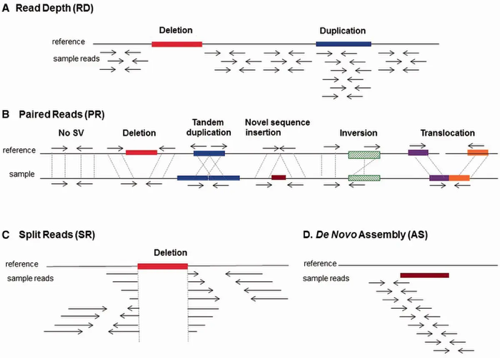
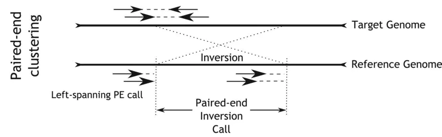

<!-- TOC -->

- [1. 结构变异/重排类型](#1-结构变异重排类型)
    - [1.1. 染色体倒位（Inversion）](#11-染色体倒位inversion)
            - [1.1.0.1. Ref](#1101-ref)
    - [1.2. 插入片段](#12-插入片段)
- [2. VCF](#2-vcf)
    - [2.1. 染色体易位（Translocation）](#21-染色体易位translocation)
- [3. 分析方法](#3-分析方法)
    - [3.1. 过滤](#31-过滤)
    - [3.2. 可视化](#32-可视化)
    - [3.3. benchmark data](#33-benchmark-data)
    - [3.4.](#34)
    - [3.5. 数据模拟](#35-数据模拟)

<!-- /TOC -->

Most 1000 Genomes SVs are deletions because these are easier to detect in low coverage sequencing data.[https://www.nature.com/articles/nature15394]

https://www.ncbi.nlm.nih.gov/pmc/articles/PMC5382922/


# 1. 结构变异/重排类型
+ 串联重复（Tandem Duplicate）
+ 易位（Translocation）
+ 缺失（Deletion)
+ Insertions
+ 倒位 (Inversion)
+ Inter-chromosomal rearrangements
+ 融合基因是有染色体重排而产生的，包括染色体的易位，插入，颠倒，缺失（非平衡重排）。


## 1.1. 染色体倒位（Inversion）

#### 1.1.0.1. Ref
https://zhuanlan.zhihu.com/p/87408242
https://www.jianshu.com/p/53534f7c030f

## 1.2. 插入片段
Differences between insert size	and inferred insert size can be	used to	detect evidence of structural variants






> Rausch T, et al. (2012) Bioinformatics


# 2. VCF
[](https://samtools.github.io/hts-specs/VCFv4.3.pdf) 中有两种描述方法
1. SV types, i.e. insertions, deletions, inversions, translocations, etc. 
2. breakend notations, often labelled with SVTYPE=BND

5.4 Specifying complex rearrangements with breakends

An arbitrary rearrangement event can be summarized as a set of novel adjacencies. Each adjacency ties together 2 breakends. The two breakends at either end of a novel adjacency are called mates.
There is one line of VCF (i.e. one record) for each of the two breakends in a novel adjacency. A breakend record is identified with the tag “SYTYPE=BND” in the INFO field. The **REF field** of a breakend record indicates a base or sequence <font color="red">s</font> of bases beginning at position POS, as in all VCF records. The ALT field of a breakend record indicates a replacement for s. This “breakend replacement” has three parts:

1. The string t that replaces places s. The string t may be an extended version of s if some novel bases are inserted
during the formation of the novel adjacency.
2. The position p of the mate breakend, indicated by a string of the form “chr:pos”. This is the location of the
first mapped base in the piece being joined at this novel adjacency.
3. The direction that the joined sequence continues in, starting from p. This is indicated by the orientation of
square brackets surrounding p.
These 3 elements are combined in 4 possible ways to create the ALT. In each of the 4 cases, the assertion is that **s** is replaced with t, and then some piece starting at position p is joined to t. The cases are:

```
REF ALT Meaning
s t[p[ piece extending to the right of p is joined after t
s t]p] reverse comp piece extending left of p is joined after t
s ]p]t piece extending to the left of p is joined before t
s [p[t reverse comp piece extending right of p is joined before t
```
```
#CHROM  POS     ID      REF     ALT     QUAL    FILTER  INFO
2       321681  bnd     W       G       G]17:198982]    6       PASS    SVTYPE=BND
2       321682  bnd     V       T       ]13:123456]T    6       PASS    SVTYPE=BND
13      123456  bnd     U       C       C[2:321682[     6       PASS    SVTYPE=BND
13      123457  bnd     X       A       [17:198983[A    6       PASS    SVTYPE=BND
17      198982  bnd     Y       A       A]2:321681]     6       PASS    SVTYPE=BND
17      198983  bnd     Z       C       [13:123457[C    6       PASS    SVTYPE=BND

==> 
##如event2表现为染色体易位

#CHROM  POS     ID      REF     ALT     QUAL    FILTER  INFO
#event1
2       321681  bnd     W       G       G]17:198982]    6       PASS    SVTYPE=BND
17      198982  bnd     Y       A       A]2:321681]     6       PASS    SVTYPE=BND
#event2
2       321682  bnd     V       T       ]13:123456]T    6       PASS    SVTYPE=BND
13      123456  bnd     U       C       C[2:321682[     6       PASS    SVTYPE=BND
#event3
13      123457  bnd     X       A       [17:198983[A    6       PASS    SVTYPE=BND
17      198983  bnd     Z       C       [13:123457[C    6       PASS    SVTYPE=BND
```


```
14      38454918        5956_2  N       ]8:9174263]N    25.35   .       SVTYPE=BND;STRANDS=-+:4;CIPOS=-9,8;CIEND=-9,8;CIPOS95=0,0;CIEND95=0,0
8       9174263 5956_1  N       N[14:38454918[  25.35   .       SVTYPE=BND;STRANDS=+-:4;CIPOS=-9,8;CIEND=-9,8;CIPOS95=0,0;CIEND95=0,0;MATEID=....
```

## 2.1. 染色体易位（Translocation）

BND即breakend的缩写。在CHROM、POS中展示第一个断点位置，在ALT中展示第二个断点位置，例如：A]10:115172011]、[12:70547434[C。通过比较第一个断点和第二个断点的染色体，可以判断是染色体间易位还是染色体内易位（这里为了描述方便，使用了“第一个断点”、“第二个断点”的描述方式，事实上两个断点并没有顺序之分）。
值得注意的是，ALT中方括号的方向在判断融合基因中有重要的作用。...]...]指易位序列在第一个断点位置的3'端，[...[...指易位序列在第一个断点位置的5‘端.

Manta会用两条记录（也就是两个BND）来描述一个易位产生的新的连接点，这两条记录互为MATE关系，在FORMATA的MATEID标签可找到另一条记录的ID。如下，
```
CHROM  POS     ID      REF     ALT     QUAL    FILTER  INFO    FORMAT  Sample1
# example1
1       180903258       MantaBND:13113:0:1:0:0:0:0      C       C[3:48537167[   314     PASS    SVTYPE=BND;MATEID=MantaBND:13113:0:1:0:0:0:1;CIPOS=0,3;HOMLEN=3;HOMSEQ=GCA;BND_DEPTH=30;MATE_BND_DEPTH=31  GT:FT:GQ:PL:PR:SR       0/1:PASS:314:364,0,423:20,9:24,6
3       48537167        MantaBND:13113:0:1:0:0:0:1      G       ]1:180903258]G  314     PASS    SVTYPE=BND;MATEID=MantaBND:13113:0:1:0:0:0:0;CIPOS=0,3;HOMLEN=3;HOMSEQ=CAC;BND_DEPTH=31;MATE_BND_DEPTH=30  GT:FT:GQ:PL:PR:SR       0/1:PASS:314:364,0,423:20,9:24,6
# example2
12      34017350        MantaBND:114233:0:1:0:0:0:0     C       C]13:48856953]  58      PASS    SVTYPE=BND;MATEID=MantaBND:114233:0:1:0:0:0:1;IMPRECISE;CIPOS=-318,319;BND_DEPTH=35;MATE_BND_DEPTH=34      GT:FT:GQ:PL:PR  0/1:PASS:58:108,0,286:20,9
13      48856953        MantaBND:114233:0:1:0:0:0:1     A       A]12:34017350]  58      PASS    SVTYPE=BND;MATEID=MantaBND:114233:0:1:0:0:0:0;IMPRECISE;CIPOS=-287,288;BND_DEPTH=34;MATE_BND_DEPTH=35      GT:FT:GQ:PL:PR  0/1:PASS:58:108,0,286:20,9
```

染色体片段在易位的过程中，可能会平移并连接到另一段染色体上(见下图 variant a），也可能翻转之后再连接到另一段染色体上（见下图 variant b）。具体看上面的两个例子，其中example1的两条记录ALT中的方括号方向不一样，它对应的是variant a这种情况；example2的两条记录中方括号方向一致，对应的是variant b这种情况。


# 3. 分析方法

## 3.1. 过滤
1. raw counts of paired and split reads supporting each allele.  The split read counts will not always be available because some calls will be imprecise, so the paired read count (SAMPLE/PR), might be the best starting point.


https://www.jianshu.com/p/a3f73991390d
https://www.jianshu.com/p/4c8e109f0e6a

 + low sequencing complexity (e.g. repetitive sequences，sequencing biases（GC-content bias and homopolymers)）
 + regions of high sequence similarity (e.g. segmental-duplicated regions). 

## 3.2. 可视化
1. To highlight the abnormal paired-ends please right click in IGV on the BAM file and activate 'View as pairs'.
2. In the same menu, please open 'Color alignments by' and then switch to "pair orientation' for inversions and duplications.
3. For deletions, you want to color the alignments by "insert size".


## 3.3. benchmark data
https://wabi-wiki.scilifelab.se/display/SHGATG/Structural+variation+calling

## 3.4.  
http://www.mi.fu-berlin.de/wiki/pub/ABI/GenomicsLecture10Materials/structural-variation.pdf

## 3.5. 数据模拟
https://github.com/joannahard/SV_imputation
https://github.com/GregoryFaust/SVsim

http://schatz-lab.org/publications/bcorganoid/