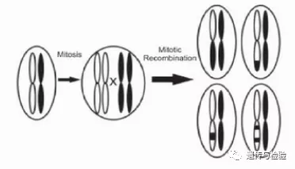
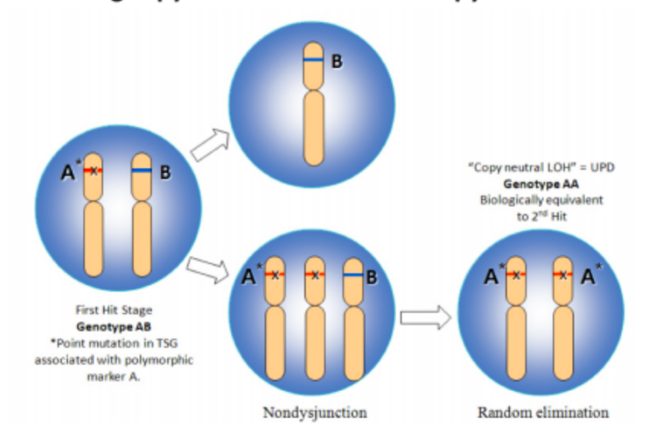
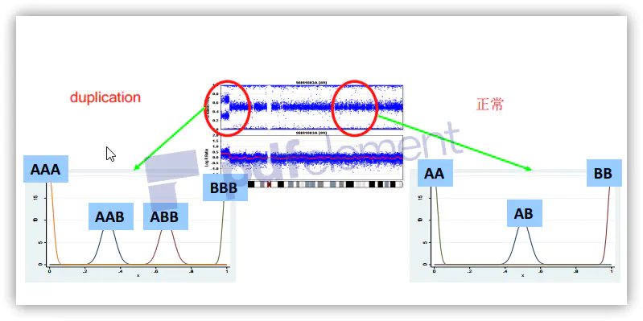
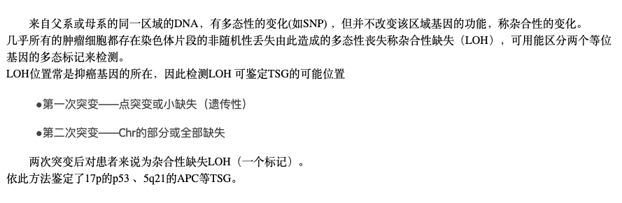

# LOH

LOH, loss of heterozygosity, OH是基于**两个等位基因功能层面**说的。与**纯合子无任何关联**！

One inherited dysfunctional TSG is not oncogenic. The 2nd wild type allele must go. 

**LOH**: Usually the 2nd wild type allele is deleted and now only one dysfunctional gene exist. This refers to loss of heterozygosity. 

**cnLOH(copy neutral LOH)**: Sometimes, the second wild type allele is lost and the dysfunctional one duplicates. Two dysfunctional are oncogenic.This is called copy neutral loss of heterozygosity. 虽然LOH了但是这个剩下来的allele会补齐丢失的那个allele应有的拷贝数 所以拷贝数是正常

Once in a while a phenomenon of gene conversion somewhat like homologous recombination leads to the wild type allele being converted into dysfunctional gene. This too is copy number neutral LOH. Epigenetic silencing of the wild allele has same functional effect as of biallelic gene loss but is not called LOH because it is not amenable to detection by methods employed to detect LOH.

LOH, in its broadest sense, simply says that a locus for which a cell is heterozygous, meaning that the 2 parental alleles are distinguishable, becomes homozygous. This is often seen in cancer, where a locus that is heterozygous in a normal cell becomes homozygous in a cancer cell derived from this normal cell. The important issue is how does this happen and what does it mean. By far, the most frequent mechanism is a cell cycle error where a chromosome (let us say it is the paternal allele) gets duplicated as a result of this error, leading to transient triploidy, followed by loss of one of the 3 chromosomes. If the chromosome that gets lost is not the one that was duplicated (i.e.: the maternal allele), then you get loss of that allele resulting in loss of heterozygosity. An important point is that there is no net loss of DNA in that process. One parental allele is lost, but the other is duplicated so you end up with a pair of 2 chromosomes, which is what you started with. Other mechanisms include deletions or other chromosome rearrangements, but the one that I explained above is the most important, as evidenced by the fact that loss of heterozygosity is usually not associated with loss of any genetic material. This is an important mechanism of tumor suppressor gene inactivation, as it represents the second hit in Knudsen's two-hit hypothesis for tumor suppressor inactivation.

sporadic cancer
hereditary cancer

uniparental disomy (UPD)

https://bitbucket.org/mcgranahanlab/loh

## Loss of heterozygosity (LOH) 
Loss of heterozygosity (LOH) is a gross chromosomal event that results in loss of the entire gene and the surrounding chromosomal region.

The loss of heterozygosity is a common occurrence in cancer, where it indicates the absence of a functional tumor suppressor gene in the lost region. However, many people remain healthy with such a loss, because there still is one functional gene left on the other chromosome of the chromosome pair. The remaining copy of the tumor suppressor gene can be inactivated by a point mutation, leaving no tumor suppressor gene to protect the body. Loss of heterozygosity does not imply a homozygous state (which would require the presence of two identical alleles in the cell).
Most diploid cells, for example human somatic cells, contain two copies of the genome, one from each parent (chromosome pair); each copy contains approximately 3 billion bases (adenine (A), guanine (G), cytosine (C) or thymine  (T)). For the majority of positions in the genome the base present is  consistent between individuals, however a small percentage may contain  different bases (usually one of two; for instance, ‘A’ or ‘G’) and these  positions are called ‘single nucleotide polymorphisms’  or ‘SNPs’. When the genomic copies derived from each parent have  different bases for these polymorphic regions (SNPs) the region is said  to be heterozygous. Most of the chromosomes within somatic cells  of individuals are paired, allowing for SNP locations to be potentially  heterozygous. However, one parental copy of a region can sometimes be  lost, which results in the region having just one copy. The single copy  cannot be heterozygous at SNP locations and therefore the region shows  loss of heterozygosity (LOH). Loss of heterozygosity due to loss of one  parental copy in a region is also called hemizygosity in that region.

https://en.wikipedia.org/wiki/Loss_of_heterozygosity#Breast_Cancer_and_BRCA1/2

##
> 观点1. 一对染色体上某一个染色体上基因失活（缺失或突变），与之配对的染色体上仍然存在。-> dominant negative
由于甲基化等原因不表达，就是变成隐性纯合状态【虽然是杂合，但是可能由于显性不表达，变成隐性】
> 观点2. 一对杂合的等位基因变成纯合状态的现象 -> LOH,杂合性丢失指的就是基因型的变化。
> 观点3. Knudson二次打击学说
第一次打击：其中一个抑癌基因发生了点突变而失去功能，通常发生在遗传性肿瘤综合征，这类人一出生就有这个突变。第二次打击：LOH，比如RB1,而其中的机制并不是简单的deletion，而是有丝分裂重组，基因转变或者copy-LOH(拷贝数代偿LOH,即拷贝数不发生变化）无论哪种机制导致LOH，最终都是使剩下的那个抑癌基因也失去了功能，这类病人最终发生肿瘤。

成瘤未必需要杂合性丢失，比如一些kras的突变，杂合突变即可成瘤。相反，p53的纯合突变也未必成瘤，还需要再次突变。

**导致了Hemizygous **

# UPD
**“单亲二体型”**，也就是“Uniparental Disomy”，简称“UPD”，是杂合性缺失的一种特殊形式。也就是一对染色体，都是来自于父亲、或者母亲中的一方，而把另一方的对应染色体，全部给缺失了。这种变异的危害，和杂合性缺失的道理是一样的。只是因为它丢的是一整个染色体，所以致病的可能性会更高。

 注意：有些书上或者课件上会用“单亲二倍体”的说法，这个称呼是不准确的，因为二倍体涉及整个染色体组，而事实上我们常讲的UPD只涉及其中某一对染色体。 

如果来源于同一亲本的两条染色体完全相同，即来源于亲本的姐妹染色体时，称为同二体型（isodisomy）。这可能是由于配子第二次减数分裂过程中或胚胎早期的姐妹染色单体不分离，进而形成三体型，然后丢失了这三条染色体中的非姐妹染色单体所致。
若果这两条染色体不完全相同，即来源于亲本的两条同源染色体时，称为异二体型（heterodisomy）。异二体型单亲二体形成可能是配子形成过程中第一次减数分裂过程中同源染色体不分离并与正常配子结合形成三体，然后丢失正常配子来源的一条染色体所致；也可能是由于配子互补，即二体型配子和与其相应的缺体型配子结合而产生。另一种可能是体细胞中同源染色体相互交换染色体片段的结果。
SNP-array能够检测出LOH，即同二体型。如果LOH区间位于基因组印记中心或者其内有常染色体隐性遗传病致病基因，而其临床表型与患者的临床表现一致时，则需要考虑该LOH与疾病具有相关性。
注意：拷贝数变异，Copy Number Variation，简称“CNV”，是指一小段染色体片段的缺失，或者额外增加。从基因组层面考虑，LOH通常不涉及片段的丢失，而CNV则存在碱基的增加与减少。

https://github.com/Gabaldonlab/jloh

https://github.com/bjhall/upd