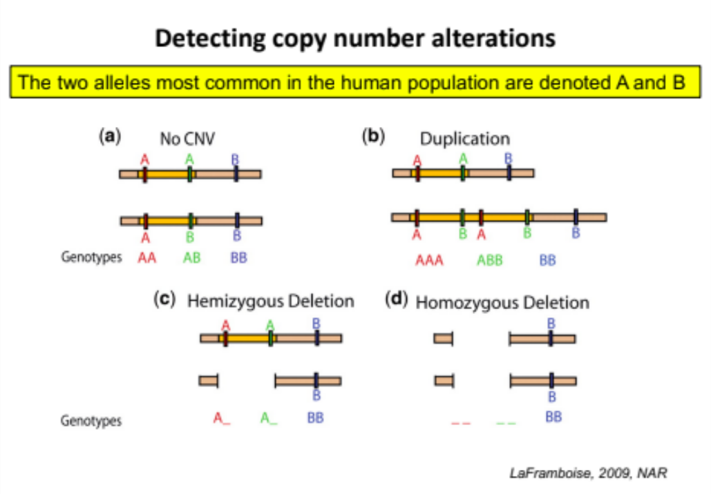
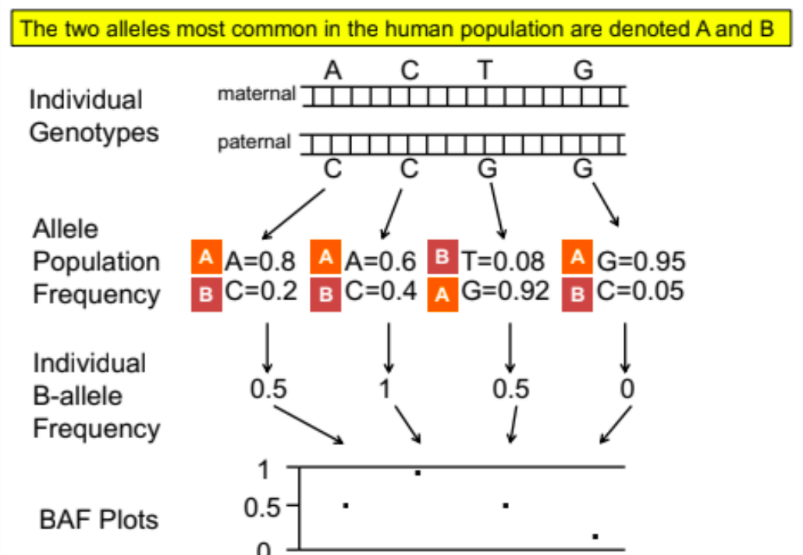
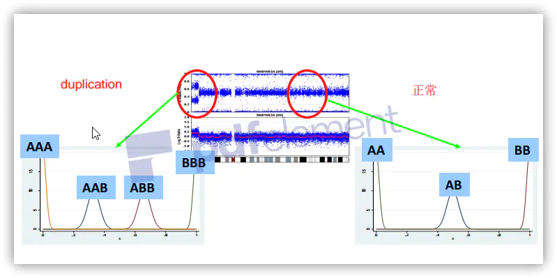
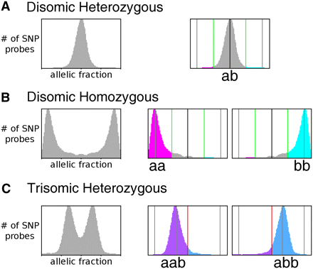

<!-- TOC -->

- [历史背景](#历史背景)
- [名词](#名词)
  - [BAF](#baf)
  - [LRR](#lrr)
  - [](#)
  - [Shallow whole genome](#shallow-whole-genome)
  - [chromosome X (ChrX) mosaicism](#chromosome-x-chrx-mosaicism)
  - [Z-score](#z-score)
  - [calibrator sample](#calibrator-sample)
  - [Ratio](#ratio)
- [ngs for cnv](#ngs-for-cnv)
- [算法](#算法)
  - [基于深度测序的拷贝数变异的检测算法](#基于深度测序的拷贝数变异的检测算法)
  - [软件比较](#软件比较)
- [方法](#方法)
  - [coverage](#coverage)
    - [1. QC](#1-qc)
    - [2. GC含量校正](#2-gc含量校正)
    - [3. normalization](#3-normalization)
    - [噪音和标准化](#噪音和标准化)
  - [segmentation](#segmentation)
    - [bins](#bins)
    - [segmentation algorithms](#segmentation-algorithms)
      - [Circular Binary Segmentation (CBS)](#circular-binary-segmentation-cbs)
      - [Hidden Markov Model (HMM)](#hidden-markov-model-hmm)
  - [cnv量化](#cnv量化)
    - [tcga](#tcga)
    - [cnvkit](#cnvkit)
    - [cosmic](#cosmic)
  - [对于cnv分析的几点思考：](#对于cnv分析的几点思考)
      - [过滤](#过滤)
      - [鉴定断裂点](#鉴定断裂点)
  - [肿瘤拷贝数数据中的异方差校正](#肿瘤拷贝数数据中的异方差校正)
  - [Aneuploidy非整倍体](#aneuploidy非整倍体)
  - [General CNV analysis strategy](#general-cnv-analysis-strategy)
  - [普通方式计算CNV](#普通方式计算cnv)

<!-- /TOC -->


https://rdrr.io/category/biocview/CopyNumberVariation/


# 历史背景
Technologies for CNV Detection
+ Giemsa staining
+ Fluorescent in situ hybridization (FISH) - 荧光原位杂交
+ Comparative genomic hybridization (CGH) - 比较基因组杂交
  它能产生全基因组中染色体上DNA序列拷贝数图谱，使用两种不同的荧光将癌症组织样本和正常组织样本的DNA进行标记制成探针后，再同时与正常的分裂中期染色体进行杂交，通过检测染色体上不同区域的两种荧光的强度比，来发现DNA序列扩增或者丢失的区域。CGH技术具有：使用DNA样本量少，检测基因组拷贝数变化只需一次杂交，既能对活细胞或组织也能对存档组织进行研究的优点。但是，它所能检测到的DNA序列扩增或丢失的大小为3-5Mb，因此对于低水平的DNA扩增和小片段丢失，会发生漏检。
+ array CGH，aCGH - 微阵列比较基因组杂交技术[10]。
  与CGH技术相比，aCGH使用微阵列代替CGH技术中的中期分裂相的染色体，使用带有不同荧光标记的测试DNA探针，以DNA探针为模板，竞争性地与微阵列的靶序列进行杂交。与CGH技术相比，它具有两方面的明显优势：（1）灵敏度和准确性较高。染色体上DNA以高密集度和超螺旋的形式存在，而aCGH技术避开了复杂的染色体结构，所使用的靶序列为少数基因的DNA片段。因此与CGH技术相比，aCGH技术能找出那些无法检测出的拷贝数差异，而且能对扩增或缺失的位置进行精准地定位。（2）自动化和程序化。aCGH技术与普通的基因芯片检测表达谱的流程一样，可以使用机器和计算机自动操作，快速且省时省力。
+ 单核苷酸多态性微阵列技术 （single nucleotide polymorphism arrays，SNP arrays）[11]。
  它通过检测杂合性丢失（loss of heterozygosity，LOH）来检测基因组片段的扩增和缺失。
+ 深度测序技术[12]。
  使用深度测序技术产生的数据来检测拷贝数变异是近年来飞速发展的新领域。拷贝数变异检测的精确度和分辨率随着测序深度的增加而提高，可以获得更加准确的拷贝数变异的断点位置，并且能够检测基于芯片方法所不能检测的插入和倒位等基因组变异形式。由于深度测序技术不需要探针，能以单碱基分辨率在全基因组范围内检测拷贝数变异，因而可以显著提高拷贝数变异的检出数。
+ Spectral karyotyping (SKY)
+ SNP genotyping arrays

# 名词
## BAF




## LRR
> **LRR** is a measure of normalized total signal intensity.
> **BAF** is a measure of normalized allelic intensity ratio.
```
BAF = Y / (X + Y)
LRR = log2( (X + Y)sampleOfInterest / (X+Y)baselineSample)
```
The combination of LRR and BAF can be used together to determine different copy numbers and to differentiate copy-neutral LOH regions from normal copy regions.


## 


[High-Resolution SNP/CGH Microarrays Reveal the Accumulation of Loss of Heterozygosity in Commonly Used Candida albicans Strains, Abbeyet al, G3: GENES, GENOMES, GENETICS December 1, 2011 vol. 1no. 7 523-530;](https://doi.org/10.1534/g3.111.000885)
## Shallow whole genome

## chromosome X (ChrX) mosaicism 

## Z-score
The Z-score measures the number of standard deviations a target is from the reference sample mean. It is computed by subtracting the normalized read depth of the reference samples from the normalized depth for the sample of interest and dividing the result by the standard deviation of the reference samples. A high Z-score is indicative of a duplication event, while a lower Z-score is evidence for a deletion event. The Z-scores are also used to compute p-values for each called event. The p-value for an event measures the probability of Z-scores at least as extreme assuming the event targets are diploid and can be useful for evaluating call quality.(https://blog.goldenhelix.com/secondary-analysis-2-0-part-iv/)

The |z-score|(absolute z-score) is a statistical measurement that indicates the number of standard deviations an observation is above or below the mean of a normally distributed population. The z-score is examined when the confidence call for a sample copy number is high, e.g., above 95%. When the confidence is below 95%, it is not necessary to review the |z-score|. The |z-score| shows how meaningful the copy number call is; i.e., shows if the sample deviates significantly from the copy number mean for other samples having the same copy number call. The following guidelines below are recommended for sample copy number calls having a confidence value > 95%, if the |z-score| is: <1.75, trust the copy number call (pass); between 1.75 and 2.65, the call is borderline (pass with caution); >2.75, do not trust the call (fail).
｜z-score|（绝对z分数）是一种统计度量，它指示观察值高于或低于正态分布总体平均值的标准偏差数。

## calibrator sample 
## Ratio
The ratio is computed for a given target by dividing the normalized read depth for the sample of interest by the normalized mean depth over the reference samples. If no CNV event is present, the sample of interest should have the same normalized depth as the reference samples, indicating a ratio value close to 1, while homozygous deletions, heterozygous deletions, and duplications will have ratio values around 0, 0.5 and 1.5, respectively. Unlike the Z-score, the ratio gives us the ability to differentiate between homozygous, and heterozygous deletion events.
# ngs for cnv
+ DOC 基于RD的方法擅长检测复杂基因组区域类别中的精确拷贝数，大插入和CNV
+ SR
+ DP(RP) 基于PEM的方法不仅可以有效识别插入和缺失，还可以定位移动元件的插入，倒置和串联重复[14]。  
+ VAF
changes in depth of coverage (DOC),
reads with a gapped sequence alignment referred to as split reads (SR),
reads-pairs with aberrant mapping orientation or distance referred to as discordant pairs (DP, Fig. 1a, b),
and variant allelic fraction of heterozygous SNPs

# 算法

The determination of CNV calling for normal and tumor samples begins with three steps:
1. Computation of sequence coverage
2. Estimation and correction of bias in coverage
a. Modeling of coverage bias
b. Correction of modeled bias
c. Coverage smoothing
3. Normalization of coverage by comparison to a baseline sample or set of samples
Following normalization of coverage, both normal and tumor samples are segmented using
Hidden Markov Models (HMM), but with a different model for each sample types:
4. HMM segmentation, scoring and output
Finally, normal samples are subjected to a “no-calling” process that identifies CNV calls that are
suspect:
5. Population-based no-calling/identification of low-confidence regions

## 基于深度测序的拷贝数变异的检测算法
随着测序技术的发展和测序成本的降低，与其他基于微阵列的技术相比，深度测序提供了更高精度和更大通量的数据用于拷贝数变异的分析[12]。针对深度测序技术，很多算法被开发出来用于拷贝数变异的检测。根据算法所使用的数据，可以将这些算法分为三类。
+ 第一类是只使用片段的深度信息，如CNAnorm、THetA等[13, 14]。
+ 第二类是只是用单核苷酸变异信息，如PurityEst和PurBayes[15, 16]。
+ 第三类是同时使用片段的深度信息和单核苷酸变异信息，如PyLOH和patchwork[17, 18]。

第一类和第二类方法会出现识别问题，因为样本纯度的不同和癌细胞倍性的不同可能会产生相同的观测数据。例如当某个肿瘤组织样本的癌细胞纯度为0.4，癌细胞的倍性为4时，与当肿瘤组织样本纯度为0.8，癌细胞的倍性为3时，样本的倍性均为2.8。同样，只使用单核苷酸变异信息也会产生类似的问题。因此，有些算法为了规避这些问题，使用了各种不同的显式或者隐式的假设。如PurityEst，一种使用B基因频率(B-allele frequencies，BAFs)的算法，会假设BAFs值接近于0.5。因此同时使用片段的深度信息和单核苷酸变异信息的第三类方法，能较好地解决识别问题。根据算法产生的结果，可以将算法分为三类，第一类是只计算片段的完全拷贝数。第二类是计算片段的完全拷贝数及主要等位基因的拷贝数，因此与第一类算法相比，这类算法能够推断出基因型。例如，某个基因的拷贝数为3，它的基因型有AAA，AAB，ABB和BBB这四种，第一类算法只能推断出这个基因的拷贝数，而第二类算法还能推断出这个基因的基因型。第三类算法除了具有第二类算法的功能外，还具有判断某个片段是否存在亚克隆的情况，由于肿瘤组织中癌细胞存在亚克隆，因此对亚克隆片段的推断有重要意义。但是对于亚克隆片段的基因型的推断，目前还是一个具有挑战性的难题。

虽然，有很多针对于深度测序数据的算法被设计出来。但是样本的测序深度，样本的纯度，样本中癌细胞发生拷贝数变异的多少及样本中亚克隆数对这些算法的影响还没有进行系统性的研究。因此在本次研究中，我们比较了3种用于检测拷贝数变异的算法。我们模拟出不同纯度、不同亚克隆数、不同拷贝数变异数量以及不同测序深度的全基因组测序数据，对这些算法进行评估，找出它们之间的优劣。
## 软件比较
https://www.yfish.org/display/PUB/Performance+comparison+of+Accucopy+%28Accurity+2%29%2C+Sequenza%2C+and+ControlFreeC

----
# 方法
## coverage
计算覆盖度的时候要注意什么：
### 1. QC
starts with the raw read counts per 1,000 base window for both normal and tumor samples by counting the number of alignment starts in the respective bam files with a mapping quality score of at least 10 that is neither **unmapped, duplicated, secondary, nor supplementary**. Windows with a GC content less than 0.2 or greater than 0.6 or with an average mappability below 0.85 are excluded from further analysis.

+ 5ng上样，预计最低10million reads。


/Users/xiucz/Downloads/bioinfonotebookxiucz/docs/10_NGS/015_GC.md

### 2. GC含量校正
http://www.zxzyl.com/archives/988

## 3. normalization
+ on-target and off-target read depth 
and B-allele frequency signatures
3.1 怎么选择用于标准化的位点：
```
  + We use only well-covered in both tumor and normal samples SNVs which are likely to be heterozygous in normal tissue.
  + We use B-allele frequency as an indicator if the genomic region can be used for normalization or not. Namely, we select chromosome arms which are likely to be copy-number neutral and use only them for normalization.
  + However, we need at least 5 chromosome arms for performing normalization since variance increases rapidly when using a smaller amount of sequenced ge- nomic material for normalization. 
```
3.2 off-target and on-target

### 噪音和标准化
测序深度对方差影响较大。除了覆盖度，标准化算法可能会忽视主要的偏差来源，导致对健康样本的整体平坦度，正态性和有限的噪声轮廓产生负面影响。样本总体平坦度和正态性可以分别通过profile-wide variance 和 Lilliefors normality test检测。两个值越小越好。


## segmentation

### bins
+ Larger bins allow the noise within each bin to be smoothed over, thereby lessening the effect of coverage fluctuations.
+ NIPT组使用100kb的 bin，因为检测的异常大小在5Mb以上。
+ Generally, for shallow whole genomes, we recommend a bin size of around 1,000,000 base pairs.


### segmentation algorithms
1) The univariate method, which considers only one sample at a time, is ideal for detecting rare and/or large CNVs. 
2) The multivariate method, which simultaneously considers all subjects, is ideal for detecting small, common CNVs. Some CNV detection algorithms also assign actual copy number calls (0,1,2,3…) for a segment based on thresholds of LR segment means, though there are some reasons why this is problematic (see CNV Analysis Tips for Illumina Data).

#### Circular Binary Segmentation (CBS)
- Find a chromosomal segment with the most significant difference in means
Circular Binary Segmentation (CBS) which performs segmentation by iteratively computing segments to maximize the variance between segments while minimizing the variance within each segment.

常染色体CBS使用DNAcopy R包。参数α（检测断点的P-value）设定为1e^{-5}。每个segment至少包含两个bins。最后连续bins的平均值作为这个segement的ratio。

#### Hidden Markov Model (HMM)
Makes assumptions on CNV states (i.e. heterozygous duplication => 1.5x increase of depth and SNVs ratio shifts to AA/B)


## cnv量化
### tcga
Numeric focal-level Copy Number Variation (CNV) values were generated with "Masked Copy Number Segment" files from tumor aliquots using GISTIC2, on a project level.

Only protein-coding genes were kept, and their numeric CNV values were further thresholded by a noise cutoff of 0.3:

Genes with focal CNV values smaller than -0.3 are categorized as a "loss" (-1)
Genes with focal CNV values larger than 0.3 are categorized as a "gain" (+1)
Genes with focal CNV values between and including -0.3 and 0.3 are categorized as "neutral" (0).
### cnvkit
在CNVKIT软件也有：https://cnvkit.readthedocs.io/en/stable/calling.html

In a diploid genome, a single-copy gain in a perfectly pure, homogeneous sample has a copy ratio of 3/2. In log2 scale, this is log2(3/2) = 0.585, and a single-copy loss is log2(1/2) = -1.0.
### cosmic
在COSMIC数据库也有说明：https://cancer.sanger.ac.uk/cosmic/help/cnv/overview

---

+ Copy number alterations/aberrations (CNAs)
+ copy number variations (CNVs) 

+ Comprise  copy-number variations ≥ 50 bp, including deletions, insertions and duplications, as well as balanced variants such as inversions and translocations.

+ Recurrent structural variants often result from non-allelic homologous recombination (NAHR) which involves recombination between long highly similar low-copy-number repeats.非等位基因同源重组是同源重组的一种形式，其发生在具有高序列相似性但不是等位基因的两段DNA之间。 它通常发生在先前通过进化复制的DNA序列之间，因此具有低拷贝重复。这些重复元件的长度通常为10-300kb，并且具有95-97％的序列同一性。在减数分裂或有丝分裂期间，LCR可能不对准，随后的交叉可导致遗传重排。

## 对于cnv分析的几点思考：
#### 过滤
“Unfiltered” refers to all CNVs ≥1 kb, while “filtered” refers to CNVs that had <70% overlap with repetitive and low-complexity regions of the genome.

#### 鉴定断裂点
+ CNVkit uses off-target reads between genes to detect CNV breakpoints, if your targeted sequencing protocol uses hybrid capture. In most of your cases this should help place the breakpoint correctly in the intergenic region instead of at the edge of the next targeted exon. Otherwise the CNVkit pipeline is conceptually similar to the workflow you're probably using.
+ If your protocol is targeted amplicon sequencing instead, and there are no off-target sequencing reads to improve your estimates, then try OncoCNV. After running CBS via DNAcopy, it uses another statistical test at the gene level to remove spurious breakpoints. I think this might trim the CNV to the gene of interest in your problematic cases.
+ The R package PSCBS, which wraps DNAcopy, has a procedure for estimating confidence intervals around breakpoints, which would help you detect breakpoints with questionable positioning near gene boundaries (if you don't mind some additional programming).

## 肿瘤拷贝数数据中的异方差校正
理想情况下，可以从整个基因组中均匀地采样DNA片段，但是Illumina测序仪倾向于具有非常高或很低GC含量的偏差。 GC含量是测序读段中G和C碱基对的数量。采样基因组中的其他偏差也可能发生。但是，通常通过对来自同一患者的配对正常组织样品进行测序来解决。然后，正常对照样本具有相同的偏倚，因此，当您计算肿瘤相对于正常对照的对数比时，偏倚就会抵消。但是，我之所以写这篇文章，是因为我有不幸的经验，无法消除那些偏见[2]。图2显示了引起的问题。它根据GC含量绘制log2（肿瘤/对照）。通常，这看起来很平坦，但是就GC含量而言，明显存在异方差，这是不希望的。为了更清楚地显示异方差，图3显示了0.005 GC含量的窗口中的方差估计。

DNA fragments would ideally be uniformly sampled from throughout the genome, but Illumina sequencing machines (for example) tend to have a bias with very high or low GC content. GC content is the number G and C basepairs in the sequenced read. Other biases in sampling the genome may also occur. However, this is usually dealt with by sequencing a paired normal tissue sample from the same patient. The normal control sample then has those same biases, so when you compute a log ratio of the tumor over normal control, the biases cancel out. However, the reason why I am writing this post is I had the unfortunate experience with having data where those biases did not cancel out [2]. Figure 2 shows the issue that caused. It plots the log2(tumor/control) against the GC content. Normally this would appear flat, but there is clear heteroskedasticity with respect to GC content, which was undesirable. To more clearly show the heteroskedasticity, Figure 3 shows the variance estimate in windows of 0.005 GC content.

https://murphycj.github.io/heteroskedasticity-correction/

## Aneuploidy非整倍体
It is not a CNV.
1. (45, X) - Turner syndrome.
2. In uniparental disomy, both copies of a chromosome
come from the same parent (with no contribution from
the other parent).
3. Trisomy 21, Trisomy 18, Trisomy 13 - Down, Edwards,
Patau. (47, XXX), (47, XXY), (47, XYY).
4. XXXX, XXYY, XXXXX, XXXXY and XYYYY.


https://ngschool.eu/sites/default/files/uploads/20160802/1.pdf


## General CNV analysis strategy
The analysis strategy for CNVs depends on inheritance mode and other factors.
These are examples of ananlysis steps that are commonly performed:

1. Check for compound heterozygous variants: CNV/CNV und CNV/SNV

Note: For the analysis of compound heterozygous CNV and SNVs, the filtering of the small variants is relevent: use the dominant_relaxed filter.

2. Check for homozygous deletions using the copy number=0 filter

3. Check for microdeletion syndromes using min regions=10 filter

4. Check for CNVs matching the patient phenotype (target region and/or phenotypes filter)

5. Check for CNVs in ACMG target-region


https://bioconductor.org/packages/release/bioc/html/CNVtools.html


------
DECIPHER:疾病相关的CNV数据库
https://decipher.sanger.ac.uk/
https://cloud.tencent.com/developer/article/1556085
https://www.sciencedirect.com/science/article/pii/S0140673614617050

## 普通方式计算CNV
```
探针长度

chrom  start  end    length 

chr1    12080  12251  172

chr1    12595  12802  208

normalized_coverage : for each target interval, the read depth (unique read starts) that correspond to a particular target interval is divided by the average number of read starts in all of the target intervals.

normal

chrom  start  end    length  normalized_coverage    gene

chr1    12080  12251  172        0                    DDX11L1

chr1    12595  12802  208        0.002957            DDX11L1

tumor

chrom  start  end    length  normalized_coverage  gene

chr1    12080  12251  172        0                  DDX11L1

chr1    12595  12802  208        0.011583            DDX11L1

算法

例如gene EGFR

片段长度：length = L1 L2 L3 L4 L5

归一化覆盖:Tn = Tn1 Tn2 Tn3 Tn4 Tn5 Nn = Nn1 Nn2 Nn3 Nn4 Nn5

计算 : ((Tn1/Nn1)xL1+(Tn2/Nn2)xL2+·····)/L1+···L5 =拷贝率
```