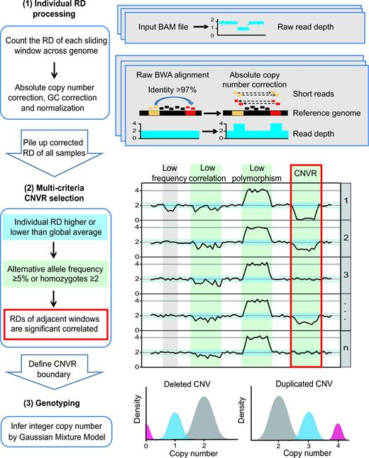

<!-- TOC -->

- [Copy-Number Variants Detection by Low-Pass Whole-Genome Sequencing](#copy-number-variants-detection-by-low-pass-whole-genome-sequencing)
- [A Robust Approach for Blind Detection of Balanced Chromosomal Rearrangements with Whole-Genome Low-Coverage Sequencing](#a-robust-approach-for-blind-detection-of-balanced-chromosomal-rearrangements-with-whole-genome-low-coverage-sequencing)
- [Haraksingh RR, Abyzov A, Urban AE. Comprehensive performance comparison of high-resolution array platforms for genome-wide Copy Number Variation (CNV) analysis in humans. BMC Genomics 2017;18:321.](#haraksingh-rr-abyzov-a-urban-ae-comprehensive-performance-comparison-of-high-resolution-array-platforms-for-genome-wide-copy-number-variation-cnv-analysis-in-humans-bmc-genomics-201718321)
- [Copy Number Variation Sequencing for Comprehensive Diagnosis of Chromosome Disease Syndromes](#copy-number-variation-sequencing-for-comprehensive-diagnosis-of-chromosome-disease-syndromes)
- [Maternal Mosaicism Is a Significant Contributor to Discordant Sex Chromosomal Aneuploidies Associated with Noninvasive Prenatal Testing](#maternal-mosaicism-is-a-significant-contributor-to-discordant-sex-chromosomal-aneuploidies-associated-with-noninvasive-prenatal-testing)
- [Discovery and Statistical Genotyping of Copy-Number Variation from Whole-Exome Sequencing Depth](#discovery-and-statistical-genotyping-of-copy-number-variation-from-whole-exome-sequencing-depth)

<!-- /TOC -->

# Copy-Number Variants Detection by Low-Pass Whole-Genome Sequencing
  + DOI: 10.1002/cphg.43
----
# A Robust Approach for Blind Detection of Balanced Chromosomal Rearrangements with Whole-Genome Low-Coverage Sequencing
  + DOI: 10.1002/cphg.51
+ WisecondorX: improved copy number detection for routine shallow whole-genome sequencing
  + 旧版本：https://github.com/VUmcCGP/wisecondor
+ AMYCNE: Confident copy number assessment using whole genome sequencing data
+ MetaCNV - a consensus approach to infer accurate copy numbers from low coverage data
  +  ReadDepth v0.9.8, which applies a read depth approach, predicts mid-sized (104–106 bp) and larger deleted segments (> 106 bp) more accurately than other callers, whereas amplifications were more accurately predicted by SVDetect v1.3, a representative of the hybrid approach.
  + ReadDepth SVDetect CNVnator
  + https://bitbucket.org/sonnhammergroup/metacnv/src/master/
+ CNAtra: An analytical and visualization tool for hierarchical CNA discovery of large-scale and focal copy number alterations in low-coverage cancer genomes (Khalil et. al., BMC Bioinformatics, 2020)
  + https://github.com/AISKhalil/CNAtra
  + https://pubmed.ncbi.nlm.nih.gov/32299346/
  + MATLAB based
+ Performance of copy number variants detection based on whole-genome sequencing by DNBSEQ platforms
  + 数据集
  + https://link.springer.com/article/10.1186/s12859-020-03859-x
+ An open resource for accurately benchmarking small variant and reference calls
  + x
+ Copy number variant detection with low-coverage wholegenome sequencing is a viable alternative to the traditional array-CGH
  + PMID: 30061371 DOI: 10.1136/jmedgenet-2018-105272
+ Copy number variant detection with low-coverage whole-genome sequencing is a viable replacement for the traditional array-CGH
  + Marcel Kucharík 1,2,*, Jaroslav Budiš 1,2,3, Michaela Hýblová 4, Gabriel Minárik 4, and Tomáš Szemes 1,2,5 
+ Characterizing sensitivity and coverage of clinical WGS as a diagnostic test for genetic disorders
+ https://genomemedicine.biomedcentral.com/articles/10.1186/s13073-021-00841-x
+ Comprehensively benchmarking applications for detecting copy number variation
  + Le Zhang  ,Wanyu Bai ,Na Yuan ,Zhenglin Du  
  + https://journals.plos.org/ploscompbiol/article?id=10.1371/journal.pcbi.1007069
  + 通过灵敏度，特异性和计算要求对应用程序进行了基准测试。以DGV黄金标准变体作为标准数据集，我们用10X到50X的测序深度评估了具有真实测序数据的十个应用程序。在基准的十种方法中，LUMPY在每个测序深度的高灵敏度和特异性方面均表现最佳。出于高度特异性的目的，Canvas也是一个不错的选择。如果首选高灵敏度，则CNVnator和RDXplorer是更好的选择。此外，CNVnator和GROM-RD在处理低深度测序数据方面也表现出色。
  + overlap of more than 50% 
  
----
+ # Whole-genome sequencing analysis of copy number variation (CNV) using low-coverage and paired-end strategies is efficient and outperforms array-based CNV analysis
  + 结论： 
  + Evaluation of copy number variation detection between high-resolution array CGH and low-coverage short-insert and mate-pair whole-genome sequencing
  +  Bo Zhou, doi: https://doi.org/10.1101/192310
  + https://trace.ncbi.nlm.nih.gov/Traces/sra/?study=SRP118709
  + https://www.ncbi.nlm.nih.gov//sra/?term=SRP118709
  +  Furthermore, we show that WGS (at 1x coverage) is able to detect 17 all seven GS deletion-CNVs >100 kb in NA12878 whereas only one is detected by most 18 arrays. 
  + Lastly, we show that the much larger 15 Mbp Cri-du-chat deletion can be readily
19 detected with short-insert paired-end WGS at even just 1x coverage.
  + LiangD,PengY,LvW,DengL,ZhangY,LiH,YangP,ZhangJ,SongZ,XuG, Cram DS, Wu L. Copy number variation sequencing for comprehensive diagnosis of chromosome disease syndromes. J Mol Diagn 2014;16:519–26.Liu S, Song L, Cram DS, Xiong L, Wang K, Wu R, Liu J, Deng K, Jia B, Zhong M, Yang F. Traditional karyotyping vs copy number variation sequencing for detection of chromosomal abnormalities associated with spontaneous miscarriage. Ultrasound Obstet Gynecol 2015;46:472–7. DongZ,ZhangJ,HuP,ChenH,XuJ,TianQ,MengL,YeY,WangJ,ZhangM, LiY,WangH,YuS,ChenF,XieJ,JiangH,WangW,WaiChoyK,XuZ.Low- pass whole-genome sequencing in clinical cytogenetics: a validated approach. Genet Med 2016;18:940–8.
  + These challenges are mainly due to read mappability (particularly in repetitive regions), GC-content bias, read quality, and the difficulty in identifying duplications [8].  It is important to note that the problem of CNV detection in repetitive regions is not yet fully resolved for both sequencing and arrays [8, 9].  复杂区域的判断。
  + 
  + Generally, large CNVs called from discordant-read-pair analysis without corroboration from read-depth analysis are likely to be false positives since large CNVs are called more robustly using read-depth analysis (Figure 3d-i).  However, when a CNV is called by both types of analyses, discordant-read-pair analysis has the ability to provide a more accurate genomic boundary of the CNV.  
  + Reference gaps, the absence of read alignment in the gaps can be mis-interpreted as deletions
  + In addition, deletions and reference gaps that lie in close proximity are sometimes merged in read-depth analysis, particularly at low coverages. 
  + <font color="#dd0000"> In read-depth analysis, the “bin size” parameter for CNV calling dictates the lower size limit of CNV detection and is optimal if the ratio of average read depth signal to its standard deviation is approximately 4 to 5 [11].  We calculated the optimal bin size to be 5kb for our WGS data (see Methods).  </font><br /> 
  +  <table><tr><td bgcolor=#54FF9F>By combining read-depth and discordant-read-pair analysis, the 3kb mate-pair WGS library provides the widest size distribution of detected CNVs.</td></tr></table>
  + 方法
    + 获取`https://trace.ncbi.nlm.nih.gov/Traces/sra/?run=SRR6061294` 
    + For discordant read-pair analysis, we ensured that the CNV events detected had multiple supporting reads as a function of sequencing coverage in order to minimize false positives, especially for duplications.  False duplication calls may arise from read-depth analysis due to poor-quality alignments and PCR duplicates, which might yield artificially higher coverage in certain regions. 


```
#Step1: Download SRA file
$samdump SRR6061300.sra > SRR6061300.sam
samtools view -S -b -h SRR6061300.sam > SRR6061300.bam
$prefetch --output-directory $output SRR6061300
#sam2bam
sam-dump SRR390728 | samtools view -bS -h - > SRR390728.bam

ascp -QT -l 300m -P33001 -i $HOME/.aspera/connect/etc/asperaweb_id_dsa.openssh era-fasp@fasp.sra.ebi.ac.uk:vol1/fastq/SRR606/004/SRR6061294/SRR6061294_1.fastq.gz . && mv SRR6061294_1.fastq.gz SRR6061294_Short-insert_whole_genome_sequencing_of_NA12878_subsampled_to_1X_coverage_1.fastq.gz
ascp -QT -l 300m -P33001 -i $HOME/.aspera/connect/etc/asperaweb_id_dsa.openssh era-fasp@fasp.sra.ebi.ac.uk:vol1/fastq/SRR606/004/SRR6061294/SRR6061294_2.fastq.gz . && mv SRR6061294_2.fastq.gz SRR6061294_Short-insert_whole_genome_sequencing_of_NA12878_subsampled_to_1X_coverage_2.fastq.gz

table1:Seven deletions are larger than 100 kb

-2 split的结果
-3 
-4 readdepth的结果
-10  整体比较
-14：Supplementary Table S5 Percent overlap between Gold Standard deletions > 100kb and those called by WGS								

```
----
# Haraksingh RR, Abyzov A, Urban AE. Comprehensive performance comparison of high-resolution array platforms for genome-wide Copy Number Variation (CNV) analysis in humans. BMC Genomics 2017;18:321.

----
+ ichorNCA
https://gavinhalab.org/projects/ichorCNA/

---

Detection of a patient with ring chromosome 15 by low-coverage massively parallel copy number variation sequencing（10.3760/cma.j.issn.1003-9406.2017.03.021
）
+ http://www.doc88.com/p-9778631399999.html
+ CNV一seq检测染色体拷贝数变异将基因组 DNA进行片段化处理，构建测序文库，使用博奥生物的BES 4佣0测序仪进行高通量全基因组测序，测序深度0 · 1倍，其检测CNV分辨率约为0 · 1 Mbo测序所得的Reads通过BWA软件与hg19基因组进行比对分析，仅保留唯一定位的Reads。将基因组划分为若干个连续的20 kb区域，统计每个区域内Reads个数，并通过局部多项式回归拟合算法校正GC含量引起的测序偏好。统计1 Mb区域的校正后的Reads个数，并与正常参考数据库进行比较，计算该区域的z值。为了提高检测灵敏度，将相邻7个区域的z值合并计算得到Stouffer，s Z值。根据Stouffer's Z值来判读待测样本的微缺失或微重复区域，Stouffer，s Z值> 3 时，判断为染色体拷贝数重复（3个拷贝）；Stouffer's z值<一3时，判断为染色体拷贝数缺失（1个拷贝）。


----
# Copy Number Variation Sequencing for Comprehensive Diagnosis of Chromosome Disease Syndromes

https://www.sciencedirect.com/science/article/pii/S1525157814001020
https://www.jmdjournal.org/article/S1525-1578(14)00102-0/fulltext

We previously showed that a low-coverage shotgun sequencing method of approximately five million mapped sequencing reads allocated to sequential 20-kb sequencing bins across each chromosome can detect levels of mosaicism of the X chromosome down to 5%.30 We, therefore, hypothesized that this method could be equally applied to detect CNV at a relatively high resolution across the 22 autosomal chromosome pairs plus the sex chromosomes X and Y. Herein, we applied CNV sequencing (CNV-seq) to blinded DNA samples with known abnormalities defined by a medium-density SNP array and showed that this method was highly concordant, reproducible, and sensitive, with a potential resolution of approximately 0.1 Mb.

Libraries were sequenced using the HiSeq 2000 platform (Illumina Inc.) to generate approximately 8 million 36-bp single-end reads, representing **0.1-fold genome coverage**. 

----
# Maternal Mosaicism Is a Significant Contributor to Discordant Sex Chromosomal Aneuploidies Associated with Noninvasive Prenatal Testing 
+ https://academic.oup.com/clinchem/article/60/1/251/5581449
+ The accuracy of NIPT for ChrX and ChrY can be improved substantially by integrating the results of maternal-plasma sequencing with those for maternal-WBC sequencing. 
+ NONINVASIVE PRENATAL TESTING
  + We constructed plasma DNA libraries and performed massively parallel sequencing on the Illumina HiSeq 2000 platform, as previously described (15, 27). We generated approximately 8 × 106 single-end reads of 36 bp from each library and aligned them to the unmasked human genome sequence (28). We counted uniquely mapped reads and then calculated z scores for each chromosome after GC normalization for Chr13, Chr18, Chr21, and ChrX (27). **Chromosome z score values less than −3.0 or greater than +3.0 were classified as abnormal** (Song Y, Liu C, Qi H, Zhang Y, Bian X, Liu J. Noninvasive prenatal testing of fetal aneuploidies by massively parallel sequencing in a prospective Chinese population. Prenat Diagn 2013;33:700–6.).
+ DETERMINATION OF ALTERED MATERNAL KARYOTYPES BY WBC GENOMIC DNA SEQUENCING
  + and 10.08% fetal DNA concentration at bin of 750 kb for detecting subchromosomal microdeletion of 3.16 Mb.
  + For each sample, we used 50 ng of WBC genomic DNA with Nextera DNA Sample Preparation Kits (Epicentre/Illumina) to construct the sequencing library. Multiple libraries were indexed and pooled into a single lane. Library fragments were sequenced to 43 bp (with 7 bp being the index sequence) on a HiSeq 2000 instrument. Sequencing reads were analyzed according to the data analysis pipeline summarized in Fig. 1. First, sequencing reads were aligned to the unmasked human genome sequence (hg19). Second, we calculated the read density by dividing each chromosome into contiguous 20-kb bins. For each bin, i, of a given sample, the reads that were uniquely and perfectly mapped to that bin (RNBi) were counted and normalized to the total read number for the sample and the total possible unique 36-bp fragment numbers within bin i (Ui), according to the following equation: NRNBi = RNBi × (8 × 106)/(total read number of the sample × Ui), where NRNBi is the normalized read number uniquely and perfectly mapped to bin i. For any given bin i of the reference samples, we calculated the median (μi) of NRNBi. We assumed that changes in abnormal copy numbers among test samples are rare for each bin; therefore, the median of NRNBi represents the normal copy number. For any bin i of a test sample, we calculated the ratio (ratioi) between the test sample and the normal chromosome copies according to the following equation: ratioi = NRNBi/μi. We then plotted log2(ratioi) values for all of the bins for a given sample to generate the copy number values along the length of each chromosome. The gain or loss of chromosome regions was detected via the fused lasso algorithm, as described previously (29). Lastly, to determine the level of chromosome mosaicism, we calculated the normalized chromosome representations (NCRj) for each chromosome of any given test sample, j, and the reference samples (NCRf) with the method described previously (27). The percentage of chromosomal mosaicism was then calculated according to the following equation: (NCRj − NCRf)/NCRf.

----
# Discovery and Statistical Genotyping of Copy-Number Variation from Whole-Exome Sequencing Depth
+ 
+ https://ars.els-cdn.com/content/image/1-s2.0-S000292971200417X-mmc1.pdf

----
# Strategies to minimize false positives and interpret novel microdeletions based on maternal copy-number variants in 87,000 noninvasive prenatal screens

----
# CovCopCan: An efficient tool to detect Copy Number Variation from amplicon sequencing data in inherited diseases and cancer
+ https://journals.plos.org/ploscompbiol/article?id=10.1371/journal.pcbi.1007503
+ $$z-score_{p-i} = \frac{NRC_{p_i} - \mu_p} {\sigma_p}$$
```
normalized read count value (NRC)
NRCp_i is the normalized read count of the amplicon i in the patient p,
μp the NRC average of the patient p, 
and σ corresponds to the standard deviation of the patient p. 
The z-score follows a standard normal distribution N(0;1).
```
We fixed a threshold corresponding to a significance level of 0.01 for both deletion and duplication events by a one-tailed test. Thus, a negative z-score with a p-value < 0.01 indicates a deleted amplicon, whereas a positive z-score with a p-value < 0.01 indicates a duplicated amplicon. 

----
普通方式计算CNV
```
探针长度

chrom  start  end    length 

chr1    12080  12251  172

chr1    12595  12802  208

normalized_coverage : for each target interval, the read depth (unique read starts) that correspond to a particular target interval is divided by the average number of read starts in all of the target intervals.

normal

chrom  start  end    length  normalized_coverage    gene

chr1    12080  12251  172        0                    DDX11L1

chr1    12595  12802  208        0.002957            DDX11L1

tumor

chrom  start  end    length  normalized_coverage  gene

chr1    12080  12251  172        0                  DDX11L1

chr1    12595  12802  208        0.011583            DDX11L1

算法

例如gene EGFR

片段长度：length = L1 L2 L3 L4 L5

归一化覆盖:Tn = Tn1 Tn2 Tn3 Tn4 Tn5 Nn = Nn1 Nn2 Nn3 Nn4 Nn5

计算 : ((Tn1/Nn1)xL1+(Tn2/Nn2)xL2+·····)/L1+···L5 =拷贝率

```
----
# CNVcaller: highly efficient and widely applicable software for detecting copy number variations in large populations 

CNVcaller algorithm flowchart (left) and the key algorithms of each step (right). (1) Individual RD processing. In the absolute copy number correction, the RDs of highly similar windows were added together to deduce the absolute copy number. (2) Multicriteria CNVR selection. The curves show the copy numbers in a specific region for multiple samples. The blue transverse boxes mark the windows with a significant distinguishing copy number from the average (individual criterion). The green vertical boxes indicate that these regions meet the frequency conditions, and the red frame indicates that the RDs between the 2 adjacent windows are significantly correlated (population criteria). The fourth bar from the left, satisfying all the above conditions, is selected as the CNVR. (3) Genotyping: The copy numbers in each CNVR are clustered by a Gaussian Mixture Model to distinguish the normal, heterozygous, and homozygous samples.


