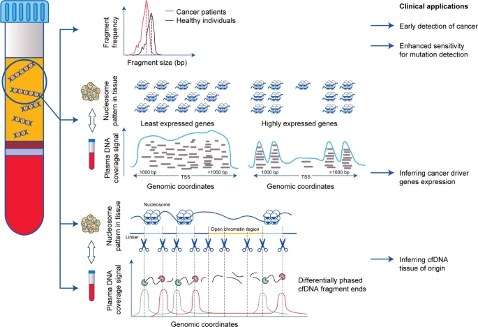

## 简介
https://nejmqianyan.cn/article/YXQYra1706174?sg=AbW1NGsHw3NxPd6F
## DNA片段化模式

> https://www.nature.com/articles/s41416-020-01047-5

1. 1cm3肿瘤释放到血液中的ctDNA比例为0.022%
2. 肿瘤体积与hGE线性相关
3. 1cm3肿瘤血液中的ctDNA平均克隆突变VAF为0.008%
> https://www.jianshu.com/p/bcb8fdde024b

4. 

## Duplex Sequencing

SSCS
DCS

https://bookdown.org/youcai/Liquid_biopsy_PocketBook/

Each consensus alignment represents a set of original paired reads which share the same position and same barcode;

## 高深度检测难点
position-based deduplication (e.g. Picard MarkDuplicates [6]) with changes to address two major challenges. These challenges are
+ (1) biological duplication can not easily be distinguished from PCR duplication in regions of ultra-deep coverage
+ (2) consensus sequences that match the reference genome are typically chosen over the sequences containing variants. 

Analyze CNVs of ctDNA https://github.com/PeterUlz/PlasmaSeq
https://github.com/PeterUlz

https://github.com/jasminezhoulab/CancerLocator

Clonal hematopoiesis of indeterminate potential(意义不明的克隆性造血）-CHIP
意义不明的克隆性造血是指由一个造血干细胞或者其他早期的起始血细胞为了更好的适应环境而发展成一个带有一些基因变异的亚型。

这个亚型带有基因变异一般是非驱动性的，而且该亚型占血细胞的比率跟年龄有很大的相关型。研究表明，40岁以下的该亚型的比率只有少于1%，而超过70岁的，可能比率会高达10%-20%。

在做cfDNA检测中，如果在抽提cfDNA时，没有将白细胞完全清楚干净，那么带有白细胞的cfDNA的检测结果可能会出现几十个低频的非驱动性变异，一般频率会低于5%。

 https://www.cnblogs.com/timeisbiggestboss/p/8409987.html
 