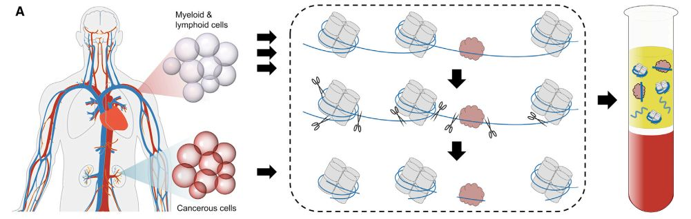
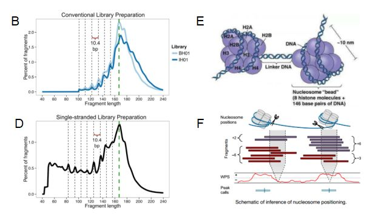
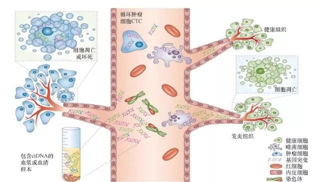

## 简介
https://nejmqianyan.cn/article/YXQYra1706174?sg=AbW1NGsHw3NxPd6F

## cfDNA的来源

> 细胞凋亡或坏死导致的天然染色质几乎完全降解。裸露的DNA 片段在细胞凋亡时就被胞内的核酸酶降解掉了，而蛋白结合的DNA 片段由于蛋白包被能免受核酸酶的降解被释放到血液循环中。经蛋白酶处理后，可从外周血浆中回收蛋白结合的DNA 片段。在健康个体中，cfDNA 主要来源于骨髓和淋巴细胞，但在某些疾病过程或生理条件下，可能存在来自一个或多个另外的组织的来源。

## DNA片段化模式
如下图B和D，片段长度分布的peak 在167 bp 处（“核小体+连接组蛋白”对应的峰），在100-160 bp 范围内有10.4 bp 的周期性波动。

cfDNA 的片段分布与核小体的结构有关，如下图E，每个核小体单位包括一个组蛋白八聚体、DNA 分子及一分子H1 ；组蛋白八聚体构成核小体的盘状核心结构（NCP，nucleosome core particle）；146 bp 的DNA分子超螺旋盘绕组蛋白八聚体1.75圈，组蛋白H1 在核心颗粒外结合额外20bp DNA，锁住核小体DNA 的进出端，起稳定核小体的作用。

因此不难理解cfDNA 的片段分布特点，如图F，核酸酶会降解相邻核小体之间的连接DNA，即裸露的DNA，缠绕在NCP 上的DNA 会被保护，缠绕在核心颗粒上的147bp 加上H1蛋白结合的20bp 对应着167bp 的主峰（本篇文章是167 bp的主峰，有的文章是166bp），这些DNA 会发生与DNA 螺距相关的切口或者裂解，对应着100-160bp 的范围。

> https://www.nature.com/articles/s41416-020-01047-5

## cfDNA的含量？

普通健康人中 cfDNA 含量低，超过 90% 的健康个体每毫升血浆中的 cfDNA 量不超过25ng。

在孕妇中，胎儿的cfDNA 来自于胎盘滋养层，现在cfDNA 可用于在高危孕妇中筛查胎儿的遗传缺陷，这就是当前火热的无创唐氏筛查的基础！一般情况下，胎儿的游离DNA 含量较低，有研究表明12孕周后的胎儿游离DNA 含量较稳定，达4%以上，可满足NIPT 的检测需求。

## cfDNA稳定吗？

研究表明，cfDNA 的半衰期仅有1~2个小时，在外周血中处于一个动态的不断变化的过程，其含量取决于cfDNA 的来源。因此收到用于cfDNA 检测的全血样本时，最好是先提取。如果没法立刻提取，需要先将血浆离心出来，然后放到 -80度存放。不过市面上有卖能保存一定时间的全血样品中游离cfDNA 的保存管。

## 什么是ctDNA（circulating tumor DNA）？

ctDNA 是来源于肿瘤细胞的cfDNA，属于cfDNA 的一种类型。两者为包含关系，ctDNA 仅为cfDNA 很小的一部分。

虽然ctDNA 所占cfDNA 的比例波动范围非常大，约0.01％～90％，有研究表明半数以上突变频率在0.4%以下，但实际上，大多数ctDNA 在cfDNA 中的占比约为0.2%。因此，ctDNA 的检测需要技术灵敏度较高，目前比较适用的技术包括数字PCR技术和结合UMI 的NGS 技术，灵敏度分别可以达到0.01%和0.1%左右。

## ctDNA用于肿瘤检测的优势？

在肿瘤患者中，ctDNA 可存在于血浆、血清、脑脊液中。ctDNA 的检测贯穿于肿瘤诊疗的全过程。

① 在肿瘤早期的筛查中，ctDNA 检测可早于影像学发现癌症，通过抽血来检测血液 ctDNA所携带的肿瘤基因组信息，实现早发现早治疗。

② 在肿瘤治疗的过程中，ctDNA 可提相关供肿瘤药物靶点基因的突变信息，指导医生个性化用药；也可对病人用药后的疗效进行实时监测。ctDNA 的检测尤其是对于一些晚期的难以获取肿瘤组织的患者更为重要。

## 什么是CTC（Circulating tumor cell）？
CTC，即循环肿瘤细胞，是指从实体瘤中脱离出来并进入外周血液循环的肿瘤细胞。通常在临检中应用的CTC，特指在检测时仍具有活性的细胞。这里的具有活性指的是细胞是活的，能自己增殖，对药物有反应，即具有一切活细胞的特性。另一方面，活的CTC提供的信息更多。

## CTC 的含量？
释放到血液中的绝大多数 CTC 发生凋亡，只有极少数细胞能存活下来并在合适条件下重新穿出血管，最终在适宜的器官形成肉眼可见的转移。有研究表明，CTC 的半衰期只有 1.0 ~ 2.4 h。因此CTC 在外周血的数量极其稀少，通常每1×106 ~ 1×107个单核细胞中才会发现一个 CTC。

## CTC 检测临床意义？

CTC 检测的临床意义主要体现在以下几个方面:

① 早期发现微转移：有研究表明 CTC 检测有助于早期发现结肠癌及可能出现的微转移；

② 评估预后：Cristofanilli等在一项多中心、前瞻性、随机双盲临床试验中，检测 177 例转移性乳腺癌患者 7.5 ml 外周血中CTC 的数量，发现治疗前外周血中 CTC≥5 个 / 7.5ml 外周血患者与 CTC ＜5 个 / 7.5 ml 外周血患者相比，预后较差， CTC 可作为转移性乳腺癌患者预后评估的独立预测因素；

③ 指导个体化治疗: CTC 计数和分子分型为制定个体化治疗方案提供依据

1. 1cm3肿瘤释放到血液中的ctDNA比例为0.022%
2. 肿瘤体积与hGE线性相关
3. 1cm3肿瘤血液中的ctDNA平均克隆突变VAF为0.008%
> https://www.jianshu.com/p/bcb8fdde024b

## Duplex Sequencing

SSCS
DCS

https://bookdown.org/youcai/Liquid_biopsy_PocketBook/

Each consensus alignment represents a set of original paired reads which share the same position and same barcode;

## 高深度检测难点
position-based deduplication (e.g. Picard MarkDuplicates [6]) with changes to address two major challenges. These challenges are
+ (1) biological duplication can not easily be distinguished from PCR duplication in regions of ultra-deep coverage
+ (2) consensus sequences that match the reference genome are typically chosen over the sequences containing variants. 

Analyze CNVs of ctDNA https://github.com/PeterUlz/PlasmaSeq
https://github.com/PeterUlz

https://github.com/jasminezhoulab/CancerLocator

Clonal hematopoiesis of indeterminate potential(意义不明的克隆性造血）-CHIP
意义不明的克隆性造血是指由一个造血干细胞或者其他早期的起始血细胞为了更好的适应环境而发展成一个带有一些基因变异的亚型。

这个亚型带有基因变异一般是非驱动性的，而且该亚型占血细胞的比率跟年龄有很大的相关型。研究表明，40岁以下的该亚型的比率只有少于1%，而超过70岁的，可能比率会高达10%-20%。

在做cfDNA检测中，如果在抽提cfDNA时，没有将白细胞完全清楚干净，那么带有白细胞的cfDNA的检测结果可能会出现几十个低频的非驱动性变异，一般频率会低于5%。

 https://www.cnblogs.com/timeisbiggestboss/p/8409987.html
 