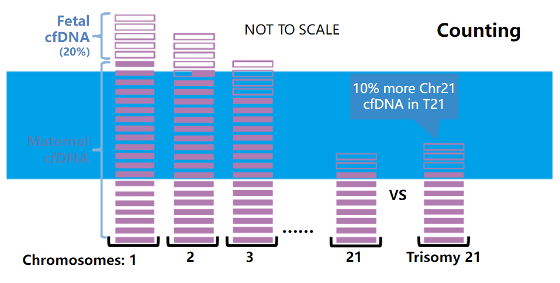
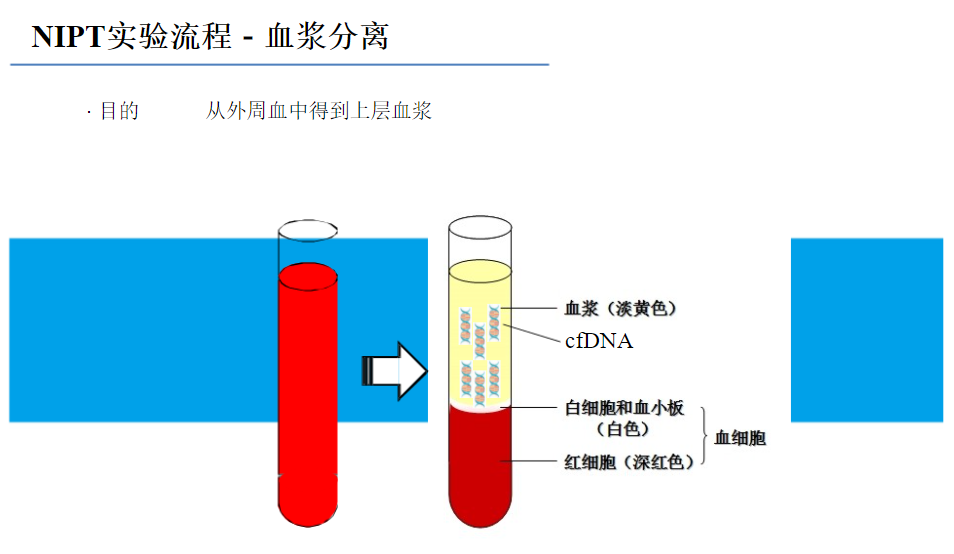
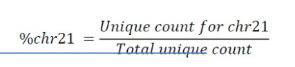
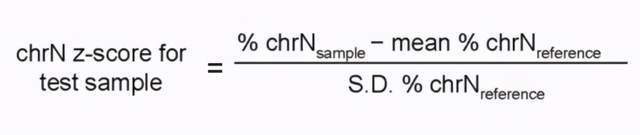

## 
placental/fetal DNA
maternal DNA

## 原理

非侵入性胎儿染色体基因检测（英语：Non-Invasive Fetal Trisomy Test，缩写：NIFTY 或英语：Non-Invasive Prenatal Test，缩写：NIPT）是一种崭新的产前检查技术，不需要透过高侵入性的羊膜穿刺术取样，仅须透过静脉采血抽取母亲的血液，就能侦测到胎儿在母血中微量的游离DNA，透过二代测序技术，可以精准检测胎儿染色体异常的状况｡相较于侵入性产前诊断方法-羊膜穿刺术，非侵入性胎儿染色体基因检测仅须透过静脉抽血，是非常安全的产检方式，并不会造成流产与羊膜腔感染的危险，更大幅降低孕妇接受产前检查的恐惧感，提高孕妇接受产前染色体检查的意愿。

适用于检测21、18、13号染色体的三体综合征。实际上，NIPT的分析流程与CNV的分析流程相似。主要的分析流程是先得到唯一比对的reads，再提取每条染色体的reads来做一个Z检验得到Z值，因为Z值在[-3, 3]这个范围的统计学意义上是占了99%，因此认为超出这个范围时就是阳性。

1. 含量低:在孕妇血液中包含母亲和胎儿的游离DNA，其中胎儿的游离DNA仅古血浆游离DNA总量的3%~20%。
2. 片段化:胎儿游离DNA片段较小，从75bp~250bp不等，平均为166bp。
3. 胎儿游离DNA来源于胎盘滋养层细胞，穿过胎盘屏障进入母血。胎儿游离DNA浓度随着孕周增加而增加，在9-11周，胎儿游离DNA浓度平均约占母体血浆中总游离DNA的10%(Norton，2012)。母体外周血中胎儿游离DNA的发现使得无需通过侵入性方法而准确检测胎儿染色体异常成为可能。
4. 血浆游离DNA含量很低，一般来说1ml血浆中会有10ng左右的游离DNA，cffDNA占血浆中全部游离DNA的5-30%之间，比例随着孕周的增大而缓慢上升。cffDNA的半衰期很短，为16.3分钟，在正常分娩后2小时后在母体外周血中已检测不到(Loetal.1998.Am JHumGenet)。





## NIPT检测算法
通过NGS的低深度WGS测序，将数据比对到人类参考基因组（一般是hg38）后，统计比对到每个染色体的reads数。然后使用Z检验的方式获得每个染色体的Z值。一般的，需要使用50个以上的正常孕妇（孕周>10）血液样本建立参考基线。

Z值的计算公式如下


```
chrN z-score for test sample:所检测样本的Z-值；
N：指定的第N染色体；
%chrNsample：待测样品第N条染色体唯一比对序列数占常染色体的百分比，通过高通量测序后软件分析获得；
Mean%chrNreference：参照样品第N条染色体比例平均值；
S.D.%chrNreference：参照样品第N 条染色体比例的标准偏差。
```
即首先可算出每个样本的每个染色体的reads数占总reads数的百分比（chrN_Sample_%），对于将所有参考样本的同一染色体百分比结果求平均值（chrN_reference_%_average）以及标准差（chrN_reference_%_stdev），最后根据公式求出单个样本单个染色体的Z值。一般取Z值大于3为该染色体数目异常增加的阈值。

由于测序仪的GC偏好，在进行以上Z检验之前，需要对检出的reads数根据参考基因组的GC比例进行校正。方法是对参考基因组划分bins，然后统计每个bins的GC比例，同时统计每个样本在每个bins中的reads数。最后使用loess回归，根据bins中的GC比例校正bins中的reads数，重新把校正后的reads数相加获得每个染色体中的校正后reads数。R语言中的写法可参考此篇https://www.biostars.org/p/233743/。

更重要的，在进行NIPT检测之前，需要进行胎儿分数评估，根据文章PMID26996738，胎儿DNA分数要达到4%对于胎儿非整倍体或其他遗传缺陷检测是必需的。计算胎儿分数的公式来自文章PMID29945966，公式如下，具体解析见文章。
$$P_{21} = \frac{1}{2}P_{U}FF + P_{U}$$
NIPT检测软件
综上所诉，NIPT检测的基本步骤包括：比对、read counts提取、GC校正、FF(Fetal Fraction)评估、Z值计算。

其中，比对可使用bowtie2或者bwa。可使用samtools或者bedtools进行reads提取，但是像NIPTeR、WisecondorX这种类型的软件将提取、GC校正、Z值计算等功能都集成了。而FF评估则可用Sanefalcon、PREFACE等。也有一些搭建好的流程可供参考，比如FluFFyPipe和IonNIPT。

自己写的用于NIPT的脚本，不包含FF评估。
https://github.com/pzweuj/practice/tree/master/python/NIPT/function

https://www.ncbi.nlm.nih.gov/bioproject/PRJNA400134

https://pzweuj.github.io/2019/03/20/NIPT.html

https://www.ncbi.nlm.nih.gov/pmc/articles/PMC3130771/

https://github.com/VUmcCGP/wisecondor
https://github.com/VUmcCGP/wisecondor/tree/legacy
https://academic.oup.com/nar/article/42/5/e31/1063962
https://github.com/VUmcCGP/sanefalcon

https://www.linkedin.com/in/rstraver


https://www.ncbi.nlm.nih.gov/pmc/articles/PMC7460070/

https://www.cnblogs.com/zdwu/p/8203672.html

https://zhuanlan.zhihu.com/p/347698594

https://max.book118.com/html/2021/1103/5310041131004100.shtm


https://mp.weixin.qq.com/s/ZihW4acsLyPrpBqF5lAo7w

https://mp.weixin.qq.com/s/vNcFM5hn5FLZi2sh5Zy5GQ

胎儿浓度
https://page.om.qq.com/page/OJMVtkHIzpjpvJOKqpIysNIQ0
https://blog.xyxu.top/2019-12-27-fetal-dna-fraction.html
https://www.sohu.com/a/299663529_733985
https://yourgene.pixnet.net/blog/post/117099888-%E8%83%8E%E5%85%92dna%E6%AF%94%E4%BE%8B%E7%9A%84%E8%A8%88%E7%AE%97%E6%96%B9%E6%B3%95
http://111.44.140.226:81/KCMS/detail/detail.aspx?filename=1019267629.nh&dbcode=CDFD&dbname=CDFD2020
https://nejmqianyan.cn/article-info?permalinks=YXQYra1705345&sg=AbW1NGsHw3NxPd6F
https://www.ncbi.nlm.nih.gov/pmc/articles/PMC7449492/
