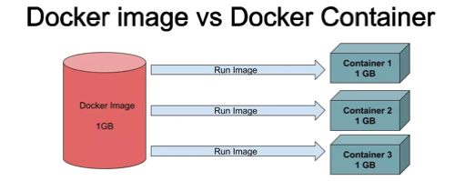

<!-- TOC -->

- [概念](#概念)
- [基础信息](#基础信息)
- [容器使用](#容器使用)
  - [在容器内运行应用程序](#在容器内运行应用程序)
- [镜像使用](#镜像使用)
- [实例](#实例)
- [其他](#其他)
- [问题故障](#问题故障)
    - [mage is being used by stopped container](#mage-is-being-used-by-stopped-container)
    - [Got permission denied while trying to connect to the Docker daemon socket at unix:///var/](#got-permission-denied-while-trying-to-connect-to-the-docker-daemon-socket-at-unixvar)
    - [权限问题](#权限问题)

<!-- /TOC -->


https://github.com/guoshijiang/-virtual-technology



## 概念
 包括三个基本概念:

> 镜像（Image）： 镜像（Image），就相当于是一个 root 文件系统。比如官方镜像 ubuntu:16.04 就包含了完整的一套 Ubuntu16.04 最小系统的 root 文件系统。

> 容器（Container）：镜像（Image）和容器（Container）的关系，就像是面向对象程序设计中的类和实例一样，镜像是静态的定义，容器是镜像运行时的实体。容器可以被创建、启动、停止、删除、暂停等。

> 仓库（Repository）：仓库可看着一个代码控制中心，用来保存镜像。

+ ce
+ EE

image 文件生成的容器实例，本身也是一个文件，称为容器文件。也就是说，一旦容器生成，就会同时存在两个文件： image 文件和容器文件。而且关闭容器并不会删除容器文件，只是容器停止运行而已。

## 基础信息
容器层面：
```bash
 <仓库名>:<标签>

 --version
docker version
docker info
#查看正在运行的容器
docker ps
#停止正在运行的容器
docker stop
#启动容器
docker start
docker ps -a #查看所有运行或者不运行容器
docker stop $(docker ps -a -q) 或者 docker stop $(docker ps -aq) #停止所有的container（容器），这样才能够删除其中的images：
docker rm $(docker ps -a -q) 或者 docker rm $(docker ps -aq) #如果想要删除所有container（容器）的话再加一个指令
docker rm -f webserver命令来移除正在运行的容器
docker run —name NAMES IMAGE 将镜像IMAGE生成NAMES的容器/docker run ：创建一个新的容器并运行一个命令
```

镜像层面：
```
docker images 列出本地镜像
docker rmi 删除镜像
docker image ls 列出镜像
docker search python 寻找镜像
docker pull python:3.5 获取镜像
#运行镜像
docker run hello-world 
sudo usermod -aG docker $USER


#复制容器内容到物理机
docker  cp  testIpMap:/testData    / 
注：将容器testIpMap的/目录下的testData文件夹复制到物理机的 / 目录下

#复制物理机内容到容器
docker  cp  物理机目录    容器名：容器目录

```
## 容器使用

### 在容器内运行应用程序
```bash
$docker run -dit ubuntu:15.10 /bin/echo "Hello world" #生成id，方便`docker  exec -it 3b1c944cda86 /bin/sh` 进去

$docker run -t -i ubuntu:15.10 /bin/echo "Hello world"

#:  的二进制执行文件。
#run: 与前面的组合来运行一个容器。
#ubuntu:15.10 指定要运行的image，首先从本地主机上查找镜像是否存在，如果不存在， 就会从镜像仓库  Hub 下载公共镜像。**REPOSITORY:TAG**
# /bin/echo "Hello world": 在启动的容器里执行的命令

* -t：进入终端，在新容器内指定一个伪终端或终端。
* -i：获得一个交互式的连接，通过获取container的输入

#后台模式启动
docker run -d ubuntu:15.10 /bin/sh -c "while true; do echo hello world; sleep 1; done"
# 退出
我们可以通过运行 exit 命令或者使用 CTRL+D 来退出容器。

# 进入容器
docker exec：推荐大家使用  exec 命令，因为此退出容器终端，不会导致容器的停止。
docker attach(不推荐)

# 退出后容器停止再重启
docker start

## 导出和导入容器
  export 1e560fca3906 > ubuntu.tar
```


## 镜像使用
我们使用 REPOSITORY:TAG 来定义不同的镜像。
```
#删除镜像
rmi hello-world
docker container run
docker image pull

#Dockerfile用于在带有Dockerfile的文件夹中使用以下命令构建镜像:
docker build -t davetang/rstudio .
```

## 实例
```{bash}
$ docker pull polyactis/accurity
$ docker images
#Log into the docker image, without mounting. Useful just to look inside the docker.
$ docker run -i -t polyactis/accurity /bin/bash
# Log into the docker image.
# Mount /home/mydata, which contains your bam files and the reference data, to /mnt inside the docker
$ docker run -i -t -v /home/mydata:/mnt polyactis/accurity /bin/bash


## 
docker run -it --rm -v /tmp/:/data continuumio/miniconda3
/tmp/是本地文件系统上数据目录的文件路径。
/data是容器中链接数据的文件夹的文件路径。
/data文件夹中的任何数据都将被本地文件系统中的数据替换。
-v选项指定你本地需要替换到容器里的路径。对容器中数据所做的任何更改，都会同步到本地文件的数据中。


```

## 其他
```
#进入docker的镜像目录。
cd /var/lib/docker 
#image镜像在哪里
#image文件夹下存放镜像内容
cd image/overlay2  # 有的是image/aufs  
cat repositories.json  # 查看镜像仓库内容
#container容器在哪里
#container文件夹下存放容器内容
cd containers 
ls -l  # 查看容器列表
```

https://blog.csdn.net/enthan809882/article/details/104455638

## 问题故障
#### mage is being used by stopped container

https://stackoverflow.com/questions/51188657/image-is-being-used-by-stopped-container

#### Got permission denied while trying to connect to the Docker daemon socket at unix:///var/
```
usermod -a -G docker zhangbo

service docker restart
newgrp docker
```


#### 权限问题
https://padeoe.com/docker-volume-file-permission-problem/
譬如执行如下命令创建一个容器，挂载当前目录到容器内，并在容器内向主机当前目录创建 tmp.txt：
```
$ docker run --rm \
    -v "$PWD":/project \
    debian \
    bash -c "touch /project/tmp.txt"
$ ls -l tmp.txt
-rw-r--r-- 1 root root 0 Sep 28 01:55 tmp.txt
```
主机当前目录出现了容器内创建的 tmp.txt，但是其权限、用户和组均是 root，其他用户不可写。

使用 user 参数指定容器运行期间的用户常见解决方法是可以通过 Docker 提供的 User 命令、--user 参数来指定容器内部的用户和组的 id，譬如：
```
$ docker run --rm \
    --user=$UID:$(id -g $USER) \
    -v "$PWD":/project \
    debian \
    bash -c "touch /project/tmp.txt"
$ ls -l tmp.txt
-rw-r--r-- 1 current_user current_user 0 Sep 28 02:09 tmp.txt
```
可以看到输出，current_user 处会显示主机当前用户的名字，所以解决了主机用户对挂载的卷没有权限的问题。

**user参数的缺陷**使用 user 参数有一些缺陷，如果你进入容器内部的 terminal，会显示如下内容：
```
$ docker run --rm \
    -it \
    --user=$UID:$(id -g $USER) \
    -v "$PWD":/project \
    debian \
    bash -c "touch /project/tmp.txt && bash"
I have no name!@6cc07662a201:/$    
```
bash 的用户名会显示 I have no name!，这是因为我们通过 --user 参数指定了容器内部的用户 id，但该 id 不存在于容器内的 /etc/passwd 文件中。

除此之外，使用 user 参数仍然存在权限问题：

> 除了绑定挂载的主机路径之外的所有路径，对于容器内部的用户都没有写权限。


