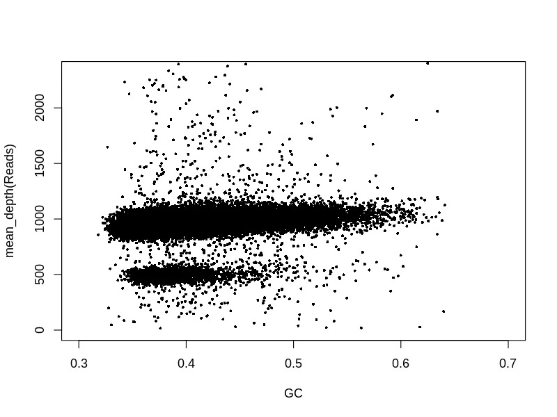

## GC偏好

我们都知道人类基因组的GC含量大约为40%左右，但是由于二代测序平台存在一定的偏好性，如果我们得到的测序数据（fastq data）的GC含量偏离40%，说明我们的测序数据有一定的偏好性，这种偏好性对于低深度全基因组的CNV分析有严重的影响。

通常我们可以通过绘制GC-depth图直观的显示测序的GC偏好性，如下图，该图的横坐标是GC含量，纵坐标是是平均深度。以100kb为窗口无overlap计算其GC含量和平均深度。正常情况下，一个GC偏好性小的样本在不同GC区域其平均深度应该是比较接近的。

测序中的GC偏好指的是基因组上GC含量在50%左右的区域更容易被测到，产生的reads更多，这些区域的覆盖度更高，在高GC或者低GC区域，不容易被测到，产生较少的reads，这些区域的覆盖度更少。用基因组单位长度的bin中的GC含量作为横坐标，覆盖度作为纵坐标作图，可以明显的看到该趋势。这种趋势在100kb为单位的bin中依然存在。

GC偏好也存在其他地方，比如基因编码区内密码子的最后一位，C碱基往往占优势；基因的长度和GC含量成相关性；Aquifex aeolicus 的基因组整体GC含量是43%，而核糖体RNA操纵子的GC含量是65%。

### 影响
举个例子，1）在检测拷贝数的时候，GC含量低或者高的区域，其覆盖度小于GC含量中等的，但不意味着仅仅根据测序的覆盖度，就认为GC含量中等的拷贝数比高/低GC含量区域的高。2）在做RNA测序分析的时候，GC含量高/低的区域reads数少，并不一定说明这个基因的表达量低。3）在做基因组拼接的时候，因为GC偏好的存在，高/低GC含量的区域被测的少，这些区域的拼接难度就较大。

### 来源
测序中GC偏好不均衡的结果来源于多个因素，比如对文库进行PCR扩增的时候，cluster簇扩增的时候，测序的时候，不同实验室之间，实验批次之间，不同的样本类型等等。这些因素都会影响测序数据。

### 校正
因为GC偏好可能会对特定的分析结果造成影响，放大变异影响真实信息，所以需要校正。有一种简单的校正，就是先统计每个GC含量（0, 1, 2, 3,…, 100%）下的特定bin的平均覆盖度，再计算所有bin的平均覆盖度，用来校正测序得到的覆盖度。

特定bin校正后的覆盖度 = 该bin的原始覆盖度 *（所有bin的平均覆盖度/与该bin的有相同GC含量的所有bin的平均覆盖度）

还有算法计算了每个bin的GC含量与观察到的depth之间的关联性，拟合出一条趋势线，用原始的覆盖度减去该趋势。

http://www.zxzyl.com/archives/988

Yoon, Seungtai, et al. “Sensitive and accurate detection of copy number variants using read depth of coverage.” Genome research 19.9 (2009): 1586-1592.
Benjamini, Yuval, and Terence P. Speed. “Summarizing and correcting the GC content bias in high-throughput sequencing.” Nucleic acids research 40.10 (2012): e72-e72.
Tilak, Marie-Ka, et al. “Illumina library preparation for sequencing the GC-rich fraction of heterogeneous genomic DNA.” Genome biology and evolution 10.2 (2018): 616-622.
https://en.wikipedia.org/wiki/GC-content
https://www.sciencedirect.com/topics/neuroscience/gc-content

对于低深度人重的样本，我们要严格把控数据的GC含量，个人觉得在38%~42%算是比较正常。GC含量异常的样本，一个是会造成很多假阳性位点，另外一个是不利于检测嵌合体CNV。