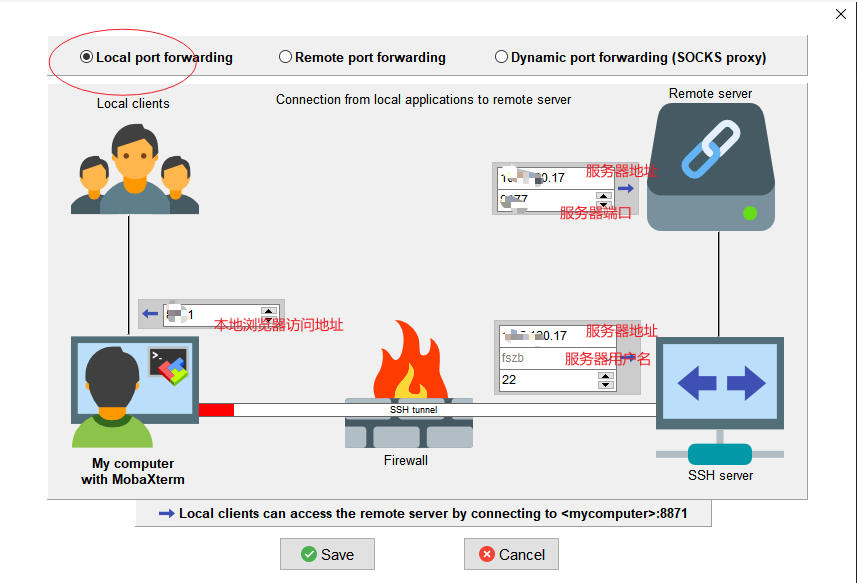

http://data.broadinstitute.org/igv/projects/downloads/


http://software.broadinstitute.org/software/igv/igvtools_commandline

一、下载 igv-webapp
```
$ wget -c https://igv.org/app-archive/igv-webapp.1.10.8.zip
$ unzip igv-webapp.1.10.8.zip
```
二、使用python调用Web服务（无需root）
```
#以下命令二选一
python3 -m http.server 7777
# python2 -m SimpleHTTPServer 7777
```
三、在windows下映射服务器端口(方法一)

```
ssh -N -f -L localhost:7777:localhost:7777 -p 端口号 username@远程地址

#locahost:7777是指本地地址，localhost:7777是指远程地址，其中7777是在linux我们为igv-webapp开启的端口
#-p 端口号 username@远程地址是什么后面的看下面截图
#例如：
ssh -N -f -L localhost:7777:localhost:7777-p 22 yuanf@114.212.169.49
#这时候输入yes，DOS让输入密码，这个密码是我们登录liunx账户的密码

```
三、在windows下映射服务器端口(方法2)(mobaxterm)
```

https://blog.csdn.net/qq_40944311/article/details/121396856
```

四、查看igv
+ igvwebConfig.js
+ resources/genomes.json
IGV browser的基因组数据
+ resources/tracks
可视化的track数据信息存放在resources文件下的tracks文件夹中
+ resources/tracks/trackRegistry.json

修改resources/genomes.json文件，加速访问数据
```
cd /var/www/html/igv-webapp/data
# 创建个人参考基因组文件夹
mkdir hg19 && cd hg19
# 下载参考基因组相关文件
wget https://s3.amazonaws.com/igv.broadinstitute.org/genomes/seq/hg19/hg19.fasta
wget https://s3.amazonaws.com/igv.broadinstitute.org/genomes/seq/hg19/hg19.fasta.fai
wget https://s3.amazonaws.com/igv.broadinstitute.org/genomes/seq/hg19/cytoBand.txt
wget https://s3.amazonaws.com/igv.org.genomes/hg19/refGene.sorted.txt.gz
wget https://s3.amazonaws.com/igv.org.genomes/hg19/refGene.sorted.txt.gz.tbi
# 更改genomes.json文件
cd ../../resources
vim genomes.json
```

参考：
+ https://www.jianshu.com/p/0384e8cd1d3c
+ https://www.jianshu.com/p/e4fd3c0f0c8d
