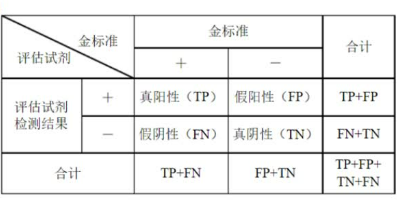
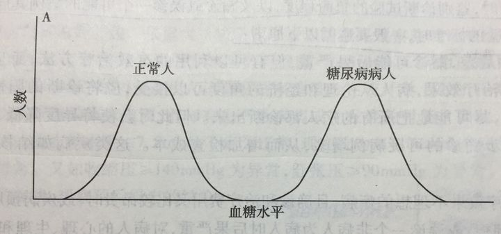
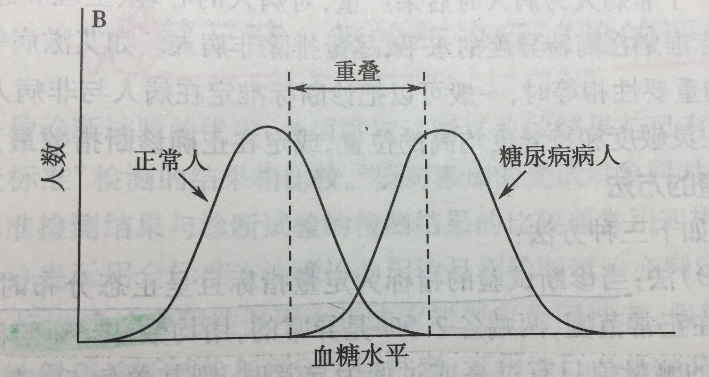
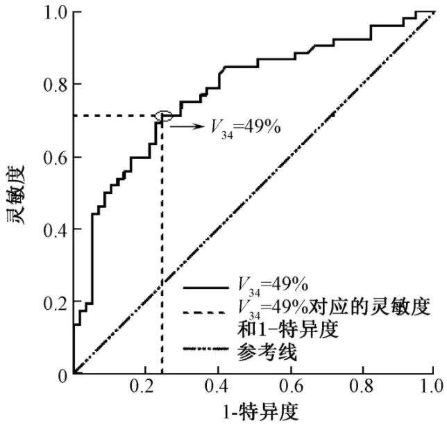

+ 敏感度：又叫真正例率，或者真阳性率，它的意义是阳性的那部分数据被预测为阳性。正确检出阳性患者的能力，也就是指在诊断疾病的时候对真正的病人不漏诊的机会有多大。敏感度越高，假阴性越少。
    + 敏感度=真阳性人数/（真阳性人数+假阴性人数）*100%。正确判断病人的率。也就**敏感度越高，漏诊率越低，假阴性的概率越低**，全部筛查出来，防止漏诊。
+ 特异度：又叫真反例率，或者真阴性率，它的意义是阴性的哪部分数据被预测为阴性。正确检出阴性患者的能力，也就是指对一个健康人不造成误诊的机会有多大。特异性越高，假阳性越少。
    + 特异度=真阴性人数/（真阴性人数+假阳性人数））*100%。正确判断非病人的率。也就**特异性越高，误诊率越低，假阳性的概率越低**（简单理解）常用来确证。
+ 灵敏度：也称检测限（LOD），指检测系统（或试剂盒）在95%敏感性下可检出最低突变频率（如1%、5%）的样本浓度或下限。
    + sensitivity应该翻译为敏感度，而不是灵敏度
+ 敏感度解决有没有的问题，灵敏度解决是不是的问题。
+ 对于敏感性特别高的疾病诊断指标，如果结果是阴性，就基本确认没这病；对于特异性特别高的指标，如果结果是阳性，就基本确认有这病。

## 实例解释
下面以医学中糖尿病人的筛查为例对敏感度和特异度进行解释。在这个例子中，我们只将病人血糖水平作为判断是否患有糖尿病的指标。下图为正常人和糖尿病患者血糖水平的统计图：

第一个钟形代表正常人，第二个钟形代表糖尿病人。

理想中，如果正常人和糖尿病人的血糖范围完全没有重合就好了。

这样我就把标准定在中间那个最低点。低于此点的，就是正常人；高于此点的，就是糖尿病人。多好！

现实中，正常人的血糖范围和糖尿病人的血糖范围有一部分是重叠的，这个时候判定标准定的不同，得到的结果就会不同。

如果我们把标准定在最左边的虚线上，则低于这条线的为正常人，高于这条线的包含了两类人：正常人和糖尿病患者。这种时候就是灵敏度最高的时候，即实际有病而被诊断出患病的概率，没有放过一个患病的人。但是有一部分正常人被认为是糖尿病人了，这一部分叫做假阳性率。

如果将标准定在最右边的虚线上，则是特异度最高的时候，即实际没病而被诊断为正常的概率，没有冤枉一个没病的人。但是有一部分糖尿病人被认为是正常人了，这一部分叫做假阴性率。

以左虚线为标准，所有病人正确确诊，部分正常人误判为病人（剩下正常人均正确判定），即TP=max, FP>0, TN=min，FN=0，灵敏度定义是TPR=TP/ (TP+ FN) =1，特异度定义TNR= TN / (FP + TN)<1，是灵敏度最大的情况。

终上所述，敏感度高=漏诊率低，特异度高=误诊率低。
理想情况下我们希望敏感度和特异度都很高，然而实际上我们一般在敏感度和特异度中寻找一个平衡点，这个过程可以用ROC(Receiver Operating Characteristic)曲线来表示：

即图中V34点，具有较高的灵敏度和特异度。这面也要提一下，ROC曲线中的横轴是1-specificity（假正例率），而不是specificity；而纵轴是sensitivity（真正例率）。

特别的，对于一些预后差，漏诊后果严重，早期诊断可以有效果很好的疾病时，我们就把灵敏度定高一点。不要放过一个病人。梅毒就是这样的疾病，所以，RPR检测的灵敏度高特异度低。对于一些治疗效果不好，确诊和治疗费用高，或者预后不太严重，，或误诊时对病人心理生理和经济上有严重影响的疾病，我们就把特异度定高一点。不要冤枉一个正常人。艾滋病就是这样的疾病。

#### Ref_Info
https://www.zhihu.com/question/30750849

