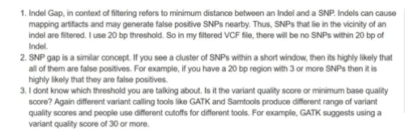

+ indel邻近区域的SNP
+ 10bp范围内的SNP cluster



```
#标出10bp范围3个SNP的 ”SnpCluster“
gatk VariantFiltration -V 324.wgs.call.SNP.Filter-SOR.ANN.vcfFliter.vcf -cluster 3 -window 10 -O 324.wgs.call.SNP.Filter-SOR.ANN.vcfFliter.10-3filter.vcf
#去除上一步标出的SnpCluster"
gatk SelectVariants -V 324.wgs.call.SNP.Filter-SOR.ANN.vcfFliter.10-3filter.vcf -O 324.wgs.call.SNP.Filter-SOR.ANN.vcfFliter.10-3filter-2.vcf -select "FILTER == SnpCluster" --invertSelect

#去除indel附近5bp范围内的SNP
bcftools filter -g 5 -O v -o 1-SnpGap5.vcf ../324.wgs.PASS.ANN.vcf.gz

```