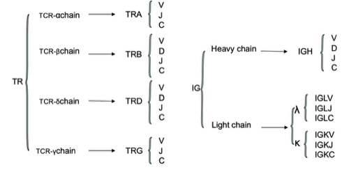

----
IGH:

|Genomic Locations for IGH Gene|
|---|
|chr14:105,586,437-106,879,844(GRCh38/hg38), -|
|chr14:106,052,774-107,288,051(GRCh37/hg19 by Entrez Gene), -|


## 
可变区（V区）

https://github.com/immunogenomics

immunotherapy 免疫疗法
https://github.com/griffithlab/pVACtools

https://ncbi.github.io/igblast/cook/How-to-set-up.html


https://www.jianshu.com/p/821a6fb7cf41

http://www.biomart.cn/specials/bgitechsolutions/article/62757

http://www.gene-health.com/a/keyanfuwu/qita/20181016/69.html

http://seqhealth.cn/list/26.html

http://www.chictr.org.cn/showproj.aspx?proj=49170

http://www.lc-bio.com/news/show-585.html

http://gb.oversea.cnki.net/KCMS/detail/detail.aspx?filename=1015964277.nh&dbcode=CMFD&dbname=CMFD2016

https://mp.weixin.qq.com/s/-XQktvQfOKyx7VjQSWT9Kw


https://www.jianshu.com/p/88af7dcff7e3


IGK:
```
chr2:88,857,361-90,235,368(GRCh38/hg38)
Size:1,378,008 basesOrientation:Plus strand


chr2:89,156,874-90,274,235(GRCh37/hg19 by Entrez Gene)
Size:1,117,362 basesOrientation:Plus strand
```


https://liulab-dfci.github.io/RIMA/Repertoire.html

https://liulab-dfci.github.io/software/

https://www.jianshu.com/p/859702773bba

