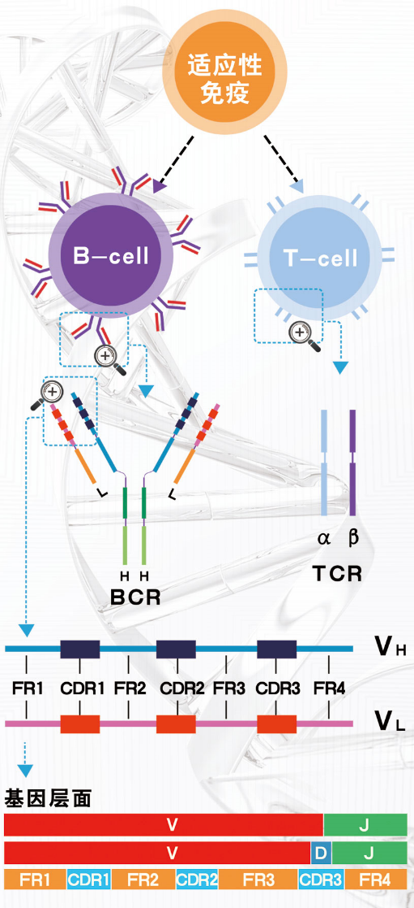
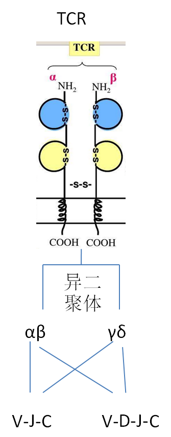
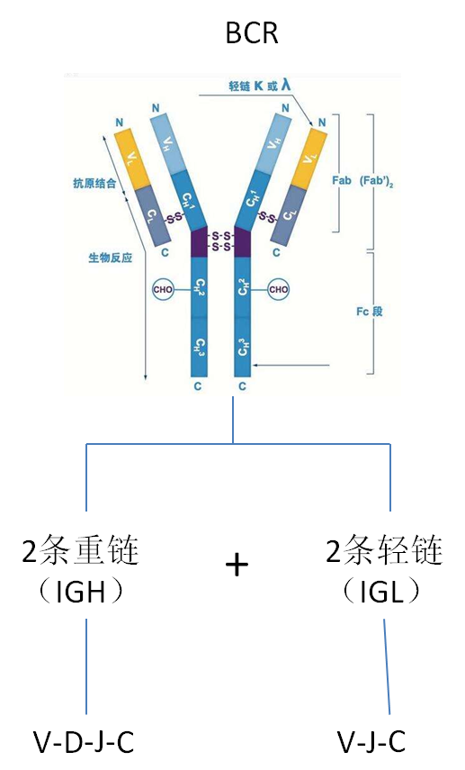
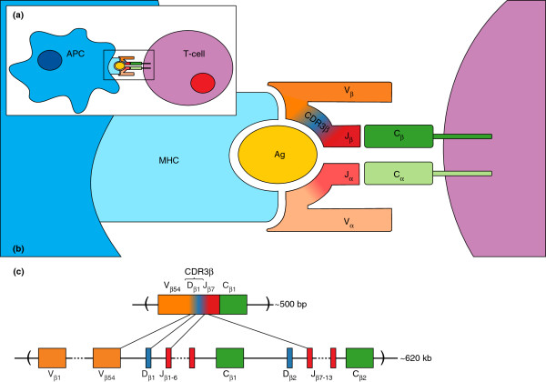

## TCR与BCR的结构：





## 抗原呈递细胞(APC)与T细胞之间的相互作用

----

## 基因层面


IGH:

|Genomic Locations for IGH Gene|
|---|
|chr14:105,586,437-106,879,844(GRCh38/hg38), -|
|chr14:106,052,774-107,288,051(GRCh37/hg19 by Entrez Gene), -|

IG和TR都是复合蛋白，由多个基因各自转录翻译后的蛋白加工组成。比如每一个BCR，包含两条重链和两条轻链。其中重链由一个可变区（V区）和三个恒定区（C区）组成，轻链则包含一个可变区与一个恒定区。

可变区（V区）：可变区（V区）则决定了它的特异性，即决定了它能和什么样的抗原结合。主要是V、D和J基因组成。
其中IG分成IGH,IGK,IGL这3类，而TR分成TRA,TRB,TRD,TRG这4类。

恒定区（C区）：重链的恒定区，决定了BCR的免疫原性，即决定了它属于5类免疫球蛋白（IgA、IgG、IgM、IgD、IgE）中的哪一种。而轻链的恒定区，则决定了搭配的轻链种类（k或入型）。


https://github.com/immunogenomics

immunotherapy 免疫疗法
https://github.com/griffithlab/pVACtools

https://ncbi.github.io/igblast/cook/How-to-set-up.html


https://www.jianshu.com/p/821a6fb7cf41

http://www.biomart.cn/specials/bgitechsolutions/article/62757

http://www.gene-health.com/a/keyanfuwu/qita/20181016/69.html

http://seqhealth.cn/list/26.html

http://www.chictr.org.cn/showproj.aspx?proj=49170

http://www.lc-bio.com/news/show-585.html

http://gb.oversea.cnki.net/KCMS/detail/detail.aspx?filename=1015964277.nh&dbcode=CMFD&dbname=CMFD2016

https://mp.weixin.qq.com/s/-XQktvQfOKyx7VjQSWT9Kw


https://www.jianshu.com/p/88af7dcff7e3


IGK:
```
chr2:88,857,361-90,235,368(GRCh38/hg38)
Size:1,378,008 basesOrientation:Plus strand


chr2:89,156,874-90,274,235(GRCh37/hg19 by Entrez Gene)
Size:1,117,362 basesOrientation:Plus strand
```


https://liulab-dfci.github.io/RIMA/Repertoire.html

https://liulab-dfci.github.io/software/

https://www.jianshu.com/p/859702773bba


T细胞受体（T-cell receptor），简称TCR，是在T细胞表面发现的一种分子。
T细胞介导的抗原识别取决于T细胞受体（TCR）与抗原主要组织相容性复合体（MHC）分子的相互作用。当TCR、抗原肽、MHC结合时，T淋巴细胞通过信号转导被激活，进入后续的免疫应答过程。
TCR作为一类重要的免疫细胞受体，其多样性非常庞大，机体内所有的TCR构成了个体的T细胞受体库(TCR repertoire)。T细胞受体库的多样性直接反映了机体免疫应答的状态，T细胞受体库解析对阐明T细胞在疾病发生发展中的作用具有重要意义。

T细胞受体库测序（T cell receptor repertoire sequencing, TCR-seq）通过高通量测序技术检测靶向扩增后的T细胞抗原识别决定性表面分子，即TCR，分析多样性，以及T细胞识别抗原前后，TCR基因重测碱基序列和各序列的丰度。

它能反映机体在生理和病理状态下T细胞介导的细胞介导的细胞免疫应答状态改变，可用于研究不同T细胞克隆的转录情况和相互间关系。

当机体受到外源性入侵时，免疫系统会召集所有免疫细胞亚群通过产生免疫反应与病原体进行对抗。由于病原体存在着多种多样的差异。因而相应产生的免疫反应和每个阶段内涉及的细胞类型也有所不同。
T细胞介导的细胞免疫应答过程中，抗原呈递细胞（Antigen-presenting cells， APC）摄取抗原（Ag）, 消化形成抗原-MHC分子复合物，并呈递给T细胞；T细胞通过自身T细胞受体β链中V-D-J基因重排后的CDR3β参与抗原识别。


--------------------------------------------------------------------------------

02. TCR有什么特征？
TCR复合物的基本功能是引导T细胞识别特定的抗原。面对多种多样的抗原类型如何做到“特异”识别，这就归功于TCR的“高度多态性”了。

TCR是高度多样化的异源二聚体，由大多数T细胞（95%）表达的α和β链（αβ-TCR，两条链分别由TRA和TRB编码）的组成，或由外周血中的T细胞（1-5%）和在粘膜部位发现的T细胞表达的γδ链（γδ-TCR，分别由TRG和TRD编码）组成。

T细胞受体（T cell receptor, TCR）中V(D)J 基因区域的随机重排，导致了T细胞种类的复杂多样性使T细胞在识别和杀伤特异外源性抗原时则更为快速，准确和有效。

TCR的基因由可变区(V)，多变区(D),结合区（J）和恒定区（C）四部分基因片段组成，形成互补决定区（complementarities determining region, CDR）和间隔的4个骨架区(framework region,FR)。在T细胞发育过程中CDR1,2 和FR区域相对保守，CDR3区域由VDJ 进行重排而形成具有功能的TCR编码基因（T细胞克隆)，由于V(65~100种)，D(2种)，J(13种)基因片段本身具有多样性，此外，由于在重排的过程中，在V-D及D-J的连接区经常有非模版的核苷酸的随机插入或删除，进一步增加了CDR3区的多样性。这种基因片段连接的不准确性使TCR的表达呈多样性，以识别不同的抗原。

CDR3区域：互补决定区域（complementarity determining region 3 (CDR3) domain），一般长度为45nt，有VJ junction形式（TCR-α）和VDJ junction形式（TCR-β）


图2 TCR α链和β链V(D)J重组与结合过程

与B细胞表达的免疫球蛋白相似，膜结合的免疫球蛋白通常被称为B细胞受体（BCR）。
TCR链由抗原识别的可变区域和恒定区域组成。
TCR α和δ链的可变区由多个可变的（variable, V）和连接（joining, J）基因编码，而TCR β和γ链还由高变（deversity, D）基因编码。在VDJ重组期间，每个基因片段的一个随机等位基因与其它基因片段重组以形成功能可变区。基于RAG1和RAG2重组酶的V-(D)-J重组过程中，V、D、J中一个随机等位基因会与其他区段等位基因重组，形成功能多样化的片段。在V-D、D-J于V-J基因片段之间的连接点处会随机进行核苷酸的添加、缺失。此外，在转录过程中位于重组V（D）J区域的序列以及恒定（Constant, C）区域的基因序列会进行可变剪切，形成存在一定功能差异的转录本（图2）。上述过程会导致超强的重组与结合多样性，产生高可变型、高多样性的T细胞受体，确保对各类抗原进行鉴定。基于数学计算，理论上存在1012-1015种不同的TCR[5]，实际人体存在的TCR多样性大约在1013这个数量级，说明看似随机的TCR重组并不是完全随机，可能受到某些机制的约束[6]。

产生TCR多样性的重组过程，是T淋巴细胞在初级淋巴器官——胸腺中的发育早期所特有。每个TCR链都含有3个高度多样性的loop，称为互补决定区域（complementarity determining re-gions, CDR1-3）。CDR1和CDR2由V基因编码，而CDR3由V-J或V-D-J基因结合区域编码，高度多样化。此外，CDR3是TCR直接接触抗原肽的区域，对TCR与抗原肽-MHC复合体的互作起到决定性作用（图1）。正因为如此，CDR3是确定T细胞克隆类型的重要区域，两个T细胞不太可能表达相同的CDR3序列，除非它们来自相同的T细胞克隆[7]。

β链是研究的主要靶区域，因为β链（VDJ中D基因的主要成分）与α链相比具有更高的组合潜力。


用恒定基因区段重组可变区产生功能性TCR链转录物。这个过程导致强组合（取决于哪个基因区域将重组）和连接多样性（将添加/删除多少核苷酸），从而产生大量且高度可变的TCR profiling，最终鉴定到大量的TCR profiling抗原。通过配对α和β或γ和δ链以形成功能性TCR来实现多样性。
每个TCR链包含三个高可变环区（hypervariable loops）,称之为互补决定区CDR1-3。CDR1和CDR2由V基因编码，并且对TCR与MHC复合物互作至关重要。然而CDR3由V和J或D和J之间连接区编码，因此CDR3变化程度较大。由于CDR3是与抗原直接接触的TCR区域，因此CDR3在TCR与肽-MHC复合物的相互作用中起到了十分重要的作用。
所以CDR3是T细胞常见的克隆区域，除非T细胞来源于相同的形式扩增出来的，一般来说T细胞几乎不太可能表达相同的CDR3序列。
所有T细胞的TCR总和成为TCR profiling（TCR谱）。随着疾病不断恶化，TCR profiling会发生很大的变化。于是研究人员越来越关注在不同的疾病条件下免疫谱的状态，如癌症、自身免疫、炎症、传染病等。
如硬化患者中T细胞的TCR谱分析表明自体干细胞移植后会对患者免疫系统带来巨大的影响。在癌症病人中，杀手T细胞（cytotoxic T cells）能够可在识别肿瘤特异性抗原后将其杀死。一些研究试图通过分析肿瘤浸润淋巴细胞谱来鉴定该过程中涉及的特定T细胞克隆类型。
目前免疫组学测序最大的问题就是过于多样化。理论上VDJ重排后可产生1015~1020种不同的克隆类型，实际上只有约1013种不同的克隆类型。这就意味.看似随机的VDJ重排其实是有规律的，并且受到各种条件的限制。
另外，以前认为正常人群中T细胞的TCR基本上较为相似，实际上最近的研究表明许多TCR都比较稀少。这就需要一种快捷高效精准的方法来研究个人免疫组库。
过去几十年内，开发了不同的技术来研究免疫组库。例如使用单克隆抗体通过荧光显微镜或流式细胞仪分析特定的V基因组亚型，而PCR技术则能够以相对较低的分辨率分析免疫组信息。直到高通量测序技术的出现，使得研究人员第一次能够大批量对TCR序列进行并行分析。目前仍然缺少一种金标准，因为每种方法都有其优缺点。	

--------------------------------------------------------------------------------
03. TCR-seq
1、测序目标—α、β链和CDR3区域？

材料选择：用αβ还是γδ？
TCR有 αβ（外周血中90%~95%）和 γδ（外周血中5%~10%）二聚体形式，一般对TCR的研究都是针对占主体的αβ二聚体形式，且α的CDR3区域是VJ junction，β的CDR3区域是VDJ junction，所以β链与α链相比具有更多的组合形式和连接的多样性，因此TCR-seq一般都是针对β链的CDR3区域

因为αβ-T细胞组成了T细胞的绝大多数群体，并且目前针对外周血的研究最为广泛，所以α链和β链是TCR-seq最常见的研究目标。
同时，因为CDR3是TCR上直接接触抗原肽的区域，因此该区域成为研究优先选择的目标区域。CDR1和CDR2因为不直接与抗原相互作用尚未引起科学界的关注，但CDR1和CDR2在与MHC分子的接触中起着重要的作用，同样也影响了TCR结合蛋白的敏感性和亲和力，目前市场上部分公司提供的TCR-seq也包含有CDR1和CDR2区域。
2、研究材料—DNA or RNA ？
市场上的TCR-seq产品有的需要客户提供RNA，有的需要提供DNA，研究者一定会思考到底二者存在怎样的区别，各自的功过。先讨论DNA为研究材料，最大的优点是有更高的稳定性，并且单个细胞的TCR DNA模板单一，方便进行单个TCR克隆的定量。DNA层面的缺点同样也很明显，即无法获取TCR转录层面的信息。此外，由于内含子的存在、VDJ的重排等因素可能导致测序结果不准。使用RNA为研究材料时，单个TCR克隆的定量极具挑战性，因为一个细胞包含多个不同的TCR转录本。然而，由于研究mRNA可以获得最终的TCR产物，所以目前许多NGS方法都是以RNA作为起始材料而设计的。RNA为起始材料还可以对整个J基因和V基因进行测序，并提供表达水平的信息。
材料选择：用DNA还是RNA？
DNA
优点：丰富，容易提取且能保持长时间的稳定，且对于每一个TCR subunit，一个细胞只有两个位置有，或者说只有固定的两份拷贝，因此DNA模板分子的数量能反映T细胞的数量
缺点：必须进行PCR扩增来达到足够的测序量，而为了得到进尽可能全的TCR库的组成，使用了多套PCR引物多重PCR方法，使得很容易在PCR过程中引入PCR bias
RNA
使用5’ RACE方法进行cDNA的扩增，因此只需要使用一套PCR引物即可
优点：只使用一套PCR引物，极大地降低了PCR bias
缺点：TCR表达水平的变异很大，不能准确地反映T细胞的数量

3、哪种建库方法？
先抛开单细胞水平的TCR-seq不谈，目前研究最多的基于细胞群体的TCR建库技术。因为细胞群更加常见用于研究TCR多样性并研究比较较大群组中不同的profiling。但是这种方法存在缺点那就是只能提供单个TCR链的频率信息，却不能与细胞进行一一配对。

多重PCR测序（Multiplex PCR）
由于TCR区域研究目标的多样性，多重PCR法目前使用最为普遍。
原理：设计位于J等位基因或者位于TCR-α链/β链恒定区域的引物，搭配一系列位于已知V等位基因上的混合引物，随后进行PCR扩增。
优劣：该方法兼容gDNA和RNA两种材料，RNA需要经过逆转录先形成cDNA，再进行扩增。由于引物设计参考了特定V等位基因，导致不能检测新的V等位基因变体。此外，多重PCR方法也存在扩增偏好性，影响TCR产物的相对丰度。通过调整、优化试验，包括调整引物浓度或使用分子条码(UMI)可以纠正这种错误。

目标区域捕获测序（Target enrichment）
原理：定制与TCR-α链/β链目标区域序列互补配对的DNA/RNA探针，与gDNA/cDNA杂交，然后进行目标区域捕获，并对目标区域进行扩增放大信号，是TCR-seq的另外一种方法。
优劣：相对于多重扩增子建库，该方案仅需较少的PCR过程，PCR偏好更小。但是，虽然杂交捕获可以耐受一些与目标序列不同的碱基，但是由于TCR区域本身的高度复杂性和可变性，目前使用目标区域捕获这种方法并不是特别主流。

5'RACE及巢式PCR（5'RACE+Switch Oligo+nested PCR）
另外一种方法必须使用RNA为起始研究对象，同时也逐渐成为群体细胞TCR分析的金标准——cDNA 5'末端快速扩增技术(5'RACE)。
原理：依赖于逆转录酶的末端转移酶活性，在第一链合成反应进行到cDNA分子的3'端时额外加上几个碱基(通常是dCTP)。一个含有oligo(rG)锚定序列的模板转换寡核苷酸链会与cDNA 3'端无模板延伸出来的C碱基互补配对，紧接着逆转录酶会进行模板转换，补齐末端碱基。最后根据逆转录过程5'端锚定引物序列(正向引物)和基因3'端恒定区已知序列(反向引物)完成TCR转录产物5'端的扩增。也可以用相同方式再执行巢式PCR，增加结果的特异性。
优劣：这种方法能够合成完整的TCR 5'cDNA，通常覆盖到完整的V基因，保留完整的TCR VDJ区域。由于扩增产物一致，也规避了扩增的偏好性。由于这种方法是以RNA为起始材料，相对于其他技术对操作要求相对较高，并且全部流程繁杂，重复性可能会受到影响。

4.样本

参考资料：
https://www.sohu.com/a/310928637_100126902
https://www.sohu.com/a/259641207_769248


--------------------------------------------------------------------------------

肿瘤新生抗原（neoantigens）主要来自于非同义突变。因为肿瘤新生抗原在正常细胞不表达，理论上可以刺激更强的T细胞反应（高亲和力的TCR，T细胞扩增，和肿瘤组织浸润淋巴细胞数量增多，因而肿瘤新生抗原疫苗和免疫检查点联用效果好）。


https://mp.weixin.qq.com/s/fPwIbPSOE2c1OrK0g4-ilQ

