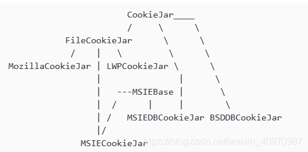

http.cookiejar实现cookie获取与存储

CookieJar是对于Cookie类的一个类似管理类的封装。

类继承图，CookieJar是基类

CookieJar类有一些子类，分别是FileCookieJar，MozillaCookieJar，LWPCookieJar。
+ CookieJar：管理HTTP cookie值、存储HTTP请求生成的cookie、向传出的HTTP请求添加cookie的对象。整个cookie都存储在内存中，对CookieJar实例进行垃圾回收后cookie也将丢失。
+ FileCookieJar (filename,delayload=None,policy=None)：从CookieJar派生而来，用来创建FileCookieJar实例，检索cookie信息并将cookie存储到文件中。filename是存储cookie的文件名。delayload为True时支持延迟访问访问文件，即只有在需要时才读取文件或在文件中存储数据。
+ MozillaCookieJar (filename,delayload=None,policy=None)：从FileCookieJar派生而来，创建与Mozilla浏览器 cookies.txt兼容的FileCookieJar实例。
+ LWPCookieJar (filename,delayload=None,policy=None)：从FileCookieJar派生而来，创建与libwww-perl标准的 Set-Cookie3 文件格式兼容的FileCookieJar实例。

https://blog.csdn.net/weixin_40970987/article/details/86597656