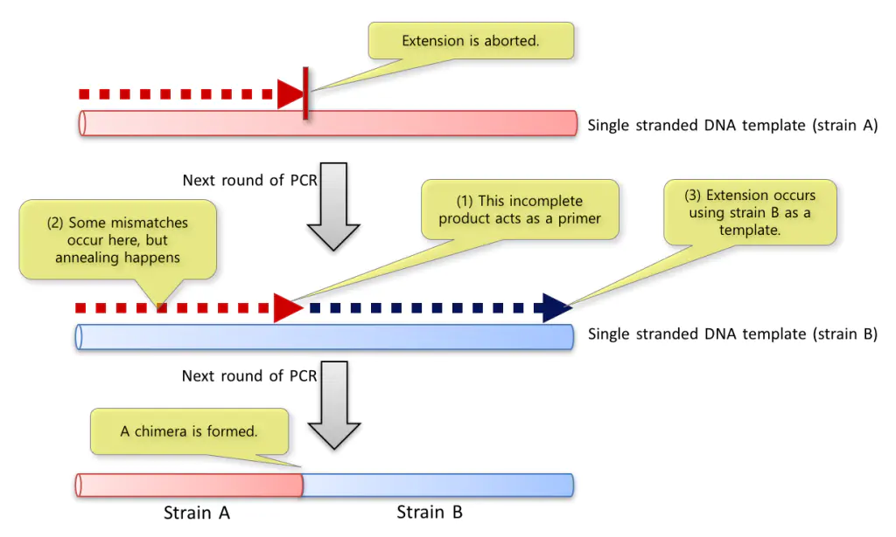

目前whole-genome amplification (WGA)—— 全基因组扩增技术有以下几种技术：PCR、MDA、MALBAC

## multiple displacement amplification (MDA) —— 多重置换扩增
PCR和MDA都会产生嵌合DNA分子会被认为是插入或结构重排。

MDA中嵌合的发生机制
Lasken, R.S., Stockwell, T.B. Mechanism of chimera formation during the Multiple Displacement Amplification reaction. BMC Biotechnol 7, 19 (2007).

#### Ref_Info
https://www.jianshu.com/p/9a9d9b6d0be3