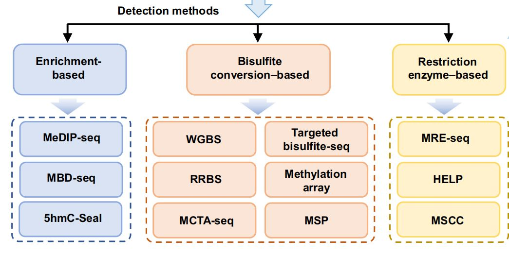

https://www.cnblogs.com/jessepeng/p/13575693.html

https://zhenglei.blog.csdn.net/article/details/108509052

# 1.概念
DNA甲基化：DNA甲基化（DNA methylation）为DNA化学修饰的一种形式，能够在不改变DNA序列的前提下，改变遗传表现。所谓DNA甲基化是指在DNA甲基化转移酶（DNMT）的作用下，-CH3基团直接与其序列中的腺嘌呤（A）或胞嘧啶（C）碱基共价结合，可在细胞分裂过程中遗传给子细胞的表观遗传现象。在肿瘤的超早期甲基化异常便会发生。正常细胞中CpG岛一般是去甲基化状态，在肿瘤细胞中抑癌基因启动子区域CpG岛会被DNMT高度甲基化，从而减弱肿瘤抑制来增加肿瘤的发生。随着肿瘤的生长，甲基化会动态发生改变。在急性和慢性细胞性白血病、结肠癌、乳腺癌、胃癌等肿瘤细胞中，甲基化图谱也存在明显差异。所以利用甲基化检测对肿瘤进行早期筛查具有很大的应用潜力。

大量研究表明，DNA甲基化能引起染色质结构、DNA构象、DNA稳定性及DNA与蛋白质相互作用方式的改变，从而控制基因表达。

+ Ø	5mC是表观遗传最重要的一种修饰，广泛存在于植物、动物等真核生物基因组中, 称誉为“第五碱基”；
+ Ø	5hmC是新发现的一种的修饰碱基，称为哺乳动物的“第六碱基”；
+ Ø	6mA在细菌、藻类及动植物基因组中存在，近来发现在癌症及神经疾病、成骨分化、胚胎发育等过程发挥作用。

## DNA甲基化研究

+ DNA甲基化是生命过程中普遍存在的一种调控方式。在哺乳动物中，大约有70%~80%的CpG岛区域的胞嘧啶存在甲基化修饰。
+ DNA甲基化是在甲基转移酶作用下，在胞嘧啶的第五位碳原子共价结合一个甲基基团。
+ 在干细胞维持和自我更新与分化，个体的衰老和发育异常及疾病（如肿瘤、糖尿病、精神病及神经系统疾病等复杂疾病）的发生发展中起着决定性的作用
+ 人类基因组(GRCh37, hg19)约有 28,299,634 个CpG Site，其中大约有60%~80%的存在甲基化修饰。

## 人和哺乳动物基因组5mC甲基化特征
 
u	在哺乳动物中CpG以两种形式存在：一种是分散于DNA序列中；另一种呈现高度聚集状态, 称之为CpG岛 (CpG island, GC含量大于50%,长度超过200bp).
u	CpG岛常位于基因转录调控区附近(启动子和第一外显子区域), 与56%的人类基因组编码基因相关;
u	人类基因组有约56M的CpG位点，CpG岛约3万个, CpG岛的数目与基因密度有良好的对应关系;
u	在正常组织里, 70%～90%散在的CpG是被甲基修饰的，而与之相反，CpG岛则往往非甲基化的。
u	在大多数染色体上，平均每100万碱基含有5～15个CpG岛，其中有1.8万多个CpG岛片段的GC含量为60%～70%。通常，这些CpG岛不仅是基因的一种标志，而且还参与基因表达的调控和影响染色质的结构。例如， 除定位于失活X染色体上的基因、印迹基因和非表达的组织特异基因（奢侈基因）外，正常细胞的CpG岛由于被保护而处于非甲基化状态。
u	全基因组低甲基化，维持甲基化模式酶的调节失控和正常非甲基化CpG岛的高甲基化是人类肿瘤中普遍存在的现象。以往的研究证明启动子区的高甲基化导致抑癌基因失活是人类肿瘤所具有的共同特征之一，而且这种高甲基化是导致抑癌基因失活的又一个机制。

# 2.技术方法
在将ctDNA甲基化分析应用于临床之前，需要解决的关键问题之一是检测技术，它必须具有高灵敏度、成本效益和测序覆盖率高的特点，特别是对于非常微量的ctDNA。目前，已经开发了许多检测ctDNA甲基化的方法，大致可分为两类：基于重亚硫酸盐转化的方法和非重亚硫酸盐转化方法。表1选择性地列出了当前主要检测方法的优缺点和对cfDNA起始量的需求。

其中，重亚硫酸盐转化方法可以分为基因组甲基化检测，代表性的方法包括全基因组甲基化测序（WGBS）和简化基因组甲基化测序（RRBS等）。如果要检测特定位点的甲基化，还可以使用靶基因重压硫酸盐测序（Target-BS）、焦磷酸测序、甲基化芯片和甲基化特异性PCR(MSP)。而不依赖于重亚硫酸盐转化的方法又可以分为基于富集的方法和基于限制性内切酶的方法。表1列出了当前主要检测方法的优缺点以及对cfDNA起始量的需求。

##  illumina芯片检测平台原理&850K芯片

https://www.jianshu.com/p/026c9753c9c6

