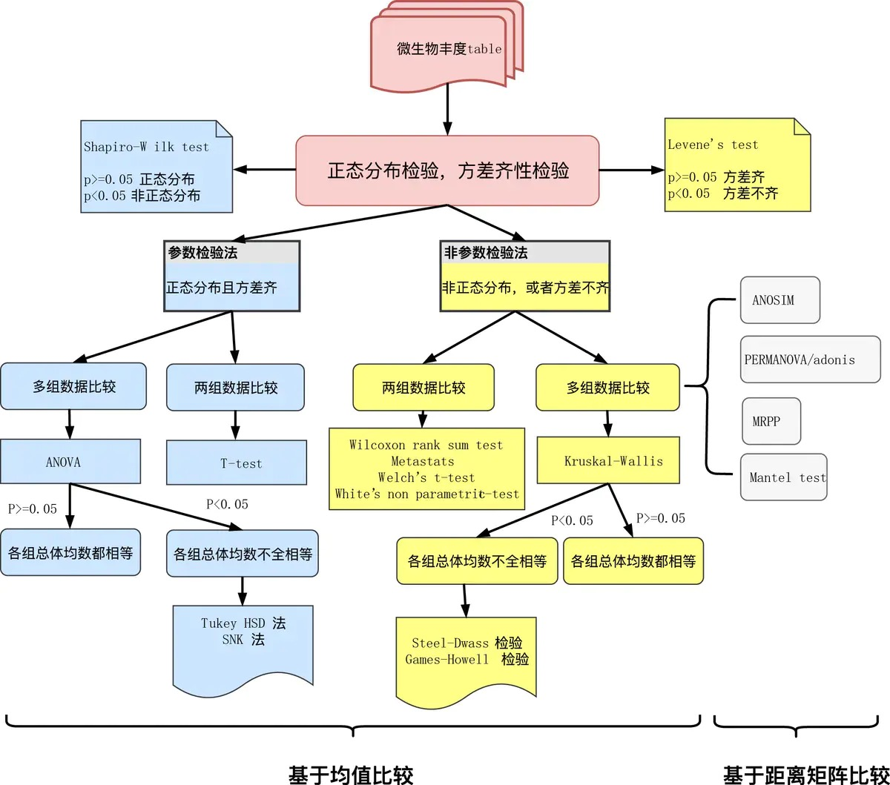
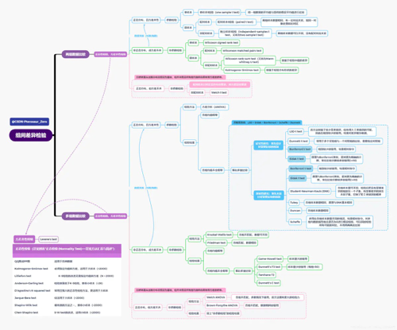

+ 两个样本
   + 卡方检验
+ 两组样本（至少3重复）
  + Student t
  + Welch‘st
  + Wilcoxon
+ 多组样本比较
  + one way ANOVA
  + TURKEY
  + Kruskal-Wallis H检验等方法。

Student t检验需要样本符合正态分布，而且方差对齐。当组间样本数不同，方差也不对齐的时候，Welch’s t检验是很好的选择。

Wilcoxon秩和检验又叫Mann-Whitney U 检验，是基于变量排名的一种统计方法，不需要样本符合正态分布，也不需要样本方差对齐，是更为广泛的检验方法，但同时也由于检验太宽松，容易带来很多假阳性。

one way ANOVA和TURKEY其实都是基于方差分析，只不过后者带有后验，可以知道两个分组对整体差异的贡献度。

Kruskal-Wallis H检验本质也是一种秩和检验，与前两者的区别在于，它不需要样本数和方差的对齐，应用更为广泛。Kruskal-Wallis检验又被称之为单因素非参数方差分析。

毫不客气地讲，一般秩和检验或置换检验属于非参数检验。在这类差异检验中，有两种集成方法特别值得我们注意：LEfSe 、metastats。

----

> 总体服从正态分布的数据在小样本时呈现为t分布，而服从t分布的数据在样本量较大时会渐进于正态分布，也就是无论样本量大小都可以使用t检验。但z检验需要数据严格服从正态分布，但数据量小时服从的是t分布而不是正态分布，因此z检验通常只能用在大样本的情况。显然t检验的使用条件更为宽松，并且完全可以替代z检验，因此可直接使用t检验。

https://blog.csdn.net/qq_33924470/article/details/115068564

https://atrebas.github.io/post/2019-03-03-datatable-dplyr/

https://cloud.tencent.com/developer/article/1682960

https://www.jianshu.com/p/0032087b9dbb

https://mp.weixin.qq.com/s/62wIOTWE3ZygBbxFucmvkw

https://mp.weixin.qq.com/s?__biz=MjM5NTk0Mzg2Nw==&mid=2247486387&idx=1&sn=0705c2a64572e3961039273b1e0b3050&chksm=a6f18f6791860671387f9da11deaeeb2476e32595f3b3dd953cae0a4f791be29ede80dd5b837&cur_album_id=1682960793862012928&scene=189#rd

https://blog.csdn.net/snowdroptulip/article/details/78770088

https://www.jianshu.com/p/67be9b3806cd
