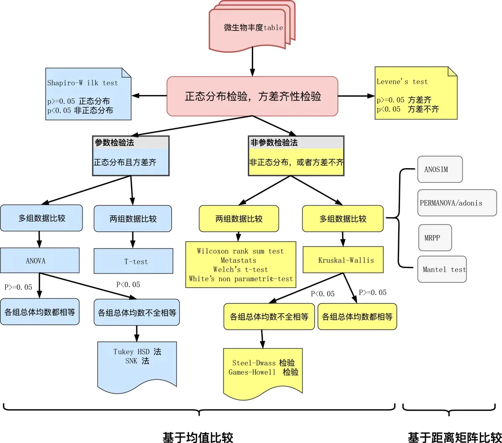
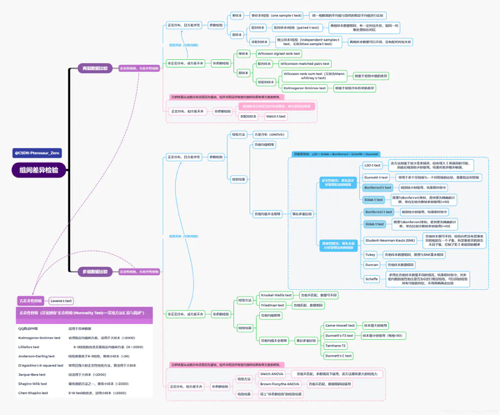

+ 两个样本
   + 卡方检验
+ 两组样本（至少3重复）
  + Student t
  + Welch‘st
  + Wilcoxon
+ 多组样本比较
  + one way ANOVA
  + TURKEY
  + Kruskal-Wallis H检验等方法。

Student t检验需要样本符合正态分布，而且方差对齐。当组间样本数不同，方差也不对齐的时候，Welch’s t检验是很好的选择。

Wilcoxon秩和检验又叫Mann-Whitney U 检验，是基于变量排名的一种统计方法，不需要样本符合正态分布，也不需要样本方差对齐，是更为广泛的检验方法，但同时也由于检验太宽松，容易带来很多假阳性。

one way ANOVA和TURKEY其实都是基于方差分析，只不过后者带有后验，可以知道两个分组对整体差异的贡献度。

Kruskal-Wallis H检验本质也是一种秩和检验，与前两者的区别在于，它不需要样本数和方差的对齐，应用更为广泛。Kruskal-Wallis检验又被称之为单因素非参数方差分析。

毫不客气地讲，一般秩和检验或置换检验属于非参数检验。在这类差异检验中，有两种集成方法特别值得我们注意：LEfSe 、metastats。

----

> 总体服从正态分布的数据在小样本时呈现为t分布，而服从t分布的数据在样本量较大时会渐进于正态分布，也就是无论样本量大小都可以使用t检验。但z检验需要数据严格服从正态分布，但数据量小时服从的是t分布而不是正态分布，因此z检验通常只能用在大样本的情况。显然t检验的使用条件更为宽松，并且完全可以替代z检验，因此可直接使用t检验。

https://blog.csdn.net/qq_33924470/article/details/115068564

https://atrebas.github.io/post/2019-03-03-datatable-dplyr/

https://cloud.tencent.com/developer/article/1682960

https://www.jianshu.com/p/0032087b9dbb

https://mp.weixin.qq.com/s/62wIOTWE3ZygBbxFucmvkw

https://mp.weixin.qq.com/s?__biz=MjM5NTk0Mzg2Nw==&mid=2247486387&idx=1&sn=0705c2a64572e3961039273b1e0b3050&chksm=a6f18f6791860671387f9da11deaeeb2476e32595f3b3dd953cae0a4f791be29ede80dd5b837&cur_album_id=1682960793862012928&scene=189#rd

https://blog.csdn.net/snowdroptulip/article/details/78770088

https://www.jianshu.com/p/67be9b3806cd

https://microimmunostats.netlify.app/two-way-anova.html#rand-block-festing

# 概率分布
1. 分布函数的性质刻划
2. 随机变量的分布
3. 离散几率分布族
  3.1	伯努利分布
  3.2	二项式分布
  3.3	几何分布
  3.4	负二项式分布
  3.5	超几何分布
    3.5.1	超几何分布与二项式分布的关系
  3.6	Poisson分布
  3.7	离散均匀分布
4. 连续几率分布族
  4.1	均匀分布
  4.2	正态分布
    4.2.1	正态分布与二项分布的关系
  4.3	伽玛分布
  4.4	指数分布
  4.5	其他连续型常用分布
    4.5.1	贝它分布
    4.5.2	双指数分布
    4.5.3	对数正态分布
    4.5.4	柏拉图分布
    4.5.5	柯西分布
  4.6	多元正态分布

## 负二项分布
负二项分布（Negative binomial distribution）是统计学上一种描述在一系列独立同分布的伯努利试验中，成功次数到达指定次数（记为r）时失败次数的离散概率分布。比如，如果我们定义掷骰子随机变量x值为x=1时为成功，所有x≠1为失败，这时我们反复掷骰子直到1出现3次（成功次数r=3），此时非1数字出现次数的概率分布即为负二项分布。

“负二项分布”与“二项分布”的区别在于：“二项分布”是固定试验总次数N的独立试验中，成功次数k的分布；而“负二项分布”是所有到r次成功时即终止的独立试验中，失败次数k的分布。

RNA-seq中的那些统计学问题（一）为什么是负二项分布？ https://zhuanlan.zhihu.com/p/65361113