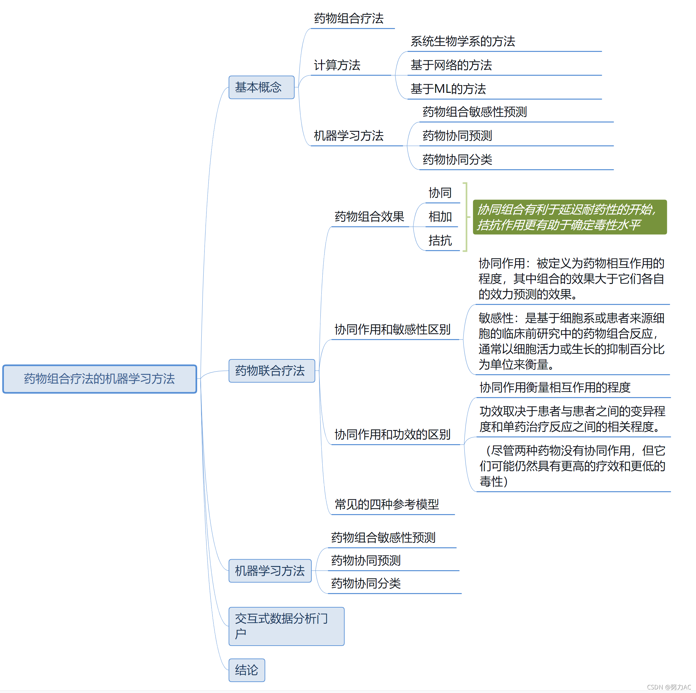

# 药物组合疗法的机器学习方法
## 药物组合疗法的研究意义？
药物组合主要针对复杂疾病如癌症等，与单药给药相比，具有药效更强，副作用低等潜在优势。

癌症等复杂疾病的产生发展往往伴随复杂的基因通路改变，因此药物组合可以通过作用于多种通路的多个靶标，发挥更好的治疗效果。

联合用药对于复杂疾病的治疗至关重要，其基本原理是联合使用靶向多个靶点、通路或细胞过程的药物，这样可以有效降低单一药物治疗的耐药性，提高治疗效果，同时通过减少单一药物的剂量而降低药物带来的毒性。然而，对于海量的可用药物组合搜索空间来说，仅通过经验筛选或高通量实验筛选技术是远远不够的。目前已有多个研究应用机器学习算法预测出具有协同作用的联合用药疗法，以快速、低成本地找到大量有效的新型药物组合。

## 机器学习方法的作用？
药物组合的实验发现十分困难，因为实验测试量巨大，想要针对大量药物测试其在多种癌细胞上的组合效果是目前几乎无法实现的。

因此基于计算机的药物组合发现方法可以辅助这一发现过程，缩短前期筛选时间。

## 当前针对药物组合研究的主要问题？
(1) 发现药物组合的作用靶标及相关生物标记物，从而发现疾病机理。

(2) 针对病人预测有效的药物组合。

----

近日，军事医学研究院伯晓晨、何松课题组在Briefings in Bioinformatics杂志发表了题为Machine learning methods, databases and tools for drug combination prediction的方法学综述，全面评述了近些年来用于预测新型联合用药疗法的机器学习方法以及相关的数据库、软件工具，并总结了该领域目前存在的挑战和未来的相关工作。
http://www.python88.com/topic/122020

https://zhuanlan.zhihu.com/p/407747557

https://blog.csdn.net/xiao_muyu/category_11396337.html

https://wenku.baidu.com/view/f378898102d276a200292e4e.html

https://kk-news.cc/technique/15b3d0.html

https://www.jianshu.com/p/297306330505

> https://www.r-project.org/nosvn/conferences/useR-2009/slides/Harbron.pdf
> https://sci-hub.se/https://doi.org/10.1080/10543400701199593